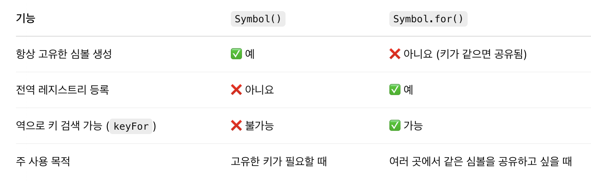
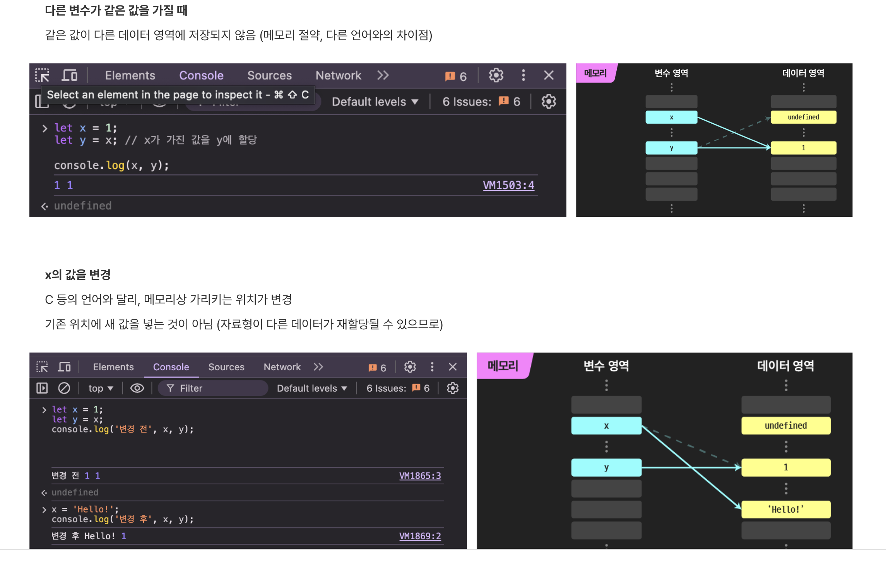
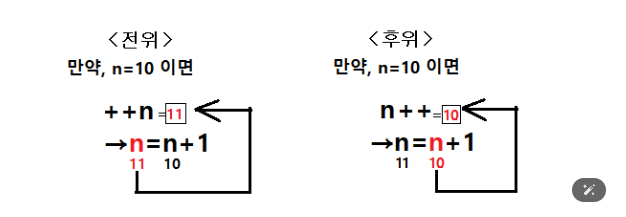

6장

1. Symbol.for
   const symA = Symbol("1");
   const symB = Symbol("1");

console.log(symA === symB); // false
const symA = Symbol.for("1");
const symB = Symbol.for("1");

console.log(symA === symB); // true

2. 데이터 타입에 의한 메모리 공간의 확보와 참조

7장

1. 전위/후위 증감 연산자

