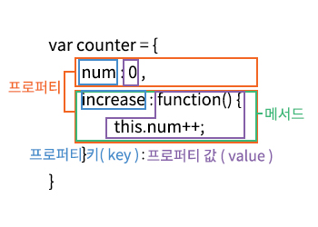

### ⭐️객체란?

- 자바스크립트는 객체 기반의 프로그래밍 언어이며, 자바스크립트를 구성하는 거의 “모든 것”이 객체다.
- 원시 값을 제외한 나머지 값(함수, 배열, 정규 표현식)은 모두 객체다.
- 원시 타입 → 단 하나의 값 , 객체 타입 → 다양한 타입의 값
- 원시 타입의 값 → 변경 불가능한 값, 객체 타입의 값 → 변경 가능한 값
- 객체는 0개 이상의 프로퍼티로 구성된 집합이며, 프로퍼티는 키(key)와 값(value)으로 구성된다.

`var person = { key : ‘값’ }`

→ 객체는 프로퍼티의 집합


→ 객체의 프로퍼티의 메서드



→ 객체 = 프로퍼티 + 메서드로 구성된 집합체 , 프로퍼티와 메서드의 역할

- 프로퍼티 : 객체의 상태를 나타내는 값
- 메서드 : 프로퍼티(상태 데이터)를 참조하고 조작할 수 있는 동작

→ 객체는 객체의 상태를 나타내느 값과 프로퍼티를 참조하고 조작할 수 있는 동작을 모두 포함할 수 있기 때문에 상태와 동작을 하나의 단위로 구조화할 수 있어 유용하다.

### ⭐️객체 리터럴에 의한 객체 생성

<aside>
🔑

인스턴스 Instance

- 클래스 - 객체 생성을 위한 설계도
- 객체 - 만들어진 데이터 덩어리
- 인스턴스 - 클래스 기반으로 생성된 특정 객체

```jsx
// 클래스 정의 (설계도)
class Animal {
  constructor(name) {
    this.name = name;
  }

  speak() {
    console.log(`${this.name}가 소리를 낸다!`);
  }
}

// 1. 일반 객체 리터럴
const dog1 = { name: "멍멍이" };

// 2. 클래스 기반 객체 생성 (인스턴스 생성)
const dog = new Animal("멍멍이");
const cat = new Animal("야옹이");

// 메서드 사용
dog.speak(); // 멍멍이가 소리를 낸다!
cat.speak(); // 야옹이가 소리를 낸다!

// ? 뭐야 그럼 객체나 인스턴스나 그게 그거 아냐?
// 1번과 2번을 비교해보기
console.log(dog1 instanceof Animal); // false ❌ -> 데이터만 있는 객체 리터럴
console.log(dog instanceof Animal); // true ✅ -> speak 라는 기능(메서드) 포함
```

## 💡 개념 정리

| 개념         | 정의                                 | 예시                                      |
| ------------ | ------------------------------------ | ----------------------------------------- |
| **클래스**   | 객체 생성을 위한 **청사진, 설계도**  | `class Animal { ... }`                    |
| **객체**     | 실제로 만들어진 **데이터 덩어리**    | `const dog = new Animal("멍멍이")`        |
| **인스턴스** | 클래스 기반으로 생성된 **특정 객체** | `dog`, `cat`은 `Animal` 클래스의 인스턴스 |

</aside>

<aside>
😛

객체 생성 방법

- 객체 리터럴
- Object 생성자 함수
- 생성자 함수
- Object-create 메서드
- 클래스(ES6)

→ 객체를 생성해보자.

```jsx
var person = {
  name: "Lee", // 속성
  sayHello: function () {
    // 메서드
    console.log(`Hello/ My name is ${this.name}`);
  },
};
console.log(typeof person); // object
console.log(person); // { name:'Lee', sayHello: f }
```

→ 만약 중괄호 내에 프로퍼티를 정의하지 않으면 빈 객체가 생성

```jsx
var empty = {}; // 빈 객체
console.log(typeof empty); // object -> 빈 "객체"
```

! 주의 할점

**중괄호가 객체 리터럴이면 "값" → 세미콜론 붙이기!**

**중괄호가 코드 블록이면 "범위" → 세미콜론 안 붙이기!**

```jsx
// 말로는 모르겠어
1;
const person = { name: "유빈" }; // 세미콜론 객체 리터럴

2;
if (true) {
  let x = 1;
} // 여기 세미콜론 필요 없음 (코드블록)
```

다음으로 객체 리터럴의 외의 객체 생성 방식들로 모두 함수를 사용해 객체를 생성하는 것을 알아보자.

</aside>

### ⭐️프로퍼티

<aside>
🔥

- 객체는 프로퍼티의 집합이며, 프로퍼티는 키와 값으로 구성된다.
- 프로퍼티 나열은 쉼표( , ) 로 구분한다. → 마지막에는 굳이 안해도 되지만 해도 상관없다.

```jsx
var person = {
  // 프로퍼티 키는 name, 프로퍼티 값은 'Lee'
  name: "Lee",
  // 프로퍼티 키는 age, 프로퍼티 값은 20
  age: 20,
}; // 세미클론 붙이기

// 프로퍼티 키 : 빈 문자열을 포함하는 모든 문자열 또는 심벌 값 -> 식별자 역할
// 프로퍼티 값 : 자바스크립트에서 사용할 수 있는 모든 값
```

- 객체 프로퍼티 이름은 문자열이 기본, 문법에 안 맞는 이름이면 “따옴표” 쓰기

```jsx
const person = {
	name: "유빈",  // 문법에 맞음 키 따옴표 x
	age: 20,    // 문법에 맞음 키 따옴표 x
	"full name" : "황유빈" // 띄어쓰기 문법에 안 맞음 키 따옴표 O
	"1stPlace" : "숨참고딥다이브" // 숫자로 시작 문법에 안 맞음 키 따옴표 O

	// 따옴표 없으면 타입 에러 => 엔진이 연산자가 있는 표현식으로 착각함.

// 심벌 사용법
const mySymbol = Symbol("secret");
const obj = {
  [mySymbol]: "비밀이에요" // [] 안에 쓰면 Symbol도 프로퍼티 키 가능
};
```

- 계산된 프로퍼티 이름(ES6) 와 프로퍼티 키 동적 생성(ES5)

```jsx
// 1. ES5 방식 – 나중에 대입
// 👉 먼저 빈 객체를 만든 뒤,
// 나중에 key 값을 이용해서 프로퍼티를 추가
var obj = {};
var key = "hello";
obj[key] = "world";

// 2. ES6 방식 – 계산된 프로퍼티 이름
// 👉 객체를 선언할 때부터
// [] 안의 표현식을 계산해서 동적으로 키를 생성
var key = "hello";
var obj = { [key]: "world" };
```

- 프로퍼티 키에 문자열이나 심벌 외 값을 사용하면 암묵적 타입 변환을 통해 문자열이 된다.

```jsx
var foo = {
  0: 1, // 숫자
  1: 2,
  2: 3,
  // + length: 3 까지 있으면 유사 배열 객체!
};

console.log(foo); // { 0: 1, 1: 2, 2: 3 } 문자열

// 주의 1. : 예약어를 키로 사용하지는 맙시다!
// 주의 2. : 존재하는 프로퍼티 키를 중복 선언하면 나중에 선언한 프로퍼티가 덮어쓴다.
//           에러를 발생하지 않는다는 점!
```

</aside>

### ⭐️메서드

<aside>
😶‍🌫️

- 자바스크립트의 함수는 객체(일급 객체)다.
- 함수는 값으로 취급할 수 있기 때문에 프로퍼티 값으로 사용할 수 있다.
- 프로퍼티 값이 함수 일 경우 일반 함수와 구분하기 위해 메서드라 부른다. ( 객체에 묶여있음 )

```jsx
var circle = {
  radius: 5, // <- 프로퍼티

  // 원의 지름
  getDiameter: function () {
    // 메서드
    return 2 * this.radius; // this 는 circle을 가리킨다.
  },
};

console.log(circle.getDiameter()); // 10
```

</aside>

### ⭐️프로퍼티 접근

<aside>
🧛‍♂️

→ 프로퍼티에 접근하는 방법

- 마침표 프로퍼티 접근 연산자( . )를 사용하는 마침표 표기법
- 대괄호 프로퍼티 접근 연간자 ([ … ])를 사용하는 대괄호 표기법

```jsx
var person = {
	name: 'Lee',
	'last-name': 'Dee',
	1: 10
};

// 마침표 표기법에 의한 프로퍼티 접근.
console.log(person.name); // Lee

// 대괄호 표기법에 의한 프로퍼티 접근.
// 1. 대괄호 프로퍼티 접근 연산자 내부에 지정하는 프로퍼티 키는 반드시 따옴표로 감싼
//    문자열이여야 한다. -> 안그러면 엔진은 식별자로 해석.
// 2. 식별자 네이밍 규칙을 준수하지 않은 이름도 대괄호 표기법!
// 3. 숫자로 이루어진 문자열인 경우 따옴표 생략 가능.
console.log(person[name]); // 참조에러 name is not defined
console.log(person['name']); // Lee
person.'last-name'; // SyntaxError 대괄호 표기법으로 사용할것.
person.last-name;  // -> NaN 이부분은 복잡한데 간단하게 last 찾기 -> undefined
                  // -> name -> window 함수에 존재 기본값 '' 따라서 undefined + ''

// -> 규칙을 잘 이행함!
person.['last-name'] // -> 'Dee'
person[1]; // -> 10
person['1']; // -> 10

// 객체에 존재하지 않는 프로퍼티에 접근하면 undefined를 반환한다.
// ! 에러는 반환하지 않음
console.log(person.age); // undefined
```

</aside>

### ⭐️프로퍼티 값 갱신

<aside>
📌

→ 이미 존재하는 프로퍼티에 값을 할당하면 프로퍼티 값이 갱신된다.

```jsx
var person = {
  name: "Lee",
};

// person 객체에 name 프로퍼티가 존재하므로 name 프로퍼티의 값이 갱신된다.
person.name = "Kim";

console.log(person); // { name : 'Kim' } // name 프로퍼티의 값이 갱신
```

</aside>

### ⭐️프로퍼티 동적 생성

<aside>
🛠

→ 존재하지 않는 프로퍼티에 값을 할당하면 프로퍼티가 동적으로 생성되어 추가되고 값이 할당된다.

```jsx
var person = {
  name: "Lee",
};

// person 객체에는 age 프로퍼티가 존재하지 않는다.
// person 객체에 age 프러퍼티가 동적으로 값이 할당된다.
person.age = 20; // -> person 객체에 age 값 동적 할당.

console.log(person); // -> { name: 'Lee' , age: 20 }
```

</aside>

### ⭐️프로퍼티 삭제

<aside>
❌

→ delete 연산자는 객체의 프로퍼티를 삭제한다.

- delete 연산자의 피연산자는 프로퍼티 값에 접근할 수 있는 표현식이여야 한다.
- 존재하지 않는 프로퍼티를 삭제하면 아무런 에러 없이 무시

```jsx
var person = {
  name: "Lee",
};

// 프로퍼티 동적 생성
person.age = 20;

// person 객체에 존재하는 프로퍼티 age 삭제
delete person.age;

// person 객체에 존재하지 않는 프로퍼티 address 삭제
// 에러 발생하지 않음 그저 무시됨.
delete person.address;

console.log(person); // { name: 'Lee'}
```

</aside>

### ⭐️ES6에서 추가된 객체 리터럴의 확장 기능

### **📌 프로퍼티 축약 표현**

<aside>
🧨

→ 프로퍼티 축약 표현 ES5 vs ES6

```jsx
// ES5
var x = 1,
  y = 2;
var obj = {
  x: x,
  y: y,
};
console.log(obj); // { x: 1, y: 2 }

//ES6
let x = 1,
  y = 2;

//프로퍼티 축약 표현
const obj = { x, y };
console.log(obj); // { x: 1, y: 2 }
```

</aside>

### **📌 계산된 프로퍼티 이름**

<aside>
💻

→ 문자열 또는 문자열로 타입 변환할 수 있는 값으로 평가되는 표현식을 사용해 프로퍼티 키를 동적으로 생성 할 수도 있다. 단, 프로퍼티 키로 사용할 표현식을 대괄호 ([ … ])로 묶어야 한다.
이를 프로퍼티 이름이라 한다.

→ 계산된 프로퍼티 이름으로 프로퍼티 키를 동적 생성하기 ES5 vs ES6

```jsx
// ES5
var prefix = "prop";
var i = 0;

var obj = {};

// 계산된 프로퍼티 이름으로 프로퍼티 키 동적 생성
obj[prefix + "-" + ++i] = i; // 'prop' + '-' + 1  = prop-1 : 1
obj[prefix + "-" + ++i] = i; // 'prop' + '-' + 2  = prop-2 : 2
obj[prefix + "-" + ++i] = i; // 'prop' + '-' + 3  = prop-3 : 3

console.log(obj); // { prop-1 : 1, prop-2: 2, prop-3: 3 }

//ES6
const prefix = "prop";
let i = 0;

// 객체 리터럴 내부에서 계산된 프로퍼티 이름으로 키를 동적 생성
const obj = {
  [`${prefix} - ${++i}`]: i, // 'prop' + '-' + 1  = prop-1 : 1
  [`${prefix} - ${++i}`]: i, // 'prop' + '-' + 2  = prop-2 : 2
  [`${prefix} - ${++i}`]: i, // 'prop' + '-' + 3  = prop-3 : 3
};

console.log(obj); // { prop-1 : 1, prop-2: 2, prop-3: 3 }
```

</aside>

### **📌 메서드 축약 표현**

<aside>
🚧

→ 메서드 축약 표현 ES5 vs ES6

```jsx
// ES5
var obj = {
  name: "Lee",
  sayHi: function () {
    console.log("Hi! " + this.name);
  },
};

obj.sayHi(); // Hi! Lee

//ES6
const obj = {
  name: "Lee",
  // 메서드 축약 표현
  sayHi() {
    console.log("Hi! " + this.name);
  },
};

obj.sayHi(); // Hi! Lee
```

</aside>
