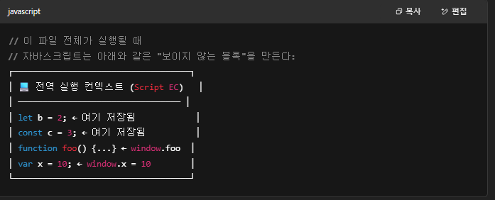

# 15장 let, const 키워드와 블록 레벨 스코프

날짜: 2025년 5월 14일

# 15.1 var 키워드로 선언한 변수의 문제점

<aside>
💡

ES5까지  변수를 선언할 수 있는 방법은 var 키워드 뿐이였다 . 

var 키워드로 선언된 변수의 특징으로

1. 변수 중복 선언이 가능하다.
2. 함수의 코드 블록만을 지역 스코프로 인정한다.
3. 변수 호이스팅에 의해 변수 선언문이 스코프의 선두로 끌어 올려진 것처럼 동작한다
</aside>

## 15.1.1 변수 중복 선언 허용

[ 예제 15 - 01 ]

```jsx
var x = 1;
var y = 1;

// var 키워드로 선언된 변수는 같은 스코프 내에서 중복 선언을 허용한다.
// 초기화문이 있는 변수 선언문은 자바스크립트 엔진에 의해 var 키워드가 없는 것처럼 동작한다.
var x  = 100;
// 초기화문이 없는 변수 선언문은 무시된다.
var y;

console.log(x); // 100
console.log(y); // 1
```

<aside>
💡

위 코드에서 보면 알 수 있듯이 

var의 문제점이 존재한다. 혹여나 자신의 실수로 이미 var로 선언된 변수명을 한번 더 사용하게 되면 의도치 않게 먼저 선언된 변수 값이 변경되는 부작용이 발생한다.

</aside>

## 15.1.2 함수 레벨 스코프

[ 예제 15 - 02 ]

```jsx
var x = 1;

if(true) {
// x는 전역 변수다. 이미 선언된 전역 변수 x가 있으므로 x 변수는 중복 선언된다.
// 이는 의도치 않게 변수값이 변경되는 부작용을 발생시킨다.
var x = 10;
}

console.log(x); // 10
```

[ 예제 15 - 03 ] 

```jsx
var i = 10;
// 여기서 다른 작업을 위해 i에 10을 대입하여 작업했다고 가정

// 여기서 까먹어 버리고 반복문을 사용할 때 주로 사용하는 i를 다시 선언해버림 !!
// for문에서 선언한 i는 전역 변수다. 이미 선언된 전역 변수 i가 있으므로 중복 선언된다.
for(var i = 0; i < 5; i++){
	console.log(i); // 0 1 2 3 4
	}
	
// 의도치 않게 i 변수의 값이 변경되었다.
console.log(i); // 5
```

## 15.1.3 변수 호이스팅

[ 예제 15 - 04 ]

```jsx
// 이 시점에는 변수 호이스팅에 의해 이미 foo 변수가 선언되었다. (1. 선언 단계)
// 변수 foo는 undefined로 초기화된다. (2. 초기화 단계)
console.log(foo); // undefined

// 변수에 값을 할당 (3. 할당 단계)
foo = 123;

console.log(foo); // 123

// 변수 선언은 런타임 이전에 자바스크립트 엔진에 의해 암묵적으로 실행된다. 
var foo;
```

<aside>
💡

자바 스크립트에서는 

1. var foo; 선언을 스코프의 최상단으로  끌어올린다. ( 변수를 선언만 함!!  **변수에 값 할당 XX )**
2. var foo을 통해 변수명 선언만 하였기 때문에 값이 할당되어있지 않아서 
console.log(foo); 을 실행하였을 때 undefined 값이 출력된 것
3. 다음 줄에 foo = 123; 을 통해 선언된 foo에 123값을 할당
4. console.log(foo); 의 출력 값은 123이 출력 된다.

**즉,  var로 선언된 변수는 선언은 호이스팅되어 스코프의 최상단에 선언되지만, 값이 할당되지 않으면 undefined의 값을 가짐**

</aside>

# 15.2 let 키워드

## 15.2.1 변수 중복 선언 금지

[ 예제 15 - 05 ] 

```jsx
var foo = 123;
// var 키워드로 선언된 변수는 같은 스코프 내에서 중복 선언을 허용한다.
// 아래 변수 선언문은 자바스크립트 엔진에 의해 var 키워드가 없는 것처럼 동작한다.
var foo = 456

let bar = 123;
// let이나 const 키워드로 선언된 변수는 같은 스코프 내에서 중복 선언을 허용하지 않는다.
let bar = 456; // SyntaxError : Identifier 'bar' has already been declared
```

## 15.2.2 블록 레벨 스코프

[ 예제 15 - 06 ]

```jsx
let foo = 1; // 전역 변수
{
	let foo = 2; // 지역 변수
	let bar = 3; // 지역 변수
}
console.log(foo); // 1
console.log(bar); // ReferenceError : bar is not defind
```

let 키워드로 선언된 변수는 블록 레벨 스코프를 따른다. 

## 15.2.3 변수 호이스팅

[ 예제 15 - 07 ]

```jsx
console.log(foo); // ReferenceError : foo is not defined
let foo;
```

[ 예제 15 - 08 ]

```jsx
// var 키워드로 선언한 변수는 런타임 이전에 선언 단계와 초기화 단계가 실행된다.
// 따라서 변수 선언문 이전에 변수를 참조할 수 있다.
console.log(foo); // undefined

var foo;
console.log(foo); // undefined

foo = 1; // 할당문에서 할당 단계가 실행된다.
console.log(foo); // 1
```

[ 예제 15 - 09 ]

```jsx
// 런타임 이전에 선언 단계가 실행된다. 아직 변수가 초기화되지 않았다.
// 초기화 이전의 일시적 사각지대에서는 변수를 참조할 수 없다.
console.log(foo); // ReferenceError: foo is not defined

let foo; // 변수 선언문에서 초기화 단계가 실행된다.
console.log(foo); // undefined

foo = 1; // 할당문에서 할당 단계가 실행된다.
console.log(foo); // 1
```

<aside>
💡

오른쪽 사진을 봐보자 !

let 키워드로 선언한 변수의 생명 주기는 var 키워드로 선언한 변수와는 다른 점이 있다.

일시적 사각지대(TDZ)가 존재한다는 것이다.

let으로 선언한 변수도 호이스팅을 진행하여 코드 실행 전에 변수 선언을 위로 끌어올린다.

하지만 var처럼 초기화를 바로 진행하지 않고 초기화 전에 변수에 접근하면 에러(RefferenceError)을 출력하도록 막아 놓은 구간이 일시적 사각지대(TDZ: Temporal Dead Zone)이다.

</aside>

[ 예제 15 - 10 ] 

```jsx
let foo = 1; // 전역 변수

{ 
	console.log(foo); // ReferenceError: Cannot access 'foo' before initialization
	let foo = 2; // 지역 변수
}
```

<aside>
💡

호이스팅이 발생하지 않는다면 let foo = 1로 선언된  전역변수가  console.log(foo); 의 출력에서 1이 출력 되었어야 했다. 

하지만 ReferenceError을 출력하는 것으로 보아 **let도 변수 호이스팅을 한다는 것을 알 수 있다 !!** 

</aside>

## 15.2.4 전역 객체와 let

var 키워드로 선언한 전역 변수와 전역 함수, 그리고 선언하지 않은 변수에 값을 할당한 **암묵적 전역(뒷 내용)**은 전역 객체 window의 프로퍼티가 된다. 전역 객체의 프로퍼티를 참조할 때 window를 생략할 수 있다.

[ 예제 15 - 11 ]

```jsx
// 이 에제는 브라우저 환경에서 실행해야 한다.

// 전역 변수
var x = 1;
// 암묵적 전역
y = 2;
// 전역 함수
function foo() {}

// var 키워드로 선언한 전역 변수는 전역 객체 window의 프로퍼티다.
console.log(window.x); // 1
// 전역 객체 window의 프로퍼티는 전역 변수처럼 사용할 수 있다.
console.log(x); // 1

// 암묵적 전역은 전역 객체 window의 프로퍼티다.
console.log(window.y); // 2
console.log(y); // 2

// 함수 선언문으로 정의한 전역 함수는 전역 객체 window의 프로퍼티다.
console.log(window.foo); // f foo() {}
// 전역 객체 window의 프로퍼티는 전역 변수처럼 사용할 수 있다.
console.log(foo); // f foo() {}
```

<aside>
💡

암묵적 전역에 관해 가볍게만 알아보자 !

암묵적 전역이란 ?

 ⇒ 변수를 선언하지 않고 그냥 사용하는 것을 암묵적 전역이라고 한다.

쉽게 이해하자면 학교에서 이름표를 붙이지 않은 물건을 아무 데나 던져 놓는 것과 같다.

만약 a = 10; 처럼 변수를 선언하지 않고 값을 대입하면 그것을 자동으로 window 객체의 전역 변수로 만들어 버린다.

즉, a = 10; 은 내부적으로는 window.a = 10; 이 되는 것이다.

자바스크립트 내에서는 var, let, const 등 어떠한 키워드 없이 변수에 값을 할당하면, 자바스크립트 내에서는 **암묵적 전역 변수** 로 간주하고, window 객체에 프로퍼티로 추가해버린다.

</aside>

[ 예제 15 - 12 ]

```jsx
// 이 예제는 브라우저 환경에서 실행해야 한다.
let x = 1;

// let, const 키워드로 선언한 전역 변수는 전역 객체 window의 프로퍼티가 아니다.
console.log(window.x) // undefined
console.log(x); // 1
```

<aside>
💡

let 키워드로 선언한 전역 변수는 전역 객체의 프로퍼티가 아니다. 즉, var 변수로 선언했을 때 처럼 [window.foo](http://window.foo) 처럼 접근할 수 없다.

let 전역 변수는 보이지 않는 개념적인 블록 내에 존재한다. (뒷 내용인 실행 컨텍스트에서 자세히 알 수 있다.)

실행 컨텍스트를 살짝만 맛만 본다면

var는 공용 보관함(window)에 이름표 붙이고 넣어두는 것이고

let, const는 비공개 보관함(실행 컨텍스트)에 넣는 것이라고 이해하고 있으면 될 것 같다 !

</aside>

### 보이지 않는 개념적인 블록이란



# 15.3 const 키워드

<aside>
💡

const 키워드는 상수를 선언하기 위해 사용한다.

</aside>

## 15.3.1 선언과 초기화

[ 예제 15 - 13 ] 

```jsx
const foo = 1; // const 키워드로 선언한 변수는 반드시 선언과 동시에 초기화해야 한다.
```

[ 예제 15 - 14 ]

```jsx
const foo; // SyntaxError: Missing initializer in const declaration
// 선언과 동시에 초기화를 하지 않았기 때문에 에러가 발생
```

[ 예제 15 - 15 ]

```jsx
{ 
	// 변수 호이스팅이 발생하지 않는 것처럼 동작한다.
	console.log(foo); // ReferenceError: Cannot acess 'foo' before initialization
	const foo = 1;
	console.log(foo); // 1
}

// 블록 레벨 스코프를 갖는다.
console.log(foo); // ReferenceError: foo is not defined
```

## 15.3.2 재할당 금지

[ 예제 15 - 16 ] 

```jsx
const foo = 1;
foo = 2; // TypeError: Assignment to constant variable.
```

## 15.3.3 상수

<aside>
💡

상수 란?

변수와 반대되는 개념으로 변하지 않는 수를 말한다.

자바스크립트 내에서의 상수는 재할당이 금지된 변수라고 한다.

</aside>

[ 예제 15 - 17 ]

```jsx
// 세전 가격
let preTaxPrice = 100;

// 세후 가격
// 0.1의 의미를 명확히 알기 어렵기 때문에 가독성이 좋지 않다.
let afterTaxPrice = preTaxPrice + (preTaxPrice * 0.1);

console.log(afterTaxPrice); // 110
```

[ 예제 15 - 18 ]

```jsx
// 세율을 의미하는 0.1은 변경할 수 없는 상후로서 사용될 값이다.
// 변수 이름을 대문자로 선언해 상수임을 명확히 나타낸다.
const TAX_RATE = 0.1;

// 세전 가격
let preTaxPrice = 100;

// 세후 가격
let afterTaxPrice = preTaxPrice + (preTaxPrice * TAX_RATE);

console.log(afterTaxPrice); // 110
```

## 15.3.4 const 키워드와 객체

[ 예제 15 - 19 ]

```jsx
const person = {
	name : 'Lee'
	};
	
	// 객체는 변경 가능한 값이다. 따라서 재할당 없이 변경이 가능하다.
person.name = 'Kim';

console.log(person); // { name: "Kim"}
```

<aside>
💡

const 키워드로 선언된 변수에는 값을 할당한 경우 값을 변경할 수 없었다. 하지만 

const 키워드로 선언된 변수에 객체를 할당한 경우 값을 변경할 수 있다.

위 예제에서 person은 객체 자체를 참조하는 주소 값을 갖고 있기 때문에 변경 할 수 있는 것이다.

여기서 알 수 있는 점은 const는 주소 값을 바꿀 수 없게 막아두는 것이지 그 주소 안의 내용물은 자유롭게 변경할 수 있다.

</aside>

# 15.4 var vs. let vs. const

변수 선언에는 기본적으로 const를 사용하고 let은 재할당이 필요한 경우에 한정해 사용하는 것이 좋다. 

const 키워드를 사용하면 의도치 않은 재할당을 방지하기 때문에 좀 더 안전하다.

var와 let, const 키워드는 다음과 같이 사용하는 것을 권장한다.

- ES6을 사용한다면 var 키워드를 사용하지 않는다.
- 재할당이 필요한 경우에 한정해 let 키워드를 사용한다. 이때 변수의 스코프는 최대한 좁게 만든다.
- 변경이 발생하지 않고 읽기 전용으로 사용하는(재할당이 필요 없는 상수) 원시 값과 객체에는 const 키워드를 사용한다. const 키워드는 재할당을 금지하므로 var, let 키워드보다 안전하다.

변수를 선언하는 시점에는 재할당이 필요할지 잘 모르는 경우가 많다. 그리고 객체는 의외로 재할당하는 경우가 드물다. 따라서 변수를 선언할 때는 일단 const 키워드를 사용하자 !

반드시 재할당이 필요하다면 그때 const 키워드를 let으로 변경해도 늦지 않다.