목표: 실행 컨텍스트(자바스크립트의 동작원리를 담고 있는 핵심 개념)을 이해하자!!

# 23.1 소스코드의 타입

| 소스코드의 타입 | 설명                                                                                  |
| --------------- | ------------------------------------------------------------------------------------- |
| 전역 코드       | 전역에 존재하는 소스 코드. 전역에 정의된 함수, 클래스 등의 내부 코드는 포함X          |
| 함수 코드       | 함수 내부에 존재하는 소스코드. 함수 내부에 중첩된 함수, 클래스 등의 내부 코드는 포함X |
| eval 코드       | 빌트인 전역 함수인 eval 함수에 인수로 전달되어 실행되는 소스코드                      |
| 모듈 코드       | 모듈 내부에 존재하는 소스코드. 모듈 내부의 함수, 클래스 등의 내부 코드는 포함X        |

<aside>
📖

전역코드

- 전역변수를 관리하기 위해 최상위 스코프인 전역 스코프를 생성해야 한다
- var 키워드로 선언된 전역 변수와 함수 선언문으로 정의된 전역 함수를 전역 객체의 프로퍼티와 메서드로 바인딩하고 참조하기 위해 전역 객체와 연결되어야 한다
- 이를 위해, 전역 코드가 평가되면 전역 실행 컨텍스트가 생성된다
</aside>

<aside>
📖

함수코드

- 지역 스코프를 생성하고 지역변수, 매개변수, arguments 객체를 관리해야 한다
- 생성한 지역 스코프를 전역 스코프에서 시작하는 스코프 체인의 일원으로 연결해야 한다
- 이를 위해, 함수 코드가 평가되면 함수 실행 컨텍스트가 생성된다
</aside>

<aside>
📖

eval 코드

- strict mode(엄격모드)에서 자신만의 독자적인 스코프를 생성한다
- 이를 위해, eval코드가 평가되면 실행 컨텍스트가 생성된다
</aside>

<aside>
📖

모듈 코드

- 모듈별로 독립적인 모듈 스코프를 생성
- 이를 위해 모듈 코드가 평가되면 모듈 실행 컨텍스트가 생성된다
</aside>

### 실행 컨텍스트 생성 흐름도


[그림 23-1: 소스코드를 평가하여 실행 컨텍스트를 생성한다.]

# 23.2 소스코드의 평가와 실행

**자바스크립트 엔진은 소스코드를 2단계로 나누어 처리:**

### 1단계: 소스코드 평가

- 실행 컨텍스트 생성
- `변수, 함수 등의 선언문`만 먼저 실행
- 생성된 식별자들을 실행 컨텍스트의 스코프에 등록

### 2단계: 소스코드 실행 (런타임)

- 선언문을 제외한 나머지 코드를 순차적으로 실행
- 변수/함수 참조 시 실행 컨텍스트의 스코프에서 검색
- 실행 결과(변수 값 변경 등)를 다시 스코프에 등록

**핵심**: 평가 단계에서 미리 선언문들을 처리해 두고, 실행 단계에서 그 정보를 바탕으로 코드를 실행하는 구조


```mermaid
flowchart LR
    %% 노드 정의
    A["1.소스코드의 평가<br/>(선언문)"]:::orange
    B[실행 컨텍스트]:::green
    C["2.소스코드의 실행<br/>(선언문 이외의 문)"]:::orange

    %% 화살표 정의
    A -->|평가 결과| B
    B -->|실행에 필요한 정보| C
    C -->|실행 결과| B

    %% 스타일 정의
    classDef orange fill:#f6b042,stroke:#333,stroke-width:1px,color:#000
    classDef green fill:#93c83d,stroke:#333,stroke-width:1px,color:#000
```

[예제 23-01]

```jsx
var x;
x = 1;
```

<aside>
📖

var x; 가 먼저 실행 이때 x는 실행 컨텍스트가 관리하는 스코프에 등록되고, undefined로 초기화

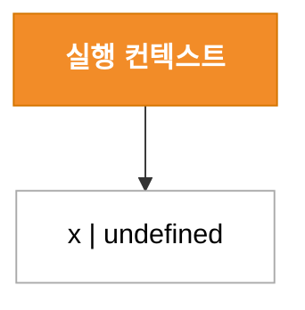
```mermaid
graph TD
    style ECHeader fill:#f28c28,stroke:#d47500,color:white,font-weight:bold
    style Row fill:#ffffff,stroke:#aaaaaa,color:#000000

    ECHeader["실행 컨텍스트"]
    Row["x | undefined"]

    ECHeader --> Row

```

소스코드 평가 과정이 끝나면 소스코드 실행 과정 시작

실행 과정에서 변수 할당문인 `x=1;` 가 실행

이때, x변수가 선언된 변수인지 확인

x는 스코프에 등록이 되어있으므로 선언된 변수 → 1이라는 값을 할당

할당 결과를 실행 컨텍스트에 등록

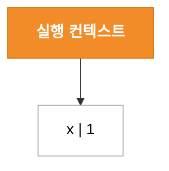
```mermaid
graph TD
    style ECHeader fill:#f28c28,stroke:#d47500,color:white,font-weight:bold
    style Row fill:#ffffff,stroke:#aaaaaa,color:#000000

    ECHeader["실행 컨텍스트"]
    Row["x | 1"]

    ECHeader --> Row

```

</aside>

# 23.3 실행 컨텍스트의 역할

`실행 컨텍스트`: 소스코드를 실행하는 데 필요한 환경을 제공하고 코드의 실행 결과를 실제로 관리하는 영역

( `식별자`와 `스코프`는 실행 컨텍스트의 렉시컬 환경으로 관리)

(`코드 실행 순서`는 실행 컨텍스트 스택으로 관리)

- [ 예제 23-02 ]

  ```tsx
  // 전역 변수 선언
  const x = 1;
  const y = 2;

  // 함수 정의
  function foo(a) {
    //지역 변수 선언
    const x = 10;
    const y = 20;

    // 메서드 호출
    console.log(a + x + y); // 130
  }

  // 함수 호출
  foo(100);

  // 메서드 호출
  console.log(x + y); // 3
  ```

    <aside>
    📖
    
    1. 전역 코드 평가
    - 전역 코드 평가 과정을 거치며 전역 코드를 실행하기 위한 준비를 한다
    - 소스 코드 평가 과정에서는 선언문만 먼저 실행
    - 변수 선언문과 함수 선언문 실행 → 전역 스코프에 등록
    - 이때, var 키워드로 선언된 전역 변수와 함수 선언문으로 선언된 전역 함수는 전역 객체의 프로퍼티와 메서드가 된다
    </aside>
    
    <aside>
    📖
    
    1. 전역 코드 실행
    - 런타임 시작
    - 전역 변수에 값이 할당되고 함수가 호출된다
    - 함수가 호출되면, 순차적으로 실행되던 전역 코드의 실행을 일시 중단하고 코드 실행 순서를 변경하여 함수 내부로 진입한다
    </aside>
    
    <aside>
    📖
    
    1. 함수 코드 평가
    - 함수 내부로 진입하면 함수 내부의 문들을 실행하기 전에 코드 평가 과정을 거침
    - 이때, 매개변수와 지역 변수 선언문이 먼저 실행 → 지역 스코프에 등록
    - 또한, 함수 내부에서 지역 변수처럼 사용할 수 있는 arguments 객체가 생성되어 지역 스코프에 등록, this 바인딩도 결정
    </aside>
    
    <aside>
    📖
    
    1. 함수 코드 실행 
    - 함수 코드 순차적으로 실행 → 매개 변수와 지역 변수에 값이 할당되고 `console.log` 메서드 호출
    - 식별자인 `console`을 **스코프 체인**을 통해 검색
    - `log` 프로퍼티를 `console` 객체의 **프로토타입 체인**을 통해 검색
    - `console.log` 메서드에 인수로 전달된 표현식 a+x+y가 평가된다(**스코프 체인을 통해 검색**)
    - `console.log` 메서드의 실행이 종료되면, 함수 호출 이전으로 되돌아가 전역 코드 실행을 계속한다
    </aside>

<aside>
📖

1. 선언에 의해 생성된 모든 식별자(변수, 함수, 클래스)를 스코프를 구분하여 등록하고 상태 변화 (식별자에 바인딩 된 값의 변화)를 지속적으로 관리 할 수 있어야 한다
2. 스코프는 중첩 관계에 의해 스코프 체인을 형성해야 한다. 즉, 스코프 체인을 통해 상위 스코프로 이동하며 식별자를 검색할 수 있어야 한다
3. 현재 실행 중인 코드의 실행 순서를 변경(예를 들어, 함수 호출에 의한 실행 순서 변경) 할 수 있어야 하며 다시 되돌아갈 수도 있어야 한다
</aside>

# 23.4 실행 컨텍스트 스택

실행 컨텍스트 스택은 코드의 실행 순서를 관리

실행 컨텍스트 스택의 최상위에 존재하는 실행 컨텍스트는 언제나 현재 실행 중인 코드의 실행 컨텍스트다

- [ 예제 23-03 ]

  ```tsx
  const x = 1;
  function foo() {
    const y = 2;

    function bar() {
      const z = 3;
      console.log(x + y + z);
    }
    bar();
  }
  foo(); //6
  ```

  
    <aside>
    📖
    
    1. 전역 코드의 평가와 실행
    - 전역 코드를 평가하여 전역 실행 컨텍스트 생성, 실행 컨텍스트 스택에 푸시한다
    - 전역변수 x와 전역함수 foo는 전역 실행 컨텍스트에 등록
    </aside>
    
    <aside>
    📖
    
    1. foo 함수 코드의 평가와 실행
    
    평가 단계:
    
    - foo함수가 호출되면 코드의 제어권이 foo함수 내부로 이동
    - foo 함수 내부의 함수 코드를 평가하여 foo 함수 실행 컨텍스트를 생성하고 실행 컨텍스트 스택에 푸시
    - foo 함수의 지역  변수 y와 중첩 함수 bar가 foo 함수 실행 컨텍스트에 등록
    
    실행 단계:
    
    - `bar()` 호출 → `bar` 실행 컨텍스트가 **스택에 push**
    </aside>
    
    <aside>
    📖
    
    1. bar 함수 코드의 평가와 실행
    
    평가 단계:
    
    - 코드의 제어권이 bar 함수 내부로 이동
    - bar 함수 내부 코드 평가, bar 함수 실행 컨텍스트 생성, 실행 컨텍스트 스택에 푸시
    - 지역 변수 `z` 등록됨
    
    실행 단계:
    
    - `console.log(x + y + z)` 실행
        - 렉시컬 환경을 따라 상위 컨텍스트(`foo`, `전역`)에 접근
        - `x = 1`, `y = 2`, `z = 3` → 결과: `6` 출력
    </aside>
    
    <aside>
    📖
    
    1. foo 함수 코드로 복귀
    - `bar` 실행 완료 후 → `bar` 실행 컨텍스트 pop
    - 제어권 foo 함수로 넘어감
    </aside>
    
    <aside>
    📖
    
    1. 전역 코드로 복귀
    - `foo()` 호출이 끝났으므로 전역 코드로 돌아옴
    - 더 이상 실행할 코드 없음 → **프로그램 종료**
    </aside>

# 23. 5 렉시컬 환경

렉시컬 환경 : 식별자와 식별자에 바인딩 된 값, 상위 스코프에 대한 참조를 기록하는 자료구조로 실행 컨텍스트를 구성하는 컴포넌트, 스코프와 식별자를 관리

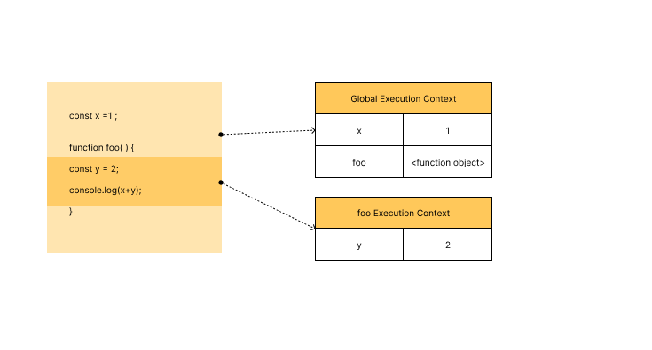

렉시컬 환경은 스코프를 구분하여 식별자를 등록하고 관리하는 저장소 역할을 하는 렉시컬 스코프의 실체 (키와 값을 갖는 객체의 형태의 스코프를 생성)

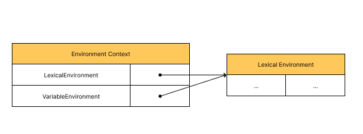

생성초기

- LexicalEnvironment 컴포넌트와 VariableEnvironment 컴포넌트는 하나의 동일한 렉시컬 환경을 참조

이후 몇가지 상황을 만나면 VariableEnvironment 컴포넌트를 위한 새로운 렉시컬 환경을 생성

이때부터, LexicalEnvironment 컴포넌트와 VariableEnvironment 컴포넌트는 내용이 달라지는 경우도 있음

(책에서는 렉시컬 환경으로 통일해서 간략하게 설명)

- 렉시컬 환경의 구성
  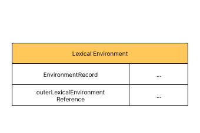

1. 환경 레코드

스코프에 포함된 식별자를 등록하고 등록된 식별자에 바인딩된 값을 관리하는 저장소다.

환경 레코드는 소스코드의 타입에 따라 관리하는 내용에 차이가 있다.

1. 외부 렉시컬 환경에 대한 참조

외부 렉시컬 환경에 대한 참조는 상위 스코프를 가리킨다. 이때 상위 스코프란 외부 렉시컬 환경, 즉 해당 실행 컨텍스트를 생성한 소스코드를 포함하는 상위 코드의 렉시컬 환경을 말한다.
외부 렉시컬 환경에 대한 참조를 통해 단방향 링크드 리스트인 스코프 체인을 구현한다.

# 23.6 실행 컨텍스트의 생성과 식별자 검색 과정

- [ 예제 23-04 ]

  ```jsx
  var x = 1;
  const y = 2;

  function foo(a) {
    var x = 3;
    const y = 4;

    function bar(b) {
      const z = 5;
      console.log(a + b + x + y + z);
    }
    bar(10);
  }
  foo(20); // 42
  ```

# 23.6.1 전역 객체 생성

- 전역 객체는 전역 코드가 평가되기 이전에 생성
- 전역 객체에는 `빌트인 전역 프로퍼티`와 `빌트인 전역 함수` 그리고 `표준 빌트인 객체`가 추가되며 동작 환경에 따라 클라이언트 사이드 Web API 또는 특정 환경을 위한 호스트 객체를 포함한다
- 전역 객체도 Object.prototype을 상속받는다 즉, `전역 객체도 프로토타입 체인의 일원`

```jsx
// Object.prototype.toString
window.toString(); // -> "[Object Window]"

window.__proto__.__proto__.__proto__.__proto__ === Object.prototype; // ->true
```

# 23.6.2 전역 코드 평가

- 전역 코드 평가의 흐름

1. 전역 실행 컨텍스트 생성
2. 전역 렉시컬 환경 생성

   2.1 전역 환경 레코드 생성

   2.1.1. 객체 환경 레코드 생성

   2.1.2. 선언적 환경 레코드 생성

   2.2 this 바인딩

   2.3 외부 렉시컬 환경에 대한 참조 결정

   [23-9 전역 실행 컨텍스트와 렉시컬 환경]

   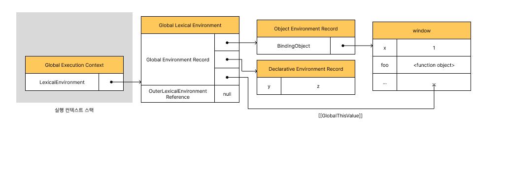

## 1. 전역 실행 컨텍스트 생성

- 비어있는 전역 실행 컨텍스트를 생성하여 실행 컨텍스트 스택에 푸시
- 이때, 전역 실행 컨텍스트는 실행 컨텍스트 스택의 최상위 = 실행 중인 실행 컨텍스트가 된다
  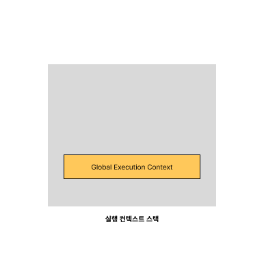

## 2. 전역 렉시컬 환경 생성

- 전역 렉시컬 환경을 생성하고 전역 실행 컨텍스트에 바인딩한다

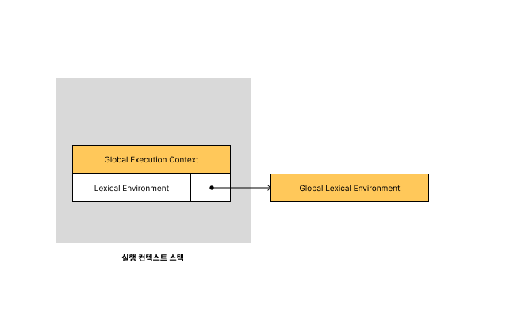

- 환경 레코드와 외부 렉시컬 환경에 대한 참조로 구성된다

### **2.1 전역 환경 레코드 생성**

- 전역 환경 레코드는 전역 변수를 관리하는 `전역 스코프`, 전역 객체의 `빌트인 전역 프로퍼티`와 `빌트인 전역 함수`, `표준 빌트인 객체`를 제공
- 전역 환경 레코드는 `객체 환경 레코드`와 `선언적 환경 레코드`로 구성되어 있다
- 전역 환경 레코드의 객체 환경 레코드와 선언적 환경 레코드는 서로 협력하여 `전역 스코프`와 `전역 객체`를 관리한다

**2.1.1. 객체 환경 레코드 생성 (var)**

- 객체 환경 레코드는 BindingObject 라고 부르는 객체와 연결된다
- 전역 평가 과정에서 `var 키워드로 선언한 전역 변수`와 함수 선언문으로 정의된 `전역 함수`는 전역 환경 레코드의 객체 환경 레코드에 연결된 BindingObject 를 통해 전역 객체의 프로퍼티와 메서드가 된다

```jsx
var x = 1;
const y = 2;

function foo (a) {

...
```

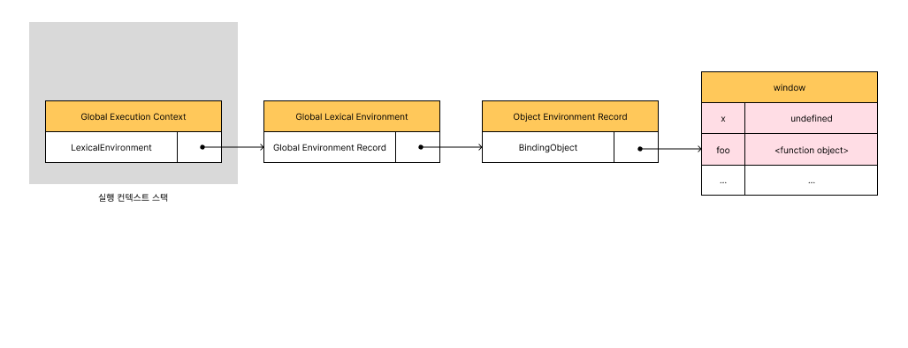

x 변수는 `선언`과 `초기화`가 동시에 진행 → 전역 객체에 변수 식별자를 키로 등록한 다음 암묵적으로 `undefined`를 바인딩

따라서 var 변수는 선언문 이전에도 참조가 가능하다 (`undefined`) → 함수 표현식도 이와 동일하게 동작 (전역 객체에 키로 등록하고 생성된 함수 객체를 즉시 할당)(변수 호이스팅이 발생하는 원인)

즉, 함수 선언문으로 정의한 함수는 함수 선언문 이전에 호출할 수 있다.

**2.1.2 선언적 환경 레코드 생성 (Let, Const)**

- let, const 키워드로 선언한 전역 변수는 `선언적 환경 레코드에 등록되고 관리된다`

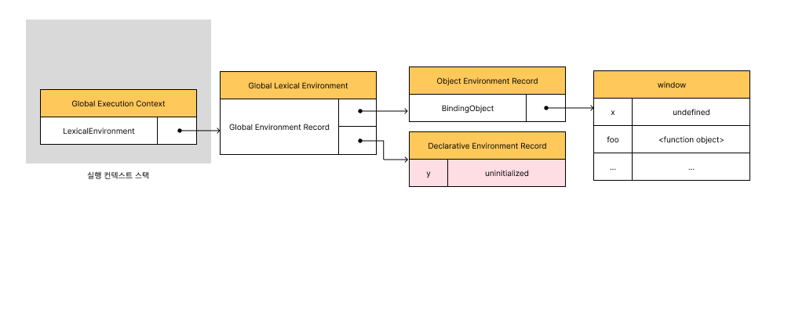

- ‘let, const는 개념적인 블록 내에 존재하게 된다’ 라고 했는데 여기서 개념적인 블록 = 전역 환경 레코드의 `선언적 환경 레코드`다
- 전역 변수 y는 let, const로 선언한 변수이므로, 전역 객체의 프로퍼티가 되지 않음 → window.y와 같이 전역 객체의 프로퍼티로서 참조 X
- `const` 변수는 ‘선언단계’와 ‘초기화 단계’로 분리되어 진행 → 즉, 변수 선언문에 도달하기 전까지 TDZ(일시적 사각지대)에 빠지게 된다
- 그림에서 uninitialized은 초기화 단계가 진행되지 않아 변수의 접근할 수 없는 상태 → 실제로 바인딩 된 것은 아님
- let, const도 변수 호이스팅이 발생하지만, TDZ에 빠지기 때문에 참조할 수 없는 상태

```jsx
let foo = 1; // 전역 변수
{
  // 호이스팅이 가능하기 때문에 값이 console.log(foo)의 값이 1로 나옴 (console만 있을때)
  console.log(foo);
  // 지역변수가 있을때 호이스팅이 여전히 발생하기 때문에 참조에러가 발생
  let foo = 2; // 지역변수
}
```

### 2.2 this 바인딩

- 전역 코드에서 this을 참조하면 전역 환경 레코드의 [[GlobalThisValue]] 내부 슬롯에 바인딩 되어 있는 객체가 반환

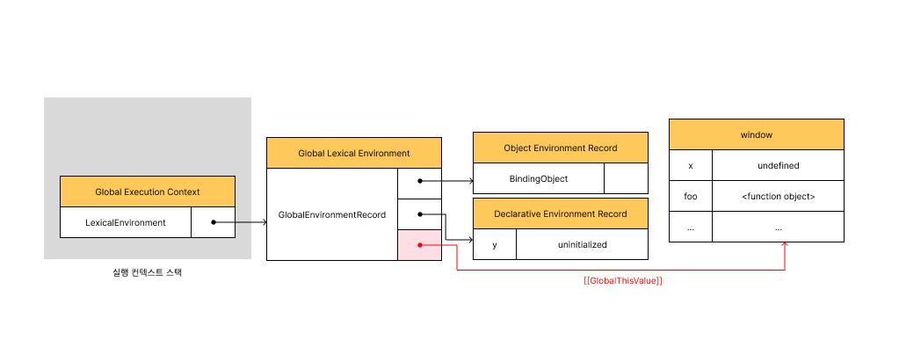

- 전역 환경 레코드를 구성하는 객체 환경 레코드와 선언적 환경 레코드에서는 this 바인딩이 X
- this 바인딩은 전역 환경 레코드와 함수 환경 레코드에만 존재
- (뒤에 설명~)

### 2.3 외부 렉시컬 환경에 대한 참조

- 외부 렉시컬 환경에 대한 참조는 현재 평가 중인 소스코드를 포함하는 외부 소스코드의 렉시컬 환경=상위 스코프를 가리킴 → 이를 통해 단방향 링크드 리스트인 단방향 스코프 체인 구성
- 현재 평가 중인 소스코드에서는 전역코드를 포함하는 소스코드가 없음 → null이 할당 → 이는 렉시컬 환경이 스코프 체인의 종점에 존재함을 의미
  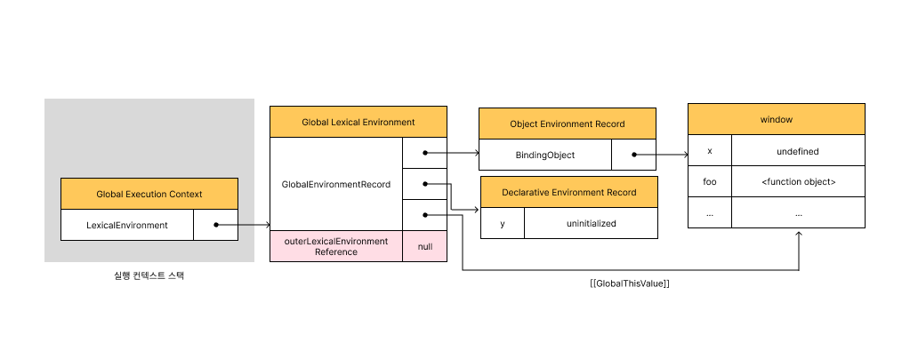

# 23.6.3 전역 코드 실행

- 전역 코드가 순차적으로 실행되기 시작
- 전역 변수 x,y에 값이 할당된다
- foo 함수가 호출

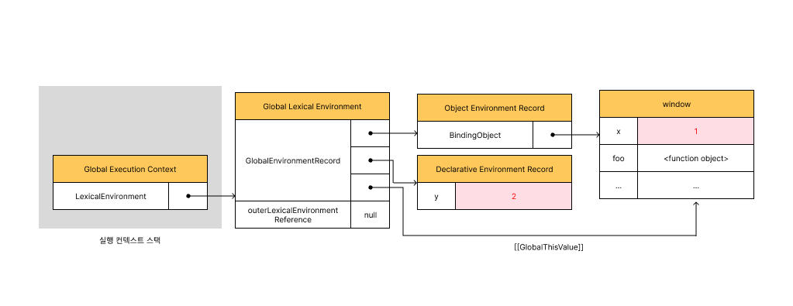

- 변수 할당문 or 함수 호출문을 실행하려면 선언된 식별자인지 확인해야 함 (선언되지 않은 식별자→ 호출 x)
- 다른 스코프에 같은 이름으로 여러 개 존재 가능 → 식별자 결정을 해야 함
- 식별자 결정 : 어느 스코프의 식별자를 참조하면 되는지 결정할 필요가 있음
- 식별자 결정을 위해 검색할 때, 실행 중인 실행 컨텍스트에서 식별자를 검색하기 시작 → 실행 컨텍스트에서 없으면 상위 스코프로 이동하여 검색
- 하지만, 전역 렉시컬 환경은 종점이므로 여기서 검색할 수 없는 식별자는 `참조에러`를 일으킴

# 23.6.4 foo 함수 코드 평가

```jsx
var x = 1;
const y = 2;

function foo(a) {
  var x = 3;
  const y = 4;

  function bar(b) {
    const z = 5;
    console.log(a + b + x + y + z);
  }
  bar(10);
}
foo(20); // <- 호출직전 (현재 위치)
```

현재까지의 렉시컬 환경 [ 23-17 foo 함수 실행 컨텍스트와 렉시컬 환경]

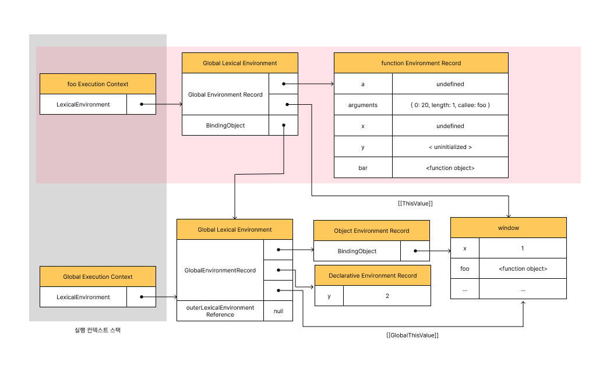

## 1. 함수 실행 컨텍스트 생성

- foo 함수 실행 컨텍스트 생성
- 이때, `foo 함수 실행 컨텍스트`는 실행 컨택스트 스택의 최상위=`실행 중인 실행 컨텍스트`가 된다

## 2. 함수 렉시컬 환경 생성

- foo 함수 렉시컬 환경을 생성하고, foo 함수 실행 컨텍스트에 바인딩
  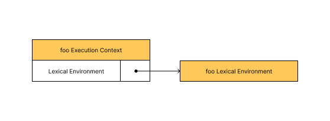
- 렉시컬 환경(2개의 컴포넌트)은 `환경 레코드`와, `외부 렉시컬 환경에 대한 참조`로 구성

### 2.1 함수 환경 레코드 생성

- `환경 레코드` (렉시컬 환경 2개의 컴포넌트 중 1개)는 매개변수, arguments 객체, 함수 내부에서 선언한 지역 변수와 중첩 함수를 등록하고 관리
  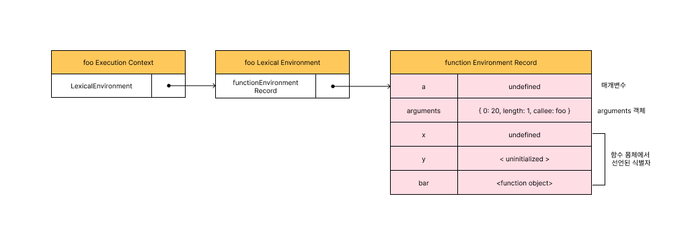

### 2.2 this 바인딩

- 함수 환경 레코드의 [[thisValue]] 내부 슬롯에 this가 바인딩 된다 → 바인딩 될 객체는 함수 호출 방식에 따라 결정
- foo 함수는 일반 함수로 호출됨 → this는 전역 객체를 가리킴 →[[thisValue]] 내부 슬롯에 전역 객체 바인딩
- foo 함수 내부에서 this를 참조하면 [[thisValue]] 내부 슬롯에 바인딩 되어 있는 객체를 반환
  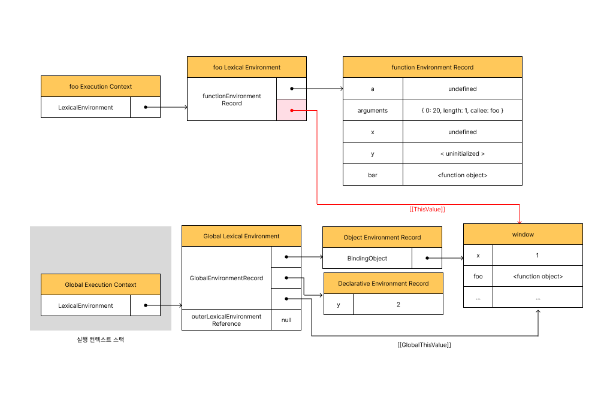

### 2.3 외부 렉시컬 환경에 대한 참조 결정

- foo 함수 정의는 전역 코드 평가 시점에 평가된다
- 외부 렉시컬 환경에 대한 참조에는 전역 레시컬 참조가 할당 (이 시점의 실행 컨텍스트 전역 실행 컨텍스트이기 때문)

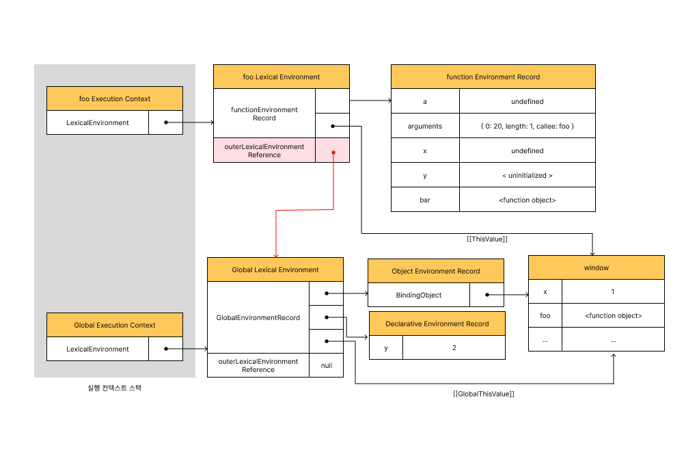

- 자바스크립트는 함수를 어디서 호출했는지가 아니라 어디에 정의했는지에 따라 상위 스코프를 결정
- 자바스크립트 엔진은 함수 정의를 평가하여 함수 객체를 생성할 때, 함수 객체의 내부 슬롯 [[Environment]]에 저장
- 즉, 함수 객체의 내부 슬롯 [[Environment]]가 바로 렉시컬 스코프를 구현하는 메커니즘이다

(클로저에서 자세히 살펴보기~~)

# 23.6.5 foo 함수 코드 실행

- 런타임이 시작되어 foo 함수의 소스코드가 실행
- 매개변수에 인수 할당, x,y 값 할당
- bar 함수 호출
- 이때, 식별자 결정을 위해 실행 컨텍스트의 렉시컬 환경에서 식별자를 검색 → foo함수 렉시컬 환경에서 식별자 x,y를 검색하기 시작

[ 그림 23-22 foo 함수 코드의 실행 ]

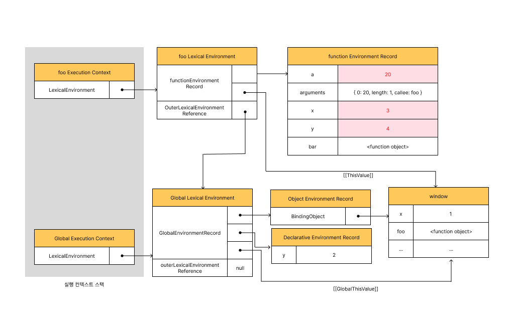

# 23.6.6 bar 함수 코드 평가

```jsx
var x = 1;
const y = 2;

function foo(a) {
  var x = 3;
  const y = 4;

  function bar(b) {
    const z = 5;
    console.log(a + b + x + y + z);
  }
  bar(10); // <- 호출직전 (현재 위치)
}
foo(20);
```

- bar 함수가 호출되면 bar 함수 내부로 코드의 제어권이 이동한다
- foo 함수 코드 평가와 동일

[ 그림 23-23 bar함수 실행 컨텍스트와 렉시컬 환경 ]

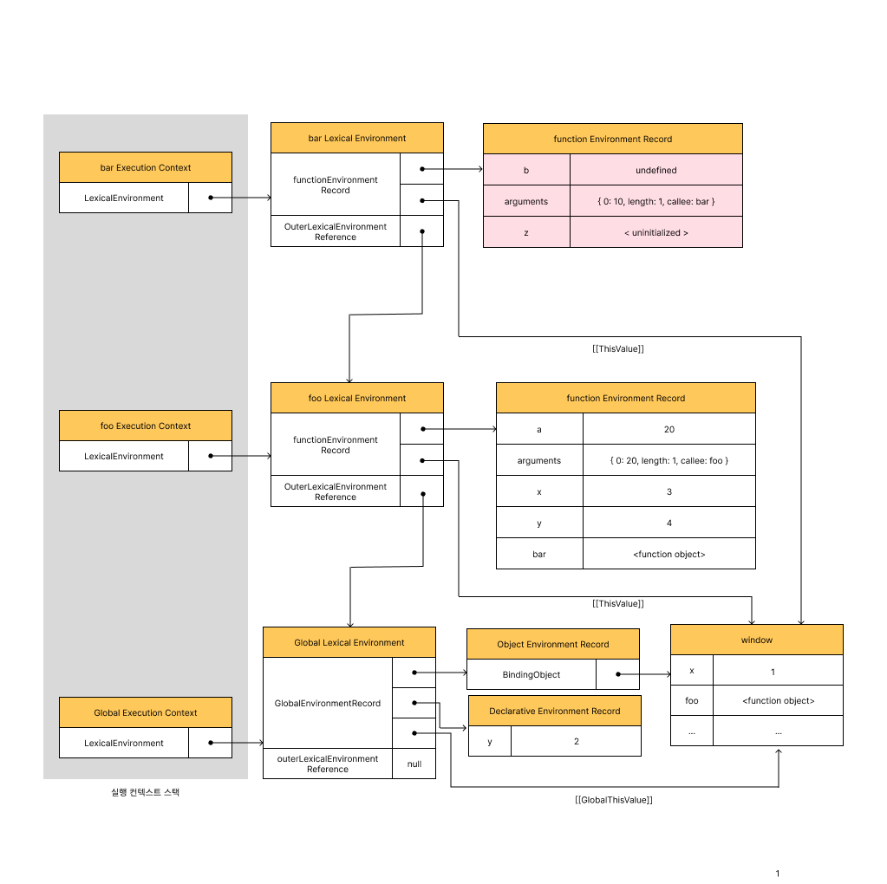

# 23.6.7 bar 함수 코드 실행

- 런타임 시작 bar 함수의 소스코드가 실행
- 매개변수에 인수 할당, 변수 할당문 실행 → `지역변수 z`에 값이 할당


다음으로 `console.log(a + b + x + y + z);` 가 실행

## 1. console 식별자 검색

- console 식별자를 스코프에서 검색 → 실행 컨텍스트의 렉시컬 환경에서 검색하기 시작
- bar에서 검색 : 없다면 → foo에서 검색 : 없다면 → 전역 렉시컬 환경에서 검색 (BindingObject 를 통해 전역 객체에서 찾을 수 있음)

## 2. log 메서드 검색

- console 객체에서 log 메서드 검색 ( 이때, console 객체의 프로토타입 체인을 통해 메서드를 검색)
- log 메서드는 상속된 프로퍼티가 아니라 console 객체가 직접 소유하는 프로퍼티

```jsx
console.hasOwnProperty("log"); // -> true
```

## 3. 표현식 `a + b + x + y + z` 의 평가

- 식별자는 실행 컨텍스트의 렉시컬 환경에서 시작하여 외부 렉시컬 환경에 대한 참조로 이어지는 렉시컬 환경의 연속에서 검색

a : foo 함수 렉시컬 환경

b: bar 함수 렉시컬 환경

x: foo 함수 렉시컬 환경

z: bar 함수 렉시컬 환경

에서 검색

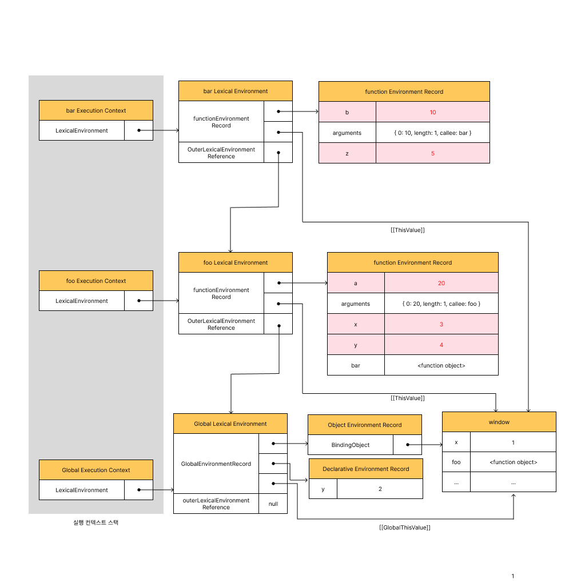

## 4. console.log 메서드 호출

- 표현식 `a + b + x + y + z` 가 평가되어 생성한 값 42를 console.log 메서드에 전달하여 호출

# 23.6.8 bar 함수 코드 실행 종료

- 스택에서 bar 함수 실행 컨텍스트가 pop 되고 foo 실행 컨텍스트가 실행 컨텍스트가 된다

[그림 23-26 bar 함수 코드 실행 종료]

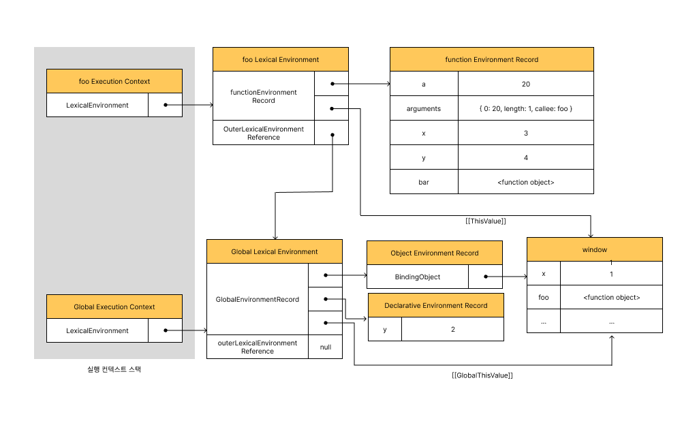

- bar 함수 실행 컨텍스트가 소멸되었다 하더라도 bar함수 렉시컬 환경을 누군가 참조하고 있다면 bar 함수 렉시컬 환경은 소멸하지 않는다

# 23.6.9 foo 함수 코드 실행 종료

- foo 함수 코드의 실행이 종료 → 스택에서 foo 함수 pop → 전역 컨텍스트가 실행 컨텍스트가 된다
- [그림 23-27 foo 함수 코드 실행 종료]

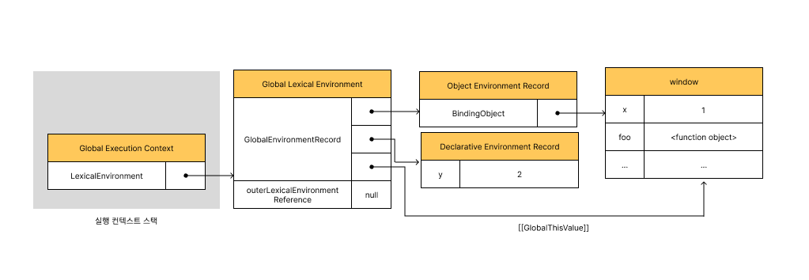

# 23.6.10 전역 함수 코드 실행 종료

전역 컨텍스트 종료 → 스택에 아무것도 x

# 23.7 실행 컨텍스트와 블록 레벨 스코프

var 키워드 변수 : 오로지 함수 코드 블록만 지역 스코프로 인정하는 함수 레벨 스코프를 따른다

let, const 키워드로 선언한 변수: 모든 코드 블록을 지역 스코프로 인정하는 블록 레벨 스코프를 따른다

```jsx
let x = 1;

if (true) {
  let x = 10;
  console.log(x); //10
}

console.log(x); //1
```

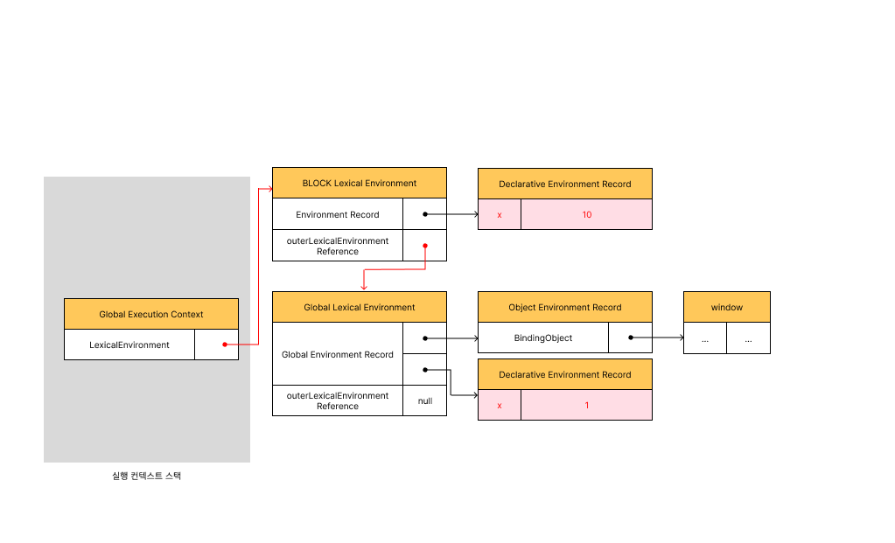

if문의 코드 블록이 실행되면 새로운 렉시컬 환경을 생성하여 기존의 렉시컬 환경을 교체

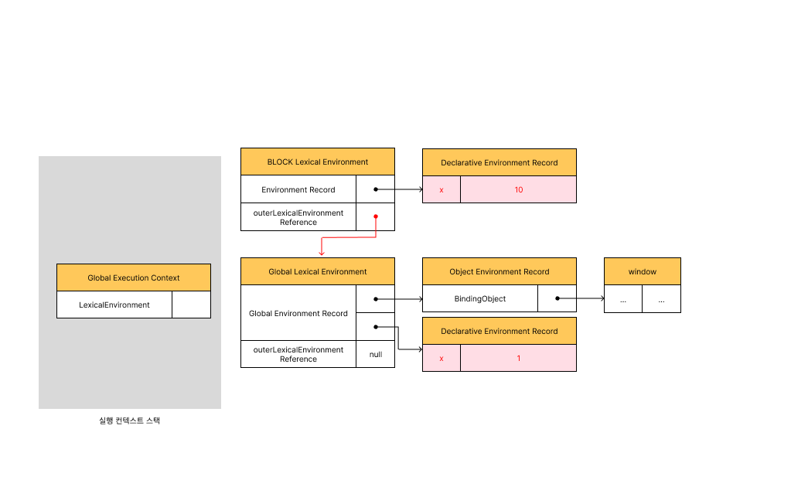

if 문의 코드 블록을 위한 렉시컬 환경에서 이전 렉시컬 환경으로 복귀

반복문은 코드 블록이 반복에서 실행될 때마다 코드 블록을 위한 새로운 렉시컬 환경을 생성

→ 코드블럭이 반복해서 실행될 때 마다 식별자의 값을 유지해야 함→ 이때, 독립적인 렉시컬 환경에서 식별자의 값을 유지해야 한다 (클로저에서 더 알아보기)
