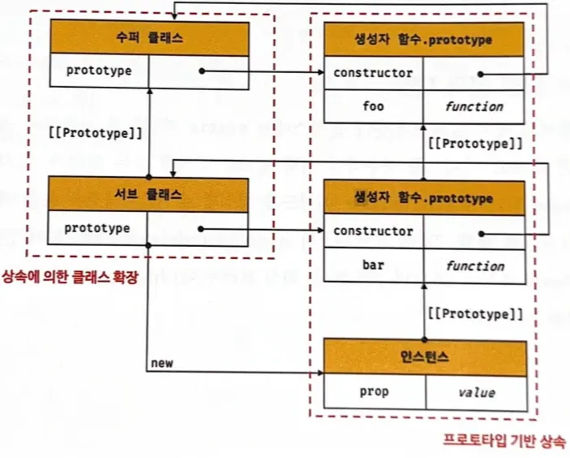
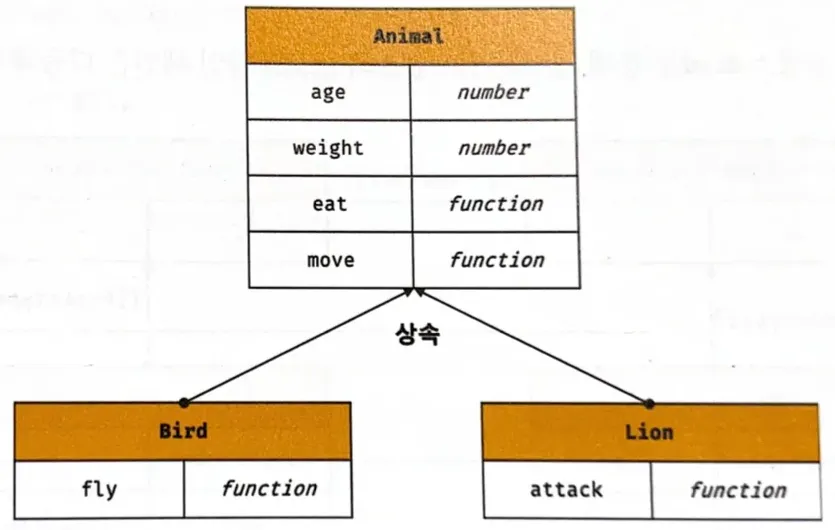
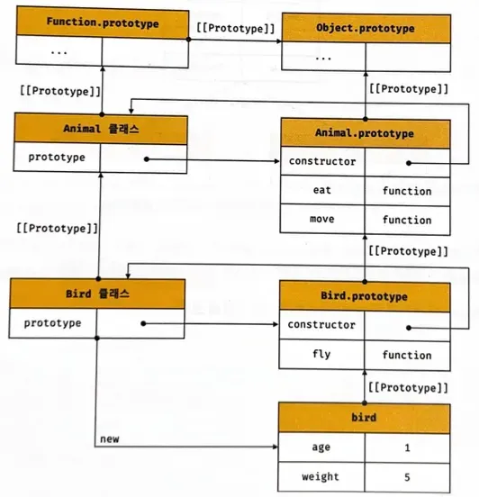
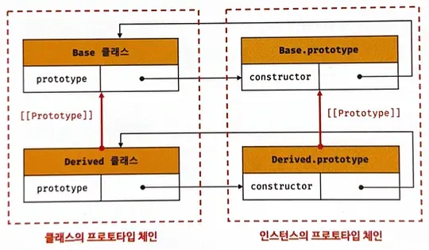
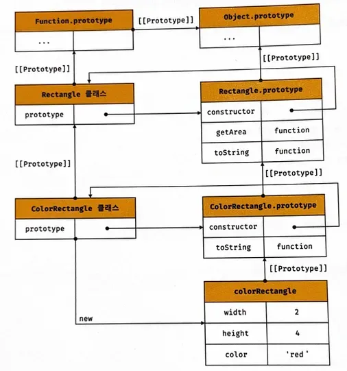

# 25장 클래스 - 25.8 상속에 의한 클래스 확장

# 25.8.1 클래스 상속과 생성자 함수 상속

- 상속에 의한 클래스 확장은 기존 클래스를 상속받아 새로운 클래스를 확장하여 정의하는 것이다.



상속에 의한 클래스 확장

- 클래스와 생성자 함수는 인스턴스를 생성할 수 있는 함수라는 점에서 매우 유사하다. 클래스는 상속을 통해 기존 클래스를 확장할 수 있는 문법이 기본적으로 제공되지만 생성자 함수는 그렇지 않다.
- 예를 들어, Animal 클래스는 동물의 속성을 표현하고 Bird, Lion 클래스는 상속을 통해 Animal 클래스의 속성을 그대로 사용하면서 자신만의 고유한 속성만 추가하여 확장할 수 있다.
- 그래서 상속에 의한 클래스 확장은 코드 재사용에 유용하다.
- 클래스는 extends 키워드가 기본적으로 제공된다.
- 하지만 생성자 함수는 클래스와 같이 상속을 통해 다른 생성자 함수를 확장할 수 있는 문법이 제공되지 않는다.
    
    
    
    클래스 상속을 통해 클래스의 속성을 상속받는다.
    

```jsx
class Animal {
  constructor(age, weigth){
    this.age = age;
    this.weigth = weigth;
  }

  eat() { return 'eat'; }

  move() { return 'move'; }
}

// Bird 클래스 - 상속을 통해 Animal 클래스를 확장함
class Bird **extends** Animal {
  fly() { return 'fly'; }
}

const bird = new Bird(1,5);

console.log(bird); //Bird { age: 1, weigth: 5 }
console.log(bird instanceof Bird); //true
console.log(bird instanceof Animal); //true

console.log(bird.eat()); //eat
console.log(bird.move()); //move
console.log(bird.fly()); //fly
```



상속에 의해 확장된 클래스 Bird에 의해 생성된 인스턴스의 프로토타입 체인

# 25.8.2 extends 키워드

```jsx
// 부모 클래스
class Base {}

// 자식 클래스(=파생/서브 클래스)
class Derived extends Base {}
```

- 부모 클래스 : 자식 클래스에게 상속된 클래스 (=수퍼/베이스 클래스)
- 자식 클래스 : 상속을 통해 확장된 클래스 (=서브/파생 클래스)

### extends

- 부모 클래스와 자식 클래스 간의 상속 관계를 설정하는 것이다.
- 기존 클래스(부모 클래스)를 상속받아 새로운 클래스(자식 클래스)를 만드는 키워드이다.
- 부모 클래스의 속성과 메서드를 물려받아 사용할 수 있게 해준다.
- 클래스도 프로토타입을 통해 상속 관계를 구현한다.



extends 키워드

# 25.8.3 동적 상속

- extends 키워드는 클래스뿐만 아니라 생성자 함수를 상속받아 클래스를 확장할 수 있다.

```jsx
// 생성자 함수
function Base(a){
  this.a = a;
}

// 생성자 함수를 상속받는 자식클래스
class Derived extends Base{}

const derived = new Derived(1);
console.log(derived); // Derived {a: 1}
```

- extends 키워드 다음에는 클래스뿐만 아니라 [[cunstruct]] 내부 메서드를 갖는 함수 객체로 평가될 수 있는 모든 표현식을 사용할 수 있다. 이를 통해 동적으로 상속받을 대상을 결정할 수 있다.

```jsx
function Base1 {} // 생성자 함수 (ES5 방식)

class Base2 {} // 클래스 문법 (ES6)

let condition = true;

// 조건에 따라 동적으로 상속 대상을 결정하는 자식클래스
class Derived **extends** (condition ? Base1 : Base2) {} 
// 조건에 따라 Base1 또는 Base2를 상속

const derived = new Derived();
console.log(derived); // Derived {}

console.log(derived instanceof Base1); // true
// condition === true라서 Base1을 상속함

console.log(derived instanceof Base2); // false
// Base2는 상속받지 않았으므로 false
```

# 25.8.4 서브클래스의 constructor

- 클래스에서 constructor를 생략하면 클래스에 비어있는 constructor가 암묵적으로 정의된다.

```jsx
constructor() {}
```

- 자식클래스에서 constructor를 생략하면

```jsx
constructor(..args) { super(...args); }
```

→ 클래스에 constructor가 암묵적으로 정의된다.

```jsx
// 부모 클래스
class Base {}

// 자식클래스
class Derived extends Base {}
```

```jsx
// 부모클래스
class Base {
  constructor() {} //아무 작업을 하지 않음 (빈 객체 생성)
}

// 자식클래스
class Derived extends Base {
  constructor(...args) { super(...args); } //부모 생성자 호출
}

const derived = new Derived();
console.log(derived); // Derived {} 
```

→ 부모, 자식 클래스 모두 constructor를 생략하면 빈 객체가 생성된다. Base 클래스의 생성자에서 아무런 프로퍼티를 추가하지 않았고, Derived 클래스는 Base를 상속하지만 아무것도 추가하지 않은 코드이다. 그래서 생성된 인스턴스는 자기 자신의 프로퍼티를 전혀 가지지 않는다. 

→ 프로퍼티를 소유하는 인스턴스를 생성하려면 constructor 내부에서 인스턴스에 프로퍼티를 추가해야한다. 

# 25.8.5 Super 키워드

- Super키워드는 함수처럼 호출할 수도 있고 this와 같이 식별자처럼 참조할 수 있는 특수한 키워드다.

### 동작 방법

- super를 **호출하면** 부모클래스의 constructor를 호출한다.
- super를 **참조하면** 부모클래스의 메서드를 호출할 수 있다.

### [super 호출]

- 부모클래스의 constructor를 호출한다.

```jsx
// 부모클래스
class Base {
  constructor(a,b) { //프로퍼티 정의함
    this.a = a;
    this.b = b;
  }
}

// 자식클래스
class Derived extends Base {
  // constructor 생략됨
  // 내부적으로 동작하는 방법 (암묵적으로 constructor가 정의된다)
  // constructor(...args){ super(...args); }
}

// new 연산자와 인수 넘기기
const derived = new Derived(1,2); 
// 호출하면 인수는 super(1,2)를 통해 Base의 constructor로 전달된다.
console.log(derived); // Derived {a:1, b:2}
```

- 자식클래스의 constructor 내부에서 추가한 프로퍼티를 그대로 갖는 인스턴스를 생성한다면 자식클래스의 cuntructor를 생략할 수 있다.
- 이때 new 연산자와 함께 자식클래스를 호출하면서 전달한 인수는 모두 자식 클래스의 constructor의 super 호출을 통해 부모클래스의 constructor에 전달된다.

```jsx
// 부모 클래스
class Base {
  constructor(a,b){ // 4️⃣
    this.a = a;
    this.b = b;
  }
}

// 자식 클래스
class Derived extends Base {
  constructor(a,b,c){ //2️⃣
    super(a,b); //3️⃣
    this.c = c;
  }
}

const derived = new Derived(1,2,3); // 1️⃣
console.log(derived); // Derived {a: 1, b: 2, c: 3}
```

1️⃣ new 연산자와 함께 Derived 클래스를 호출하면서 전달한 인수 1,2,3은 

2️⃣ Derived 클래스의 constructor에 전달되고 

3️⃣ super 호출을 통해 

4️⃣ Base 클래스의 constructor에 일부가 전달된다. 

→ new 연산자와 함께 자식 클래스를 호출하면서 전달한 인수 중에서 부모 클래스의 constructor에 전달할 인수는 자식 클래스의 constructor에서 호출하는 super를 통해 전달한다. 

### super 호출 주의사항

1. 자식 클래스에서 constructor를 생략하지 않으면 자식 클래스의 constructor에서는 반드시 super를 호출해야한다. 

```jsx
class Base {}

class Derived extends Base {
  constructor(){
    // ReferenceError: Must call super constructor in derived class before accessing 'this' or returning from derived constructor
    console.log('constructor call');
  }
}

const derived = new Derived();
```

1. 서브클래스의 constructor에서 super를 호출하기 전에는 this를 참조할 수 없다. 

```jsx
class Base {}

class Derived extends Base {
  constructor() {
    // ReferenceError: Must call super constructor in derived class before accessing 'this' or returning from derived constructor
    this.a = 1;
    super();
  }
}

const derived = new Derived(1);
```

1. super는 반드시 자식클래스의 constructor에서만 호출한다. 자식클래스가 아닌 클래스의 constructor나 함수에서 super를 호출하면 에러가 발생한다.

```jsx
class Base {
  constructor() {
    super(); //SyntaxError: 'super' keyword unexpected here
  }
}

function Foo() {
  super(); //SyntaxError: 'super' keyword unexpected here
}
```

### [super 참조]

- 매서드 내에서 super를 참조하면 부모클래스의 메서드를 호출할 수 있다.
1. 자식클래스의 프로토타입 메서드 내에서 super.sayHi는 부모클래스의 프로토타입 메서드 sayHi를 가리킨다. 

```jsx
// 부모클래스
class Base {
  constructor(name){
    this.name = name;
  }

  sayHi() {
    return `Hi! ${this.name}`;
  }
}

//자식클래스
class Derived extends Base {
  sayHi(){
    // super.sayHi는 부모클래스의 프로토타입 메서드를 가리킨다.
    return `${super.sayHi()}. how are you doing?`;
  }
}

const derived = new Derived('Lee');
console.log(derived.sayHi()); //Hi! Lee. how are you doing?
```

```jsx
//동일한 동작 코드
//부모클래스
class Base{
  constructor(name){
    this.name = name;
  }

  sayHi() {
    return `Hi! ${this.name}`;
  }
}

class Derived extends Base {
  sayHi(){
    const __super = Object.getPrototypeOf(Derived.prototype);
    return `${__super.sayHi.call(this)} how are you doing?`;
  }
}
```

- super는 자신을 참조하고 있는 메서드가 바인딩되어 있는 객체의 프로토타입을 가리킨다. 따라서 super.sayHi는 Base.prototype.sayHi를 가리킨다.
- 단, Base.prototype.sayHi를 호출할 때 call 메서드를 사용해 this를 전달해야 한다.
- super가 동작하기 위해서는 super를 참조하고 있는 메서드(Derived의 sayHi)가 바인딩되어 있는 객체의 프로토타입을 찾을 수 있어야 한다. 이를 위해 내부 슬롯 [[HomeObject]]를 가지고, 자신을 바인딩하고 있는 객체를 가리킨다.

super 참조를 의사 코드로 표현한 코드

```jsx
super = Object.getPrototypeOf([[HomeObject]]) 
```

```
const obj = {
  // foo는 ES6의 메서드 축약 표현으로 정의한 메서드라서 [[HomeObject]]를 갖는다.
  foo() {},
  // bar는 ES6의 메서드 축약 표현으로 정의한 메서드가 아니라 일반 함수라서 
  // [[HomeObject]]를 갖지 않는다. 
  bar: function () {}
};
```

- super를 참조하려면 함수는 [[HomeObject]]를 가져야한다. super참조는 부모클래스의 메서드를 참조하기 위해 사용하므로 자식클래스의 메서드에서 사용해야 한다.

```jsx
const base = {
  name: 'Lee',
  sayHi(){
    return `Hi! ${this.name}`;
  }
};

const derived = {
  __proto__: base,
  // ES6 메서드 축약 표현으로 정의한 메서드라서 [[HomeObject]]를 갖는다. - super참조 가능
  sayHi(){
    return `${super.sayHi()}. how are ypu doing?`;
  }
};

console.log(derived.sayHi()); //Hi! Lee. how are you doing?
```

1. 자식클래스의 정적 메서드 내에서 super.sayHi는 부모클래스의 정적 메서드 sayHi를 가리킨다.

```jsx
// 부모클래스
class Base {
  static sayHi(){ //정적메서드 sayHi
    return 'Hi';
  }
}

// 자식클래스
class Derived extends Base {
  static sayHi(){
    // super.sayHi는 부모클래스의 정적 메서드를 가리킨다.
    return `${super.sayHi()} how are you doing?`;
  }
}

console.log(Derived.sayHi()); //Hi how are you doing?
```

# 25.8.6 상속 클래스의 인스턴스 생성 과정

- 상속 관계에 있는 두 클래스가 협력하여 인스턴스를 생성하는 과정

```jsx
// 부모클래스
class Rectangle {
  constructor(width, heigth){
    this.width = width;
    this.heigth = heigth;
  }

  getArea(){
    return `width = ${this.width}, height = ${this.heigth}`;
  }
}

//자식클래스
class ColorRactangle extends Rectangle { //상속을 통해 Rectangle를 확장한 ColorRactangle 클래스
  constructor(width, heigth, color){
    super(width, heigth);
    this.color = color;
  }

  // 메서드 오버라이딩 
  toString() {
    return super.toString() + `, color = ${this.color}`;
  }
}

const colorRectangle = new ColorRactangle(2,4,'red');
console.log(colorRectangle);

// 상속을 통해 getArea 메서드 호출
console.log(colorRectangle.getArea()); //8
// 오버라이딩된 toString 메서드 호출
console.log(colorRectangle.toString()); //width = 2, height = 4, color = red

```



ColorRectangle 클래스에 의해 생성된 인스턴스의 프로토타입 체인

### 자식클래스 ColorRectangle이 new 연산자와 함께 호출되면 인스턴스를 생성하는 과정

### 1. 자식클래스의 super 호출

- 자식클래스는 자신이 직접 인스턴스를 생성하지 않고 부모클래스에게 인스턴스 생성을 위임한다. 자식클래스의 constructor에서 반드시 super를 호출해야하는 이유이다.
- 인스턴스를 생성하는 주체는 부모클래스이기 때문에 부모 클래스의 constructor를 호출하는 super가 호출되지 않으면 인스턴스를 생성할 수 없다. 그래서 자식클래스 constructor 내부에 super 호출이 없으면 에러가 발생한다.

### 2. 부모클래스의 인스턴스 생성과 this 바인딩

- 부모클래스의 constructor 내부의 코드가 실행되기 이전에 암묵적으로 빈 객체를 생성하는데, 이 빈 객체가 클래스가 생성한 인스턴스이다.
- 암묵적으로 생성된 빈 객체(인스턴스)는 this에 바인딩된다.
- 따라서 부모클래스의 constructor 내부의 this는 생성된 인스턴스를 가리킨다.

```jsx
// 부모클래스
class Rectangle {
  constructor(width, height){
    // 암묵적으로 빈 객체, 즉 인스턴스가 생성되고 this에 바인딩된다.
    console.log(this); //ColorRectangle {}
    // new 연산자와 함께 호출된 함수, 즉 new.target은 ColorRectangle이다.
    console.log(new.target); // ColorRectangle
  }
}
```

- new 연산자와 함께 호출된 함수를 가리키는 new.target은 자식클래스를 가리킨다.
- 인스턴스는 new.target이 가리키는 서브클래스가 생성한 것으로 처리된다.
- 따라서 생성된 인스턴스의 프로토타입은 부모클래스의 prototype 프로퍼티가 가리키는 객체가 아니라 new.target(자식클래스의 prototype 프로퍼티가 가리키는 객체)이다.

```jsx
class Rectangle {
  constructor(width, height){
    // 암묵적으로 빈 객체, 즉 인스턴스가 생성되고 this에 바인딩된다.
    console.log(this); //ColorRectangle {}
    // new 연산자와 함께 호출된 함수, 즉 new.target은 ColorRectangle이다.
    console.log(new.target); // ColorRectangle

    //생성된 인스턴스의 프로토타입으로 ColorRectangle.prototype이 설정된다
    console.log(Object.getPrototypeOf(this) === ColorRactangle.prototype); //true
    console.log(this instanceof ColorRactangle); //true
    console.log(this instanceof Rectangle); // true
    ...
  }
}
```

### 3. 부모클래스의 인스턴스 초기화

- this에 바인딩되어 있는 인스턴스에 프로퍼티를 추가하고 constructor가 인수로 전달받은 초기값으로 인스턴스의 프로퍼티를 초기화한다.

```jsx
class Rectangle {
  constructor(width, height){
    // 암묵적으로 빈 객체, 즉 인스턴스가 생성되고 this에 바인딩된다.
    console.log(this); //ColorRectangle {}
    // new 연산자와 함께 호출된 함수, 즉 new.target은 ColorRectangle이다.
    console.log(new.target); // ColorRectangle

    //생성된 인스턴스의 프로토타입으로 ColorRectangle.prototype이 설정된다
    console.log(Object.getPrototypeOf(this) === ColorRactangle.prototype); //true
    console.log(this instanceof ColorRactangle); //true
    console.log(this instanceof Rectangle); // true
    
    // 인스턴스 초기화
    this.width = width;
    this.height = height;

    console.log(this); //ColorRactangle {width: 2, height: 4 }
  }
  ...
```

### 4. 자식클래스 constructor로의 복귀와 this 바인딩

- super가 반환한 인스턴스가 this에 바인딩된다. 자식클래스는 별도의 인스턴스를 생성하지 않고 super가 반환한 인스턴스를 this에 바인딩하여 그대로 사용한다.

```jsx
class ColorRactangle extends Rectangle {
  constructor(width, height, color){
    super(width, height);

    // super가 반환한 인스턴스가 this 에 바인딩된다
    console.log(this); // ColorRectangle {width: 2, height: 4}
    ...
```

- super가 호출되지 않으면 인스턴스가 생성되지 않고, this 바인딩도 할 수 없다.
- 반드시 자식 클래스 constructor 내부의 인스턴스 초기화는 super 호출 이후에 처리되어야 한다.

### 5. 자식클래스의 인스턴스 초기화

- super호출 이후, 자식클래스의 constructor에 기술되어 있는 인스턴스 초기화가 실행된다.
- this에 바인딩되어 있는 인스턴스에 프로퍼티를 추가하고 constructor가 인수로 전달받은 초기값으로 인스턴스의 프로퍼티를 초기화한다.

### 6. 인스턴스 반환

- 클래스의 모든 처리가 끝나면 완성된 인스턴스가 바인딩된 this가 암묵적으로 반환된다.

```jsx
class ColorRactangle extends Rectangle {
  constructor(width, height, color){
    super(width, height);

    // super가 반환한 인스턴스가 this 에 바인딩된다
    console.log(this); // ColorRectangle {width: 2, height: 4}
    
    // 인스턴스 초기화
    this.color = color;
    
    // 완성된 인스턴스가 바인딩된 this가 암묵적으로 반환된다
    console.log(this); // ColorRectangle {width: 2, height: 4, color: "red"}
  }
  ...
```

# 25.8.7 표준 빌트인 생성자 함수 확장

- String, Number, Array 같은 빌트인 객체도 [[Constructor]] 내부 메서드를 갖는 생성자 함수 이므로 extends 키워드를 사용하여 확장할 수 있다.

```jsx
//Array 생성자 함수를 상속받아 확장한 MyArray
class MyArray **extends** Array {
  // 중복된 배열 요소를 제거하고 반환: [1,1,2,3] => [1,2,3]
  uniq(){
    return this.filter((v, i, self) => self.indexOf(v) === i);
  }
  
  // 모든 배열 요소의 평균 구함: [1,2,3] => 2
  average(){
    return this.reduce((pre, cur) => pre + cur, 0) / this.length;
  }
}

const myArray = new MyArray(1,1,2,3);
console.log(myArray); //MyArray(4)[1,1,2,3]

//uniq호출
console.log(myArray.uniq()); // MyArray(3)[1,2,3]
//average호출
console.log(myArray.average()); //1.75
```

- Array 생성자 함수를 상속받아 확장한 MyArray 클래스가 생성한 인스턴스는 Array.prototype과 MyArray.prototype의 모든 메서드를 사용할 수 있다.
- 주의) Array.prototype의 메서드 중에서 map, filter와 같이 새로운 배열을 반환하는 메서드가 MyArray 클래스의 인스턴스를 반환한다.

```jsx
console.log(myArray.filter(v => v % 2) instansof MyArray); // true
```

- 만약 새로운 배열을 반환하는 메서드가 MyArray 클래스의 인스턴스를 반환하지 않고 Array의 인스턴스를 반환하면 MyArray 클래스의 메서드와 메서드 체이닝이 불가능하다.

```jsx
// 메서드 체이닝
// [1,1,2,3] => [1,1,3] => [1,3] => 2
console.log(myArray.filter(v => v % 2).uniq().average()); //2
```

- myArray.filter가 반환하는 인스턴스는 MyArray 클래스가 생성한 인스턴스, 즉 MyArray 타입이다.
- uniq 메서드가 반환하는 인스턴스로 average 메서드를 연이어 호출(메서드 체이닝)할 수 있다.
- 만약 MyArray 클래스의 uniq 메서드가 MyArray 클래스가 생성한 인스턴스가 아닌 Array가 생성한 인스턴스를 반환하려면 Symbol.species를 사용하여 정적 접근자 프로퍼티를 추가한다.

```
//Array 생성자 함수를 상속받아 확장한 MyArray
class MyArray extends Array {
	// 모든 메서드가 Array 타입의 인스턴스를 반환한다
	static get [Symbol.species]() {return Array;}
	
  // 중복된 배열 요소를 제거하고 반환: [1,1,2,3] => [1,2,3]
  uniq(){
    return this.filter((v, i, self) => self.indexOf(v) === i);
  }
  // 모든 배열 요소의 평균 구함: [1,2,3] => 2
  average(){
    return this.reduce((pre, cur) => pre + cur, 0) / this.length;
  }
}

const myArray = new MyArray(1,1,2,3);

console.log(myArray.uniq() instanseOf MyArray); //false

console.log(myArray.uniq() instanseOf Array); //true

// 메서드 체이닝
// uniq 메서드는 Array 인스턴스를 반환하므로 average 메서드를 호출할 수 없다
console.log(myArray.uniq().average());
// TypeError: myArray.uniq( ... ).average is not a function
```