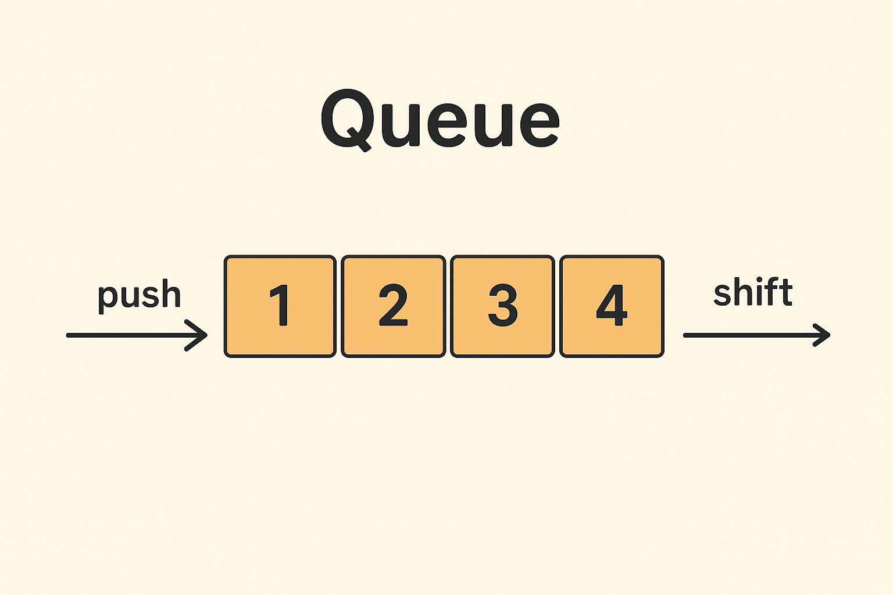

# 27.8 배열메서드

- 자바스크립트는 배열을 다룰 때 유용한 다양한 빌트인 메서드를 제공
  - Array 생성자 함수: 정적 메서드 제공
  - Array.prototype: 프로토타입 메서드 제공
- 배열 메서드는 결과물을 반환하는 패턴 두가지

  - 원본 배열을 직접 변경하는 메서드
  - 원본은 건들이지않고, 새로운 배열을 생성(원본 복사 등)하여 반화하는 메서드

  ```jsx
  // push메서드는 원본 배열을 직접 변경한다
  arr.push(2);
  console.log(arr); // [ 1, 2 ]

  //concat메서드는 원본 뱌열을 직접 변경하지 않고 새로운 배열을 생성하여 반환
  const result = arr.concat(3);
  console.log(arr); // [ 1, 2 ]
  console.log(result); // [ 1, 2, 3 ]
  ```

## 27.8.1 Array.isArray

- Arrat.isArray메서드: 전달된 인수가 배열 o: true, 배열 x: false 반환

  ```jsx
  //true
  Array.isArray([]);
  Array.isArray([1, 2]);
  Array.isArray([new Array()]);

  // false
  Array.isArray();
  Array.isArray({});
  Array.isArray(null);
  Array.isArray(undefined);
  Array.isArray(1);
  Array.isArray("Array");
  Array.isArray(true);
  Array.isArray(false);
  Array.isArray({ 0: 1, length: 1 });
  ```

## 27.8.2 Array.prototype.indexOf

- indexOf 메서드는 원본 배열에서 인수로 전달된 **요소를 검색하여 인덱스 반환**
  - 중복되는 요소가 검색되면 첫번째로 검색된 요소의 인덱스를 반환
  - 검색한 요소가 없을 경우 -1 반환

```jsx
const arr = [1, 2, 2, 3];

arr.indexOf(2); // 1
arr.indexOf(4); // -1
// arr.indexOf(검색 시작 인덱스, 검색 요소)
arr.indexOf(2, 2); // 2 (인덱스 2부터 끝까지 검색)
```

- indexOf는 메서드는 요소가 있는지 확인할 때 적합

```jsx
// 사용예시
const foods = ["apple", "banana", "orange"];
// 만약 foods에 orange가 없다면 추가해라
if (foods.indexOf("orange") === -1) {
  food.push("orange");
}

console.log(foods); // [ 'apple', 'banana', 'orange' ]
```

## 27.8.3 Array.prototype.push

- 배열의 **끝에 요소를 추가하고 새로운 배열의 길이(length)를 반환**
- push 메서드는 원본 배열을 직접 변경함

```jsx
const arr = [1, 2];

// 요소 추가 후 length 값 반환
let result = arr.push(3, 4);
console.log(result); // 4

// 원본 배열에 직접 추가
console.log(arr); // [ 1, 2, 3, 4 ]
```

- push는 성능 면에서 좋지 않음 따라서 length에 직접 추가할 수 있음

```jsx
// arr.push(3)과 동일한 처리 -> 속도가 더 빠름
const arr = [1, 2];
arr[arr.length] = 3;
console.log(arr); // [ 1, 2, 3 ]
```

- push는 원본 배열을 직접 변경 → 따라서 스프레드 문법을 사용하는 것이 더 좋음 (35장에서 알아보기)

## 27.8.4 Array.prototype.pop

- 배열의 **마지막 요소를 제거하고** 그 값을 반환하는 메서드
- pop 메서드는 원본 배열을 직접 변경함
- 배열이 비어 있다면 `undefined`를 반환

```jsx
const arr = [1, 2];

// 마지막 요소 제거 -> 제거한 요소 반환
let result = arr.pop();
console.log(result); // 2

console.log(arr); // [1]
```

- 자료구조 스택:
  - `push` → 데이터를 **위에 쌓기**
  - `pop` → 가장 마지막에 쌓은 데이터를 **꺼내기**

```jsx
// 간단한 스택 표현
const stack = [];

// push : 데이터 넣기
stack.push(1);
stack.push(2);
stack.push(3);

console.log(stack); // [1, 2, 3]

// pop : 마지막 데이터 꺼내기
const last = stack.pop();
console.log(last); // 3 (꺼낸 값)
console.log(stack); // [1, 2]
```

## 27.8.5 Array.prototype.unshift

- 배열의 **앞쪽(0번 인덱스 위치)에 요소를 추가**하는 메서드
- 원본 배열을 직접 변경함
- 반환값은 **새로운 배열의 길이(length)**

```jsx
const arr = [1, 2];

// length 값 반환
let result = arr.unshift(3, 4);
console.log(result); // 4

console.log(arr); // [3, 4, 1, 2]
```

- 원본을 직접 변경하기 때문에 35장의 스프레드 문법을 쓰는게 좋음 (뒤에 알아보기)

## 27.8.6 Array.prototype.shift

- 배열의 **첫 번째 요소를 제거하고 그 값을 반환**하는 메서드
- 원본 배열을 직접 변경함
- 배열이 비어 있다면 `undefined`를 반환

```jsx
const arr = [1, 2];

// **첫 번째 요소를 제거하고 그 값을 반환**
let result = arr.shift();
console.log(result); // 1

console.log(arr); // [2]
```

- 자료구조 큐 : 선입선출 방식 (먼저 넣은 데이터를 먼저 꺼냄)
  

```jsx
function Queue() {
  this.items = []; // 큐를 저장할 배열
}

// 데이터 넣기 (enqueue)
Queue.prototype.enqueue = function (element) {
  this.items.push(element);
};

// 데이터 빼기 (dequeue)
Queue.prototype.dequeue = function () {
  if (this.isEmpty()) {
    return "Queue is empty";
  }
  return this.items.shift();
};

// 맨 앞 데이터 보기 (peek)
Queue.prototype.peek = function () {
  if (this.isEmpty()) {
    return "Queue is empty";
  }
  return this.items[0];
};

// 큐가 비었는지 확인
Queue.prototype.isEmpty = function () {
  return this.items.length === 0;
};

// 큐 크기 확인
Queue.prototype.size = function () {
  return this.items.length;
};

// 큐 출력
Queue.prototype.print = function () {
  console.log(this.items.toString());
};

const q = new Queue();
q.enqueue("A");
q.enqueue("B");
q.enqueue("C");
q.print(); // A,B,C

console.log(q.dequeue()); // A
console.log(q.peek()); // B
console.log(q.size()); // 2
```

## 27.8.7 Array.prototype.concat

- **두 개 이상의 배열이나 값들을 이어 붙여서 새로운 배열을 반환**하는 메서드.
- 원본 배열은 **변경되지 않고**, 새로운 배열이 생성됩니다.

```jsx
const arr1 = [1, 2];
const arr2 = [3, 4];

// 원본 배열 arr1의 마지막 요소로 추가한 새로운 배열 반환
let result = arr1.concat(arr2);
console.log(result); // [ 1, 2, 3, 4 ]

let result2 = arr1.concat(arr2, 5);
console.log(result2); // [ 1, 2, 3, 4, 5 ]

// 원본 배열 변경 X
console.log(arr1); // [1, 2]
```

- push와 unshift는 concat으로 대체 가능 하지만 push, unshift는 원본 배열 변경 o ( 따라서 원본 배열을 변수에 저장해두어야 함), concat는 원본 배열 변경 X → 둘 다 스프레드 문법으로 사용가능 (35장 스프레드 문법에서 다시 보기, 스프레드 문법이 더 일관성 있게 사용가능)

## 27.8.8 Array.prototype.splice

- 원본 배열의 **중간에서 요소를 추가하거나 제거할 때 사용**
- 원본 배열을 직접 변경함

```jsx
const arr = [1, 2, 3, 4];

// 인덱스 1부터 2개의 요소를 제거하고 거기서 20,30을 추가
const result = arr.splice(1, 2, 20, 30);
// 제거한 요소 반환
console.log(result); // [ 2, 3 ]

console.log(arr); // [ 1, 20, 30, 4 ]
```

```jsx
const arr = [1, 2, 3, 4];
const result = arr.splice(1, 0, 100); // 제거할 요소를 0으로 지정
console.log(result); // []
console.log(arr); // [ 1, 100, 2, 3, 4 ]
```

```jsx
const arr = [1, 2, 3, 4];
const result = arr.splice(1, 2); // 제거할 요소만 있고 추가할 요소 없음
console.log(result); // [ 2, 3 ] 제거
console.log(arr); // [ 1, 4 ]
```

- 특정 요소를 제거 하려면 indexOf를 통해 인덱스를 취득하고 splice 메서드를 사용

```jsx
const arr = [1, 2, 3, 1, 2];

function remove(array, item) {
  // 배열에서 item이 처음 등장하는 인덱스를 찾음
  const index = array.indexOf(item);

  // indexOf가 -1이 아니면(= 존재하면) splice로 해당 요소 제거
  if (index !== -1) array.splice(index, 1);

  // 수정된 배열을 반환
  return array;
}

// 배열 arr에서 첫 번째로 만나는 2를 제거 → 두 번째 요소 2가 사라짐
console.log(remove(arr, 2)); // [1, 3, 1, 2]

// 10은 배열에 없으므로 아무 것도 제거되지 않음 → 그대로 반환
console.log(remove(arr, 10)); // [1, 3, 1, 2]
```

- filter를 사용하여 특정 요소 제거 가능 (뒤에 나옴)

## 27.8.9 Array.prototype.slice

- 배열의 **일부를 잘라서 새로운 배열을 반환**하는 메서드.
- 원본 배열은 **변경 x**

```jsx
const arr = [1, 2, 3];

// 인덱스 0부터 시작해서 1 직전까지 추출 → [1]
// 하지만 반환값만 새 배열로 주고, arr 원본은 바뀌지 않음
arr.slice(0, 1);

// 인덱스 1부터 시작해서 2 직전까지 추출 → [2]
// 이것도 역시 새 배열 반환, 원본 arr는 변하지 않음
arr.slice(1, 2);

console.log(arr); // [1, 2, 3] (원본 배열은 변경되지 않음)
```

```jsx
const arr = [1, 2, 3];
// arr[1]이후의 모든 요소를 복사하여 반환
arr.slice(1); // [2,3]
```

```jsx
const arr = [1, 2, 3];
// 배열의 끝에서 분터 반환
arr.slice(-1); // [3]
arr.slice(-2); // [2,3]
```

```jsx
const arr = [1, 2, 3];
// 모든 값 반환
const copy = arr.slice();
console.log(copy); // [1, 2, 3]
console.log(copy === arr); // false
```

- 이때 얕은 복사를 통해 생성
- 유사 배열 객체로 변환 가능 → Array.from
- 더 간단하게 유사 배열 객체로 변환 가능 → 이터러블 객체 (34장에서 알아보자)

- `splice()` vs `slice()`

| 메서드     | 원본 변경 여부 | 반환값           |
| ---------- | -------------- | ---------------- |
| `slice()`  | X 변경 없음    | 잘라낸 새 배열   |
| `splice()` | O 원본 변경    | 제거된 요소 배열 |

## 27.8.10 Array.prototype.join

- **배열의 모든 요소를 하나의 문자열로 연결하는 메서드**

```jsx
const arr = [1, 2, 3, 4];

arr.join(); // "1,2,3,4" - 매개변수 없으면 기본 구분자 쉼표(,) 사용
arr.join(""); // "1234" - 빈 문자열로 구분자 없이 연결
arr.join(":"); // "1:2:3:4" - 콜론(:)을 구분자로 사용하여 연결
```

## 27.8.11 Array.prototype.reverse

- **배열의 요소 순서를 역순으로 바꾸는 메서드**
- 원본 직접 변경

```jsx
const arr = [1, 2, 3];
const result = arr.reverse();

console.log(arr); // [ 3, 2, 1 ]
console.log(result); // [ 3, 2, 1 ]
```

## 27.8.12 Array.prototype.fill

- **배열의 모든 요소 또는 지정된 범위의 요소를 하나의 값으로 채우는 메서드**
- 원본 배열 직접 변환

```jsx
const arr = [1, 2, 3];
arr.fill(0);
console.log(arr); // [ 0, 0, 0 ]
```

```jsx
const arr = [1, 2, 3, 4, 5];
arr.fill(0, 1); // 인덱스 1부터 끝까지 채우기
console.log(arr); // [ 1, 0, 0, 0, 0 ]
```

```jsx
const arr = [1, 2, 3, 4, 5];
arr.fill(0, 1, 3); // 인덱스 1부터 3 이전까지 채우기
console.log(arr); // [ 1, 0, 0, 4, 5 ]
```

- 배열 생성하면서 값 채우기

```jsx
const arr = new Array(3);
console.log(arr); // [ <3 empty items> ]

const result = arr.fill(1);
console.log(arr); // [ 1, 1, 1 ]

console.log(result); // [ 1, 1, 1 ]
```

- 요소의 하나의 값으로만 채울 수 없다는 단점이 있음 → Array.from을 사용하면 두번째 인수로 전달한 콜백 함수를 통해 다른 값으로 배열 채우기 가능

## 27.8.13 Array.prototype.includes

- 특**정 요소를 포함하고 있는지 판별하여 `true` 또는 `false`를 반환하는 메서드**
  - `true`: 배열에 해당 요소가 있는 경우
  - `false`: 배열에 해당 요소가 없는 경우

```jsx
const arr = [1, 2, 3];
arr.includes(2); // true - 배열에 2가 존재함
arr.includes(100); // false - 배열에 100이 존재하지 않음
```

```jsx
const arr = [1, 2, 3];

// arr.includes(검색할 요소, 검색시작인덱스);
arr.includes(1, 1); // false - 인덱스 1부터 검색하면 [2, 3]에서 1을 찾을 수 없음
arr.includes(3, -1); // true - 인덱스 -1(마지막 요소)부터 검색하면 [3]에서 3을 찾음
```

- Array.prototype.includes를 사용할 때 indexOf를 사용하여 반환값이 -1인지 확인해봐야하고 NaN이 포함되어 있는지 확인할 수 없다는 단점이 있다

## 27.8.14 Array.prototype.flat

- **중첩된 배열을 평탄화하는 메서드**

```jsx
[1, [2, 3, 4, 5]].flat(); // [1, 2, 3, 4, 5]
```

1. 첫 번째 요소 `1`은 그대로 유지
2. 두 번째 요소 `[2, 3, 4, 5]`는 배열이므로 한 단계 풀어짐
3. 최종적으로 모든 요소가 동일한 레벨의 1차원 배열로 변환

```jsx
[1, [2, [3, [4]]]].flat(); // [1, 2, [3, [4]]] - 1단계만 평탄화
[1, [2, [3, [4]]]].flat(1); // [1, 2, [3, [4]]] - 명시적으로 1단계

[1, [2, [3, [4]]]].flat(2); // [1, 2, 3, [4]] - 2단계 평탄화
[1, [2, [3, [4]]]].flat().flat(); // [1, 2, 3, [4]] - 1단계씩 두 번 = 2단계

[1, [2, [3, [4]]]].flat(Infinity); // [1, 2, 3, 4] - 완전 평탄화
```

# 27.9 배열 고차 함수

- 고차함수 : **함수를 인자로 전달 받거나 함수를 반환하는 함수**
  - 고차함수는 외부 상태의 변경이나 가변 데이터를 피하고, 불변성을 지향하는 함수형 프로그래밍에 기반을 두고 있다
  - 함수형 프로그래밍 : 순수함수 + 보조함수를 통해 로직 내에 존재하는 조건문과 반복문을 제거하여 복잡성을 해결하고 변수의 사용을 억제하여 상태 변경을 피하려는 프로그래밍의 패러다임
    즉, 순수함수를 통해 부수효과를 최대한 억제하여 오류를 피하고 프로그래밍의 안전성을 높이려고 하는 것

## 27.9.1 Array.prototype.sort

- **배열을 정렬하는 메서드**
- 원본 배열 자체를 변경하고, 정렬된 배열을 반환

```jsx
const fruits = ["Banana", "Orange", "Apple"];

// 오름차순 정렬 (한글동일)
fruits.sort();

console.log(fruits); // [ 'Apple', 'Banana', 'Orange' ]
```

- 내림차순 정렬 (reverse)

```jsx
const fruits = ["Banana", "Orange", "Apple"];

// 오름차순 정렬
fruits.sort();

console.log(fruits); // [ 'Apple', 'Banana', 'Orange' ]

// 내림차순 정렬
fruits.reverse(); // [ 'Orange', 'Banana', 'Apple' ]
console.log(fruits);
```

- 숫자 정렬 ( 오류 있음): 따라서 숫자를 정렬할 때는 **정렬 순서를 정의하는 비교함수를 인수로 전달해야 함**

```jsx
const points = [40, 100, 1, 5, 2, 25, 10];

// 오류
points.sort();
console.log(points); //[ 1, 10, 100, 2, 25, 40,5]

// 오름차순 정렬
points.sort((a, b) => a - b);
console.log(points); // [ 1,  2,   5, 10, 25, 40, 100]

// 최대값, 최소값
console.log(points[0], points[points.length - 1]); // 1 100

// 내림차순 정렬
points.sort((a, b) => b - a);
console.log(points); // [100, 40, 25, 10, 5, 2, 1];
```

- 활용 예시

```jsx
const todos = [
  { id: 4, content: "JabaScript;" },
  { id: 1, content: "HTML" },
  { id: 2, content: "CSS" },
];

// 비교함수, 매개변수 key는 프로퍼티 키다
function compare(key) {
  return (a, b) => (a[key] > b[key] ? 1 : a[key] < b[key] ? -1 : 0);
}
// id를 기준으로 오름차순 정렬
todos.sort(compare("id"));
console.log(todos);
// [
//   { id: 1, content: "HTML" },
//   { id: 2, content: "CSS" },
//   { id: 4, content: "JabaScript;" },
// ];

// content를 기준으로 오름차순 정렬
todos.sort(compare("content"));
console.log(todos);
// [
//   { id: 2, content: "CSS" },
//   { id: 1, content: "HTML" },
//   { id: 4, content: "JabaScript;" },
// ];
```

## 27.9.2 Array.prototype.forEach

- **배열의 각 요소에 대해 한 번씩 주어진 콜백 함수를 실행**하는 메서드 (for문 대체)
  - 단순히 순회할 때 많이 쓰입니다.
  - 원본 배열은 **변경 X**
  - forEach의 반환값은 언제나 undefined

```jsx
const numbers = [1, 2, 3];
const pows = [];

// for문
for (let i = 0; i < numbers.length; i++) {
  pows.push(numbers[i] ** 2);
}

console.log(pows); // [ 1, 4, 9 ]
```

- forEach 사용

```jsx
const numbers = [1, 2, 3];
const pows = [];

// forEach문
numbers.forEach((item) => pows.push(item ** 2));

console.log(pows); // [ 1, 4, 9 ]
```

- forEach는 메서드는 콜백 함수를 호출하면서 요소값, 인덱스, this를 전달한다
- forEach는 원본을 변경하지는 않지만 할 수 있음

```jsx
const numbers = [1, 2, 3];
// 초기 배열

numbers.forEach((item, index, arr) => {
  // item  → 현재 요소 값
  // index → 현재 요소의 인덱스
  // arr   → 원본 배열 (numbers 자신)

  arr[index] = item ** 2;
  // 원본 배열을 직접 수정 → 각 요소를 제곱으로 바꿈
});

console.log(numbers); // [ 1, 4, 9 ]
// forEach는 새로운 배열을 반환하지 않고,
// 원본 배열 numbers 자체가 [1,4,9]로 바뀜
```

- ES6의 화살표 함수와 같이 사용하면 this의 바인딩 이슈도 깔끔하게 해결하면서 사용가능

```jsx
class Numbers {
  numberArray = [];

  multiply(arr) {
    // 화살표 함수 내부에서 this를 참조하면 상위 스코프의 this를 그대로 참조한다.
    arr.forEach((item) => this.numberArray.push(item * item));
  }
}

const numbers = new Numbers();
numbers.multiply([1, 2, 3]);
console.log(numbers.numberArray); // [1, 4, 9]
```

- forEach 중간에 빠져나올 수 없음

```jsx
[1, 2, 3].forEach(item => {
  console.log(item);
  if (item > 1) break; // SyntaxError: Illegal break statement
});

[1, 2, 3].forEach(item => {
  console.log(item);
  if (item > 1) continue;
  // SyntaxError: Illegal continue statement: no surrounding iteration statement
});
```

- forEach는 for문 보다 성능이 더 좋지는 않지만 가독성이 더 좋음. 높은 성능이 필요한게 아니라면 forEach문 권장

## 27.9.3 Array.prototype.map

- **배열의 각 요소에 주어진 콜백 함수를 적용한 결과로 새로운 배열을 반환**하는 메서드
  - 원본 배열은 변경되지 않음.
  - `forEach()`와 달리 항상 **원본과 같은 길이의 새 배열 생김**

```jsx
const numbers = [1, 4, 9];

// map 메서드는 numbers 배열의 모든 요소를 순회하면서 콜백 함수를 반복 호출한다.
// 그리고 콜백 함수의 반환값들로 구성된 새로운 배열을 반환한다.
const roots = numbers.map((item) => Math.sqrt(item));

// 위 코드는 다음과 같다.
// const roots = numbers.map(Math.sqrt);

// map 메서드는 새로운 배열을 반환한다
console.log(roots); // [ 1, 2, 3 ]
// map 메서드는 원본 배열을 변경하지 않는다
console.log(numbers); // [ 1, 4, 9 ]
```

- map 메서드가 반환한 새로운 배열은 기존의 배열과 반드시 1대1 매핑

```jsx
// map 메서드는 콜백 함수를 호출하면서 3개(요소값, 인덱스, this)의 인수를 전달한다.
[1, 2, 3].map((item, index, arr) => {
  console.log(
    `요소값: ${item}, 인덱스: ${index}, this: ${JSON.stringify(arr)}`
  );
  return item;
});
/*
요소값: 1, 인덱스: 0, this: [1,2,3]
요소값: 2, 인덱스: 1, this: [1,2,3]
요소값: 3, 인덱스: 2, this: [1,2,3]
*/
```

- forEach와 마판가지로 map 메서드의 두 번째 인수로 map메서드의 콜백 함수 내부에서 this 사용할 객체 전달 가능
- ES6의 화살표 함수와 같이 사용하면 this의 바인딩 이슈도 깔끔하게 해결하면서 사용가능

## 27.9.4 Array.prototype.filter

- **배열의 각 요소에 대해 주어진 조건(콜백 함수)을 검사해서, `true`인 요소만 모아 새로운 배열로 반환**하는 메서드
  - 원본 배열은 **변경 X**
  - 조건을 만족하는 값만 걸러내기 때문에 반환 배열의 길이는 원본보다 짧을 수 있음

```jsx
const numbers = [1, 2, 3, 4, 5];

// filter 메서드는 numbers 배열의 모든 요소를 순회하면서 콜백 함수를 반복 호출한다.
// 그리고 콜백 함수의 반환값이 true인 요소로만 구성된 새로운 배열을 반환한다.
// 다음의 경우 numbers 배열에서 홀수인 요소만을 필터링한다(1은 true로 평가된다).
const odds = numbers.filter((item) => item % 2);
console.log(odds); // [1, 3, 5]
```

- filter 메서드는 자신을 호출한 배열에서 특정 요소를 제거하기 위해 사용할 수도 있음 → 중복된 요소가 있으면 다 제거, 만약 하나만 제거하고 싶다면 indexOf 사용하기

## 27.9.5 Array.prototype.**reduce**

- **배열의 모든 요소를 순회하면서 누적 계산을 수행**하고, **하나의 최종 결과값을 반환**하는 메서드

  - 합계, 평균, 최대/최소, 객체 변환 등에 자주 쓰임
  - 자신을 호출한 배열을 순회하면서 콜백함수 호출 → 콜백함수의 반환값은 다음 순회에서 콜백함수의 첫번째 인수로 전달 (이런식으로 순회함)

  ```jsx
  // [1, 2, 3, 4]의 모든 요소의 누적을 구한다.
  const sum = [1, 2, 3, 4].reduce(
    (accumulator, currentValue, index, array) => accumulator + currentValue,
    0
  );

  console.log(sum); // 10
  ```

- 사용 예
- **평균 구하기**

```jsx
const values = [1, 2, 3, 4, 5, 6];

const average = values.reduce((acc, cur, i, { length }) => {
  // 마지막 순회가 아니면 누적값을 반환하고 마지막 순회면 누적값으로 평균을 구해 반환한다.
  return i === length - 1 ? (acc + cur) / length : acc + cur;
}, 0);

console.log(average); // 3.5
```

- **최대값 구하기**

```jsx
const values = [1, 2, 3, 4, 5];

const max = values.reduce((acc, cur) => (acc > cur ? acc : cur), 0);
console.log(max); // 5
```

- **요소의 중복 횟수 구하기**

```jsx
const fruits = ["banana", "apple", "orange", "orange", "apple"];

const count = fruits.reduce((acc, cur) => {
  // 첫 번째 순회 시 acc는 초기값인 {}이고 cur은 첫 번째 요소인 'banana'다.
  // 초기값으로 전달받은 빈 객체에 요소값인 cur을 프로퍼티 키로, 요소의 개수를 프로퍼티 값으로
  // 할당한다. 만약 프로퍼티 값이 undefined(처음 등장하는 요소)이면 프로퍼티 값을 1로 초기화한다.
  acc[cur] = (acc[cur] || 0) + 1;
  return acc;
}, {});

// 콜백 함수는 총 5번 호출되고 다음과 같이 결과값을 반환한다.
/*
{banana: 1} => {banana: 1, apple: 1} => {banana: 1, apple: 1, orange: 1}
=> {banana: 1, apple: 1, orange: 2} => {banana: 1, apple: 2, orange: 2}
*/

console.log(count); // { banana: 1, apple: 2, orange: 2 }
```

- **중첩 배열 평탄화**

```jsx
const values = [1, [2, 3], 4, [5, 6]];

const flatten = values.reduce((acc, cur) => acc.concat(cur), []);
// [1] => [1, 2, 3] => [1, 2, 3, 4] => [1, 2, 3, 4, 5, 6]

console.log(flatten); // [1, 2, 3, 4, 5, 6]

// flat메서드 사용
[1, [2, 3, 4, 5]].flat(); // -> [1, 2, 3, 4, 5]

// 인수 2는 중첩 배열을 평탄화하기 위한 깊이 값이다.
[1, [2, 3, [4, 5]]].flat(2); // -> [1, 2, 3, 4, 5]
```

- **중복 요소 제거**

```jsx
const values = [1, 2, 1, 3, 5, 4, 5, 3, 4, 4];

const result = values.reduce(
  (unique, val, i, _values) =>
    // 현재 순회 중인 요소의 인덱스 i가 val의 인덱스와 같다면 val은 처음 순회하는 요소다.
    // 현재 순회 중인 요소의 인덱스 i가 val의 인덱스와 다르다면 val은 중복된 요소다.
    // 처음 순회하는 요소만 초기값 []가 전달된 unique 배열에 담아 반환하면 중복된 요소는 제거된다.
    _values.indexOf(val) === i ? [...unique, val] : unique,
  []
);

console.log(result); // [1, 2, 3, 5, 4]
```

## 27.9.6 Array.prototype**.some**

- **배열 안에 조건을 만족하는 요소가 하나라도 있으면 `true`, 없으면 `false`를 반환**하는 메서드
  - 즉, “하나라도 조건에 맞니?”를 확인할 때 사용
  - 원본 배열은 **변경 X**

```jsx
// 배열의 요소 중에 10보다 큰 요소가 1개 이상 존재하는지 확인
[5, 10, 15].some((item) => item > 10); // -> true

// 배열의 요소 중에 0보다 작은 요소가 1개 이상 존재하는지 확인
[5, 10, 15].some((item) => item < 0); // -> false

// 배열의 요소 중에 'banana'가 1개 이상 존재하는지 확인
["apple", "banana", "mango"].some((item) => item === "banana"); // -> true

// some 메서드를 호출한 배열이 빈 배열인 경우 언제나 false를 반환한다.
[].some((item) => item > 3); // -> false
```

## 27.9.7 Array.prototype**.every**

- **배열의 모든 요소가 주어진 조건을 만족하면 `true`, 하나라도 만족하지 않으면 `false`를 반환**하는 메서드
  - 즉, “모두 조건에 맞니?”를 확인할 때 사용
  - 원본 배열은 **변경 X**

```jsx
// 배열의 모든 요소가 3보다 큰지 확인
[5, 10, 15].every((item) => item > 3); // -> true

// 배열의 모든 요소가 10보다 큰지 확인
[5, 10, 15].every((item) => item > 10); // -> false

// every 메서드를 호출한 배열이 빈 배열인 경우 언제나 true를 반환한다.
[].every((item) => item > 3); // -> true
```

## 27.9.8 Array.prototype.find

- **배열에서 조건을 만족하는 첫 번째 요소를 반환**하는 메서드
  - 없으면 `undefined`를 반환
  - 조건에 맞는 게 여러 개여도 **첫 번째 요소만 반환**
  - 원본 배열은 **변경 X**

```jsx
const users = [
  { id: 1, name: "Lee" },
  { id: 2, name: "Kim" },
  { id: 2, name: "Choi" },
  { id: 3, name: "Park" },
];

// id가 2인 첫 번째 요소를 반환한다. find 메서드는 배열이 아니라 요소를 반환한다.
users.find((user) => user.id === 2); // -> {id: 2, name: 'Kim'}
```

- filter 와 find의 차이

```jsx
// filter는 배열을 반환한다.
[1, 2, 2, 3].filter((item) => item === 2); // -> [2, 2]

// find는 요소를 반환한다.
[1, 2, 2, 3].find((item) => item === 2); // -> 2
```

## 27.9.9 Array.prototype.findIndex

- **배열에서 조건을 만족하는 첫 번째 요소의 인덱스를 반환**하는 메서드
  - 없으면 `-1`을 반환
  - 조건에 맞는 게 여러 개여도 **첫 번째 요소의 인덱스만 반환**
  - 원본 배열은 **변경 X**

```jsx
const users = [
  { id: 1, name: "Lee" },
  { id: 2, name: "Kim" },
  { id: 2, name: "Choi" },
  { id: 3, name: "Park" },
];

// id가 2인 요소의 인덱스를 구한다.
users.findIndex((user) => user.id === 2); // -> 1

// name이 'Park'인 요소의 인덱스를 구한다.
users.findIndex((user) => user.name === "Park"); // -> 3

// 위와 같이 프로퍼티 키와 프로퍼티 값으로 요소의 인덱스를 구하는 경우
// 다음과 같이 콜백 함수를 추상화할 수 있다.
function predicate(key, value) {
  // key와 value를 기억하는 클로저를 반환
  return (item) => item[key] === value;
}

// id가 2인 요소의 인덱스를 구한다.
users.findIndex(predicate("id", 2)); // -> 1

// name이 'Park'인 요소의 인덱스를 구한다.
users.findIndex(predicate("name", "Park")); // -> 3
```

## 27.9.10 Array.prototype.flatMap

- `map()`과 `flat(1)`을 합쳐놓은 메서드
- 배열의 각 요소를 변환(`map`)한 뒤, 결과 배열을 **한 단계 평탄화(flat)** 해서 반환
  - 원본 배열은 **변경 X**

```jsx
const arr = ["hello", "world"];

// map과 flat을 순차적으로 실행
arr.map((x) => x.split("")).flat();
// -> ['h', 'e', 'l', 'l', 'o', 'w', 'o', 'r', 'l', 'd']

// flatMap은 map을 통해 생성된 새로운 배열을 평탄화한다.
arr.flatMap((x) => x.split(""));
// -> ['h', 'e', 'l', 'l', 'o', 'w', 'o', 'r', 'l', 'd']
```

```jsx
const arr = ["hello", "world"];

// flatMap은 1단계만 평탄화한다.
arr.flatMap((str, index) => [index, [str, str.length]]);
// -> [[0, ['hello', 5]], [1, ['world', 5]]] => [0, ['hello', 5], 1, ['world', 5]]

// 평탄화 깊이를 지정해야 하면 flatMap 메서드를 사용하지 말고 map 메서드와 flat 메서드를 각각 호출한다.
arr.map((str, index) => [index, [str, str.length]]).flat(2);
// -> [[0, ['hello', 5]], [1, ['world', 5]]] => [0, 'hello', 5, 1, 'world', 5]
```
