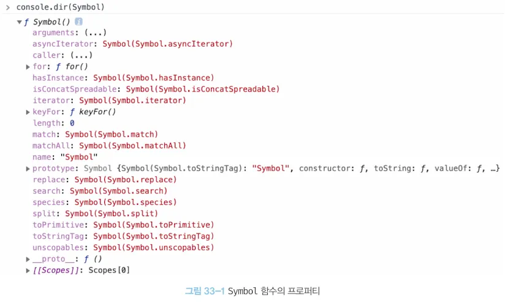

# 33장 7번째 데이터 타입 Symbol

# 심벌이란?

- ES6에서 도입된 7번째 데이터 타입
- 변경 불가능한 원시 타입의 값
- 다른 값과 중복되지 않는 유일무이한 값이다.
    - 주로 이름의 충돌 위험이 없는 유일한 프로퍼티 키를 만들기 위해 사용한다.

# 심벌 값의 생성

## Symbol 함수

- `Symbol` 함수를 호출하여 생성 (리터럴 표기법으로 생성할 수 없다.)
- new 연산자와 함께 호출하지 않는다.
- 생성된 심벌 값은 외부로 노출되지 않아 확인할 수 없으며,
**다른 값과 절대 중복되지 않는 유일무이한 값이다.**
- `Symbol` 함수에는 선택적으로 문자열을 인수로 전달할 수 있다.
    - 이 문자열은 생성된 심벌 값에 대한 설명으로 디버깅 용도로만 사용되며,
    심벌 값 생성에 어떠한 영향도 주지 않는다.
    - 서로 다른 심벌에 설명 값이 같더라도 각자가 유일무이한 값이다.
- 심벌 값도 객체처럼 접근하면 암묵적으로 래퍼 객체를 생성한다.
    - 메서드 사용이 가능하다.
    - 래퍼 객체(21-3)
        - 문자열, 숫자, 불리언 값에 대해 객체처럼 접근하면 생성되는 임시 객체
        - 자바스크립트 엔진이 일시적으로 원시값을 연관된 객체로 변환해 준다.
- 심벌 값은 암묵적으로 문자열이나 숫자 타입으로 변환되지 않는다.
    - 단, 불리언 타입으로는 암묵적으로 타입 변환이 된다.
        - 이를 통해 if 문 등에서 존재 확인이 가능하다.

```jsx
// Symbol 함수를 호출하여 유일무이한 심벌 값을 생성한다.
const mySymbol = Symbol();
console.log(typeof mySymbol); // symbol

// 심벌 값은 외부로 노출되지 않아 확인할 수 없다.
console.log(mySymbol); // Symbol()

// new 연산자를 사용해서 호출하지 않는다.
new Symbol(); // typeError: Symbol is not a constructor

// 심벌 값에 대한 설명이 같더라도 유일무이한 심벌 값을 생성한다.
const mySymbol1 = Symbo('mySymbol');
const mySymbol2 = Symbo('mySymbol');

console.log(mySymbol1 === mySymbol2); // false

// 심벌도 래퍼 객체를 생성한다.
const mySymbol3 = Symbol('mySymbol');

console.log(mySymbol3.description); // mySymbol
console.log(mySymbol3.toString()); // Symbol(mySymbol)

// 심벌 값은 암묵적으로 문자열이나 숫자 타입으로 변환되지 않는다.
// 불리언 타입으로는 암묵적으로 타입 변환된다.
const mySymbol4 = Symbol();

console.log(mySymbol4 + ''); // TypeError: Cannot conver a Symbol value to a string
console.log(+mySymbol4); // TypeError: Cannot conver a Symbol value to a number
console.log(!!mySymbol4); // true

if(mySymbol) console.log('mySymbol is not empty.');

```

## Symbol.for / Symbol.keyFor 메서드

- `Symbol.for`  메서드는 인수로 전달받은 문자열을 키로 사용하여 키와 심벌 값의 쌍들이 저장되어 있는 전역 심벌 레지스트리에서 해당 키와 일치하는 심벌 값을 검색한다.
    - 검색에 성공하면 새로운 심벌 값을 생성하지 않고 검색된 심벌 값을 반환한다.
    - 검색에 실패하면 새로운 심벌 값을 생성하여 Symbol.for 메서드의 인수로 전달된 키로 전역 심벌 레지스트리에 저장한 후, 생성된 심벌 값을 반환한다.
- `Symbol.for` 메서드를 사용하면 애플리케이션 전역에서 중복되지 않는 유일무이한 상수인 심벌 값을 단 하나만 생성하여 전역 심벌 레지스트리를 통해 공유할 수 있다.
    - `Symbol` 함수를 통해 만들면 심벌 레지스트리에서 심벌 값을 검색할 수 있는 키를 지정할 수 없으므로 전역 심벌 레지스트리에 등록되어 관리되지 않는다.
- `Symbol.keyFor` 메서드를 사용하면 전역 심벌 레지스트리에 저장된 심벌 값의 키를 추출할 수 있다.

```jsx
// 전역 심벌 레지스트리에 mySymbol 이라는 키로 저장된 심벌 값이 없으면 새로운 심벌 값을 생성
const s1 = Symbol.for('mySymbol');
// 전역 심벌 레지스트리에 mySymbol 이라는 키로 저장된 심벌 값이 있으면 해당 심벌 값을 반환
const s2 = Symbol.for('mySymbol');

console.log(s1 === s2); // true

// 전역 심벌 레지스트리에 저장된 심벌 값의 키를 추출
Symbol.keyFor(s1); // mySymbol

// Symbol 함수를 호출하여 생성한 심벌 값은 전역 심벌 레지스트리에 등록되어 관리되지 않는다.
const s3 = Symbol('foo');
// 전역 심벌 레지스트리에 저장된 심벌 값의 키를 추출
Symbol.keyFor(s3); // undefined
```

# 심벌과 상수

```jsx
// 위, 아래, 왼쪽 , 오른쪽을 나타내는 상수를 정의
// 이때 값 1, 2, 3, 4 에는 특별한 의미가 없고 상수 이름에 의미가 있다.

const Direction = {
	UP: 1,
	DOWN: 2,
	LEFT: 3,
	RIGHT: 4
};

//  변수에 상수를 할당
const myDirection = Dirction.UP;
if(myDirection === Direction.UP){
		console.log('You are going UP.')	 
}
```

- 상수 값 1, 2, 3, 4가 변경될 수 있으며, 다른 변수 값과 중복될 수도 있다.

```jsx
// 위, 아래, 왼쪽 , 오른쪽을 나타내는 상수를 정의
// 중복될 가능성이 없는 심벌 값으로 상수 값을 생성

const Direction = {
	UP: Symbol('up'),
	DOWN: Symbol('down'),
	LEFT: Symbol('left'),
	RIGHT: Symbol('right')
};

const myDirection = Dirction.UP;
if(myDirection === Direction.UP){
		console.log('You are going UP.')	 
}
```

- 변경/중복될 가능성이 있는 무의미한 상수 대신 중복될 가능성이 없는 유일무이한 심벌 값을 사용

# 심벌과 프로퍼티 키

- 객체의 프로퍼티 키는 빈 문자열을 포함하는 모든 문자열 또는 심벌 값으로 만들 수 있다.
심벌 값으로 동적으로 생성도 가능하다.
- 프로퍼티 키로 사용할 심벌 값에 대괄호를 사용하여 생성
- 프로퍼티에 접근할 때도 대괄호를 사용
- 실벌 값은 유일무이한 값이므로 **심벌 값으로 프로퍼티 키를 만들면 다른 프로퍼티 키와 절대 충돌하지 않는다.**

```jsx
const obj = {
	// 심벌 값으로 프로퍼티 키를 생성
	[Symbol.for('mySymbol')]: 1
}

obj[Symbol.for('mySymbol')]; // 1
```

# 심벌과 프로퍼티 은닉

- 심벌 값을 프로퍼티 키로 사용하여 생성한 프로퍼티는 `for in` 문, `Object.keys`, `Object.getOwnPropertyNames` 메서드로 찾을 수 없다.
    - 프로퍼티 은닉이 가능하다.
    - 완전하게 숨길 수 있는 것은 아니고 ES6의 `object.getOwnPropertySymbols` 메서드를 사용하면 심벌 값을 프로퍼티 키로 사용하여 생성한 프로퍼티를 찾을 수 있다.

```jsx
const obj = {
	// 심벌 값으로 프로퍼티 키를 생성
	[Symbol.for('mySymbol')]: 1
}

for(const key in obj){
	console.log(key); // 아무것도 출력되지 않음
}

console.log(Object.keys(obj)); // []
console.log(Objecct.getOwnPropertyNames(obj)); // []

// getOwnPropertySymbols 메서드는 인수로 전달한 객체의 심벌 프로퍼티 키를 배열로 반환한다.
console.log(Object.getOwnPropertySymbols(obj)); // [Symbol(mySymbol)]

// getOwnPropertySymbols 메서드로 심벌 값도 찾을 수 있다.
const symbolKey1 = object.getOwnPropertySymbols(obj)[0];
console.log(obj[SymbolKey1]) // 1
```

# 심벌과 표준 빌트인 객체 확장

- 표준 빌트인 객체에 사용자 정의 메서드를 직접 추가하여 확장하는 것은 권장하지 않는다.
    - 개발자가 직접 추가한 메서드와 미래에 표준 사양으로 추가될 메서드의 이름이 중복될 수 있기 때문
    
    ex) ES6에서 Array.prototype.find 메서드가 도입되기 전에 Array.prototype에 사용자 정의 find 메서드를 직접 추가했다면 ES6 도입 이후 ES6의 Array.prototype.find 메서드가 사용자 정의 find 메서드를 덮어쓰는 문제가 발생 
    
- 하지만 중복될 가능성이 없는 심벌 값으로 프로퍼티 키를 생성하여 표준 빌트인 객체를 확장하면 안전하게 표준 빌트인 객체를 확장할 수 있다.

```jsx
// 표준 빌트인 객체를 확장하는 것은 권장하지 않는다.
Array.prototype.sum = function(){
	return this.reduce((acc, cur) => acc + cur, 0);
};

[1, 2].sum(); // 3

// 심벌 값으로 프로퍼티 키를 동적 생성하면 다른 프로퍼티 키와 절대 충돌하지 않아 안전하다.
Array.prototype.[Symbol.for('sum')] = function(){
	return this.reduce((acc, cur) => acc + cur, 0);
}

[1, 2][Symbol.for('sum')](); // 3
```

# Well-known Symbol

- 자바스크립트가 기본 제공하는 빌트인 심벌 값
- `Symbol` 함수의 프로퍼티에 할당되어 있다.
    
    
    
- Well-known Symbol은 자바스크립트 엔진의 내부 알고리즘에 사용된다.