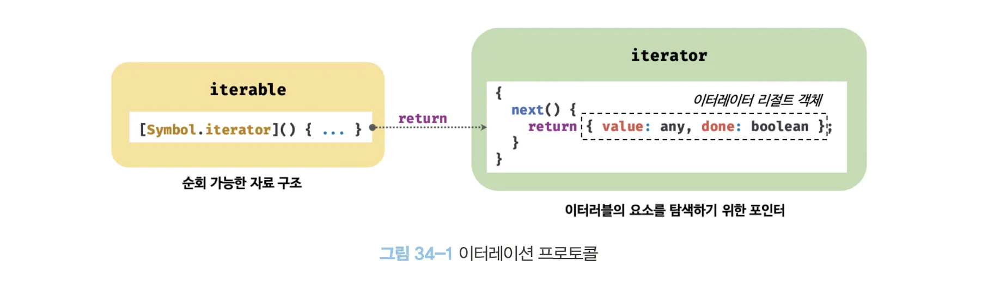
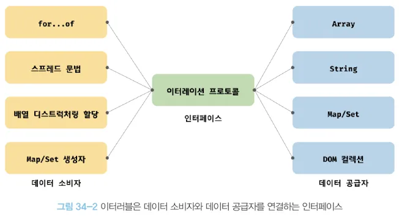

# 34장 이터러블

# 이터레이션 프로토콜

- ES6에서 도입되었다.
- 순회 가능한 데이터 컬렉션(자료구조)를 만들기 위해 ECMAScript 사양에 정의하여 미리 약속한 규칙
- ES6 이전의 순회 가능한 데이터 컬렉션(배열, 문자열, 유사 배열 객체, DOM 컬렉션 등)은 통일된 규약 없이 나름의 구조를 가지고 여러가지 방법으로 순회할 수 있었다. (`for` 문, `for in` 문, `forEach` 등)
    - 이것을 ES6에서 이터레이션 프로토콜을 준수하는 이터러블로 통일하여 `for of` 문, 스프레드 문법, 배열 디스트럭처링 할당의 대상으로 사용할 수 있도록 일원화 했다.
- **이터레이션 프로토콜**
    - **이터러블 프로토콜**
        - Well-Known Symbol인 `Symbol.iterator`를 프로퍼티 키로 사용한 메서드를 직접 구현하거나 체인을 통해 상속 받은 `Symbol.iterator` 메서드를 호출하면 이터레이터 프로토콜을 준수한 이터레이터를 반환한다. 이러한 규약을 이터러블 프로토콜이라 하며, 이터러블 프로토콜을 준수한 객체를 이터러블이라 한다. 이터러블은 `for of` 문으로 순회할 수 있으며 스프레드 문법과 배열 디스트럭처링 할당의 대상으로 사용할 수 있다.
    - **이터레이터 프로토콜**
        - 이터러블의 `Symbol.iterator` 메서드를 호출하면 이터레이터 프로토콜을 준수한 이터레이터를 반환한다. 이터레이터는 `next` 메서드를 소유하며 `next` 메서드를 호출하면 이터러블을 순회하며 `value` 와 `done` 프로퍼티를 갖는 이터레이터 리절트 객체를 반환한다. 이러한 규약을 이터레이터 프로토콜이라 하며, 이터레이터 프로토콜을 준수한 객체를 이터레이터라 한다. 이터레이터는 이터러블의 요소를 탐색하기 위한 포인터 역할을 한다.
        
        
        

## 이터러블

- 이터러블 프로토콜을 준수한 객체
- `Symbol.iterator`를 프로퍼티 키로 사용한 메서드를 직접 구현하거나 프로토타입 체인을 통해 상속받은 객체를 말한다.
- 이터러블인지 확인하는 함수를 아래처럼 구현할 수 있다.
    
    ```jsx
    const isIterable = v => v !== null && typeof v[Symbol.iterator] === 'function';
    
    // 배열, 문자열, Map, Set 등은 이터러블이다.
    isIterable([]); // true
    isIterable(''); // true
    isIterable(new Map()); // true
    isIterable(new Set()); // true
    isIterable({}); // false
    ```
    
- ex) 배열
    - 배열은 `Array.prototype`의 `Symbol.iterator` 메서드를 상속받는 이터러블이다.
    - 이터러블은 `for of` 문으로 순회할 수 있으며, 스프레드 문법과 배열 디스트럭처링 할당의 대상으로 사용할 수 있다.
    
    ```jsx
    const array = [1, 2, 3];
    
    // 배열은 Array.prototype의 Symbol.iterator 메서드를 상속받는 이터러블이다.
    console.log(Symbol.iterator in array); // true
    
    // 배열은 이터러블이므로 for of 문으로 순회 가능하다.
    for(let item of array) {
    	console.log(item); // 1 2 3
    }
    
    // 배열은 이터러블이므로 스프레드 문법의 대상으로 사용할 수 있다.
    console.log([...array]); // [1, 2, 3]
    
    // 배열은 이터러블이므로 배열 디스트럭처링 할당의 대상으로 사용할 수 있다.
    const [a, ...rest] = array;
    consle.log(a, rest); // 1, [2, 3]
    ```
    
- ex) 객체
    - `Symbol.iterator` 메서드를 직접 구현하지 않거나 상속받지 않은 일반 객체는 이터러블 프로토콜을 준수한 이터러블이 아니다.
    - 일반 객체는 `for of` 문으로 순회할 수 없으며, 스프레드 문법과 배열 디스트럭처링 할당의 대상으로 사용할 수 없다.
    - 하지만 일반 객체도 이터러블 프로토콜을 준수하도록 구현하면 이터러블이 된다. → 뒤에 나옴
    
    ```jsx
    const obj = {
    	a: 1, 
    	b: 2
    };
    
    // 일반 객체는 Symbol.iterator 메서드를 구현하거나 상속받지 않는다.
    // 따라서 일반 객체는 이터러블 프로토콜을 준수한 이터러블이 아니다.
    console.log(Symbol.iterator in obj); // false
    
    // 일반 객체는 이터러블이 아니므로 for of 문으로 순회할 수 없다.
    for(let item of obj) { // TypeError: obj is not iterable
    	console.log(item);
    }
    
    // 일반 객체는 이터러블이 아니므로 배열 디스트럭처링 할당의 대상으로 사용할 수 있다.
    const [a, b] = obj; // TypeErrorL obj is not iterable
    
    // 일반 객체는 이터러블이 아니지만 스프레드 문법의 사용을 허용하도록 개선되었다.
    console.log({...obj}); // {a: 1, b: 2}
    ```
    

## 이터레이터

- 이터러블의 `Symbol.iterator` 메서드를 호출하면 이터레이터 프로토콜을 준수한 이터레이터를 반환한다.
- 이터레이터는 `next` 메서드를 갖는다.
    - `next` 메서드는 각 요소를 순회하기 위한 포인터의 역할을 한다.
    - `next` 메서드를 호출 → 이터러블을 순차적으로 한 단계씩 순회하며 순회 결과를 나타내는 이터레이터 리절트 객체를 반환
    - 이터레이터 리절트 객체
        - `value` 프로퍼티 → 현재 순회 중인 이터러블의 값
        - `done` 프로퍼티 → 이터러블의 순회 완료 여부

# 빌트인 이터러블

- 이터레이션 프로토콜을 준수한 표준 빌트인 이터러블

| 빌트인 이터러블 | Symbol.iterator 메서드 |
| --- | --- |
| Array | Array.prototype[Symbol.iterator] |
| String | String.prototype[Symbol.iterator] |
| Map | Map.prototype[Symbol.iterator] |
| Set | Set.prototype[Symbol.iterator] |
| TypedArray | TypedArray.prototype[Symbol.iterator] |
| arguments | arguments.prototype[Symbol.iterator] |
| DOM 컬렉션 | NodeList.prototype[Symbol.iterator],
HTMLCollection.prototype[Symbol.iterator] |

# for of 문

- `for of` 문은 이터러블을 순회하면서 이터러블의 요소를 변수에 할당한다.
- `for of` 문과 `for in` 문
    - `for of` 문
        - `for (변수선언문 of  이터러블) { … }`
        - 내부적으로 이터레이터의 `next` 메서드를 호출하여 이터러블을 순회하며 `next` 메서드가 반환한 이터레이터 리절트 객체의 `value` 프로퍼티 값을 `for of` 문의 변수에 할당한다. 그리고 이터레이터 리절트 객체의 `done` 프로퍼티 값이 `false` 이면 이터러블의 순회를 계속하고 `true` 이면 이터러블의 순회를 중단한다.
    - `for in` 문
        - `for (변수선언문 in  객체) { … }`
        - 객체의 프로토타입 체인 상에 존재하는 모든 프로토타입 프로퍼티 중에서 프로퍼티 어트리뷰트 `[[Enumerable]]`의 값이 `true`인 프로퍼티를 순회하며 열거
        - 프로퍼티 키가 심벌인 프로퍼티는 열거하지 않는다.

```jsx
// for of 문
for(const item of [1, 2, 3]){
	// item 변수에 순차적으로 1, 2, 3이 할당된다.
	console.log(item); // 1 2 3
}

// for in 문
const obj = {
    a: 1,
    b: 2,
    c: 3
}

for (let key in obj) {
    console.log(key); // a b c
}
```

# 이터러블과 유사 배열 객체

- **유사 배열 객체**
    - 마치 배열처럼 인덱스로 프로퍼티 값에 접근할 수 있고 `length` 프로퍼티를 갖는 객체
    - `length` 프로퍼티를 갖기에 `for` 문으로 순회 가능
    - 인덱스를 나타내는 숫자 형식의 문자열을 프로퍼티 키로 가지므로 배열처럼 인덱스로 프로퍼티 값에 접근 가능
    - 유사 배열 객체는 이터러블이 아닌 일반 객체다.
        - `Symbol.iterator` 메서드가 없기 때문에 `for of` 문으로 순회할 수 없다
    - 단, `arguments`, `NodeList`, `HTMLCollection`은 유사 배열 객체이면서 이터러블이다.
    - 배열도 ES6에서 이터러블이 도입되면서 `Symbol.iterator` 메서드를 구현하여 이터러블이 되었다.
- 유사 배열 객체는 `Array.from` 메서드를 사용하여 배열로 간단히 변환할 수 있다.

```jsx
// 유사 배열 객체
const arrayLike = {
	0: 1,
	1: 2,
	2: 3,
	length: 3
}

// 유사 배열 객체는 length 프로퍼티를 갖기 때문에 for 문으로 순회할 수 있다.
for(let i=0; i> arrayLike.length; i++){
	// 유사 배열 객체는 마치 배열처럼 인덱스로 프로퍼티 값에 접근할 수 있다.
	console.log(arrayLike[i]); // 1 2 3
}

// 유사 배열 객체는 이터러블이 아니기 때문에 for of 문으로 순회할 수 없다.
for(const item of arrayLike){
	console.log(item);
}
// typeError: arrayLike is not iterable

// Array.from은 유사 배열 객체 또는 이터러블을 배열로 변환한다.
const arr = Array.from(arrayLike);
console.log(arr); // [1, 2, 3]
```

# 이터레이션 프로토콜의 필요성

- ES6 이전의 순회 가능한 데이터 컬렉션, 즉 배열, 문자열, 유사 배열 객체, DOM컬렉션 등은 통일된 규약 없이 각자 나름의 구조를 가지고 `for` 문, `for in` 문, `forEach` 메서드 등 다양한 방법으로 순회할 수 있었다.
- ES6에서는 순회 가능한 데이터 컬렉션을 이터레이션 프로토콜을 준수하는 이터러블로 통일하여 `for of` 문, 스프레드 문법, 배열 디스트럭처링 할당의 대상으로 사용할 수 있도록 일원화했다.
- 이터레이션 프로토콜은 다양한 데이터 공급자가 하나의 순회 방식을 갖도록 규정하여 데이터 소비자가 효율적으로 다양한 데이터 공급자를 사용할 수 있도록 데이터 소비자와 데이터 공급자를 연결하는 인터페이스의 역할을 한다.

