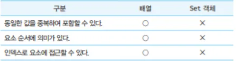

# 37장 Set과 Map

# 37.1 Set

<aside>
💡

Set 객체는 중복되지 않는 유일한 값들의 집합이다. Set 객체는 **배열과 유사**하지만 다음과 같은 차이가 있다.

</aside>



Set 객체의 특성은 수학적 집합의 특성과 일치한다. Set은 수학적 집합을 구현하기 위한 자료구조다.

따라서 Set을 통해 교집합, 합집합, 차집합, 여집합 등을 구현할 수 있다.

## 37.1.1 Set 객체의 생성

Set 객체는 Set 생성자 함수로 생성한다. Set 생성자 함수에 인수를 전달하지 않으면 빈 Set 객체가 생성된다.

[ 예제 37 - 01 ]

```jsx
const set = new Set();
console.log(set); // Set(0) {}
```

[ 예제 37 - 02 ] 

```jsx
const set1 = new Set([1,2,3,3]);
console.log(set1); // Set(3) {1,2,3}

const set2 = new Set('hello');
console.log(set2); // Set(4) {"h","e","l","o"}
```

[ 예제 37 - 03 ]

```jsx
// 배열의 중복 요소 제거
const uniq = array => array.filter((v,i,self) => self.indexOf(v) === i);
console.log(uniq([2,1,2,3,4,3,4])); // [2,1,3,4]

// Set을 사용한 배열의 중복 요소 제거
const uniq = array => [ ...new Set(array)];
console.log(uniq([2,1,2,3,4,3,4])); // [2,1,3,4];
```

## 37.1.2 요소 개수 확인

Set 객체의 요소 개수를 확인할 때는 Set.prototype.size 프로퍼티를 사용 !

[ 예제 37 - 04 ]

```jsx
const {size} = new Set([1,2,3,3]);
console.log(size); // 3
```

size 프로퍼티는 setter 함수 없이 getter 함수만 존재하는 접근자 프로퍼티다.

⇒ **즉, 값을 읽을 수는 있지만 직접 값을 바꿀 수 없다는 말 !**

[ 예제 37 - 05 ] 

```jsx
const set = new Set([1,2,3]);

console.log(Object.getOwnpropertyDescriptor(Set.prototype, 'size'));
// {set : undefined, enumerable: false, configurable: true, get: f}

set.size = 10; // 값 변경 시도
console.log(set.size); // 3
```

- console.log(Object.getOwnpropertyDescriptor(Set.prototype, 'size')); 의 결과 값에 대한 해석
    
    set : undefined ⇒ setter(값을 설정하는 함수)가 없다.
    
    enumerable: false ⇒ for…in 등에 나오지 않는다. (for … in 에서는 Set 객체의 프로퍼티를 확인할 수 없다는 말)
    
    configurable: true ⇒ 프로퍼티를 삭제하거나 재정의할 수 있다.
    
    get: f ⇒ getter 함수가 있다.(읽을 때 이 함수가 호출되어 값을 반환한다.)
    

## 37.1.3 요소 추가

Set 객체에 요소를 추가할 때는 Set.prototype.add 메서드를 사용한다.

[ 예제 37 - 06 ] 

```jsx
const set = new Set();
console.log(set); // Set(0) {}

set.add(1);
console.log(set); // Set(1) {1}
```

add 메서드는 새로운 요소가 추가된 Set 객체를 반환한다. 따라서 add 메서드를 호출한 후에 add 메서드를 연속적으로 호출 가능
[ 예제 37 - 07 ] 

```jsx
const set = new Set();
set.add(1).add(2);
console.log(set); // Set(2) {1, 2}
```

Set 객체에 **중복된 요소의 추가는 허용 x , 에러는 발생하지 않지만 무시된다.**

[ 예제 37 - 08 ] 

```jsx
const set = new Set();
set.add(1).add(2).add(2);
console.log(set); // Set(2) {1, 2} 
```

**일치 비교 연산자 ( “ === “ ) 은 NaN과 NaN을 다르다고 평가**한다. 하지만 **Set 객체는 NaN과 NaN을 같다고 평가하여 중복 추가를 허용하지 않는다.**

[ 예제 37 - 09 ]

```jsx
const set = new Set();

console.log(NaN === NaN); // false 
// => javascript 표준(ECMAScript)은 자기 자신과도 같지 않다고 정의되어 있기 때문이다 !
console.log(0 === -0); // true

// NaN과 NaN을 같다고 평가하여 중복 추가를 허용하지 않는다.
set.add(NaN).add(NaN);
console.log(set); // Set(1) {NaN}

// +0과 -0을 같다고 평가하여 중복 추가를 허용하지 않는다.
set.add(0).add(-0);
console.log(set); // Set(2) {NaN, 0}
```

**Set 객체는 자바스크립트의 모든 값을 요소로 저장할 수 있다 !**

[ 예제 37 - 10 ] 

```jsx
const set = new Set();

set
	.add(1)
	.add('a')
	.add(true)
	.add(undefined)
	.add(null)
	.add({})
	.add([])
	.add(()=>{});
	
console.log(set); // Set(8) {1, "a", true, undefined, null, {}, [], ()=>{}}
```

## 37.1.4 요소 존재 여부 확인

<aside>
💡

Set 객체에 특정 요소가 존재하는지 확인하려면 **Set.prototype.has 메서드**를 사용한다. has 메서드는 특정요소의 존재 여부를 나타내는 불리언 값을 반환한다.

</aside>

[ 예제 37 - 11 ] 

```jsx
const set = new Set([1,2,3]);

console.log(set.has(2)); // true
console.log(set.has(4)); // false
```

## 37.1.5 요소 삭제

<aside>
💡

> Set 객체의 특정 요소를 삭제하려면 **Set.prototype.delete 메서드**를 사용한다. delete 메서드는 삭제 성공 여부를 나타내는 불리언 값을 반환한다.
> 

delete 메서드에는 index가 아니라 삭제하려는 요소 값을 인수로 전달해야 한다.

⇒ Set 객체는 순서에 의미가 없기 때문이다.

</aside>

[ 예제 37 - 12 ]

```jsx
const set = new Set([1,2,3]); 

// 요소 2를 삭제한다.
set.delete(2);
console.log(set); // Set(2) {1,3}

// 요소 1을 삭제한다.
set.delete(1);
console.log(set); // Set(1) {3}
```

**만약 존재하지 않는 Set 객체의 요소를 삭제하려하면 에러 없이 무시됨 !**

[ 예제 37 - 13 ]

```jsx
const set = new Set([1,2,3]);

// 존재하지 않는 요소 0을 삭제하면 에러 없이 무시된다.
set.delete(0);
console.log(set); // Set(3) {1,2,3}
```

delete 메서드는 삭제 성공 여부를 나타내는 불리언 값을 반환한다. 따라서 Set.prototype.add 메서드와 달리 연속적으로 호출 X 

[ 예제 37 - 14 ]

```jsx
const Set = new Set([1,2,3]);

// delete는 불리언 값을 반환한다.
set.delete(1).delete(2); // TypeError : set.delete(...) delete is not a function
```

## 37.1.6 요소 일괄 삭제

Set 객체의 모든 요소를 일괄 삭제하려면 **Set.prototype.clear메서드**를 사용한다. clear  메서드는 언제나 undefined를 반환한다.

[ 예제 37 - 15 ] 

```jsx
const set = new Set([1,2,3]);

set.clear();
console.log(set); // Set(0) {}
```

## 37.1.7 요소 순회

Set 객체의 요소를 순회하려면 **Set.prototype.forEach 메서드를 사용**한다. 

Set.prototype.forEach 메서드는 Array.prototype.forEach 메서드와 유사하게 this로 사용될 객체를 인수로 전달한다. 

이때 콜백 함수는 다음과 같이 3개의 인수를 전달받는다.

- 첫 번째 인수 : 현재 순회 중인 요소값
- 두 번째 인수 : 현재 순회 중인 요소값
- 세 번째 인수  : 현재 순회 중인 Set 객체 자체

이때, 첫 번째 인수와 두 번째 인수는 같은 값이다.

⇒ 그 이유는 Array.prototype.forEach 메서드와 인터페이스를 동일하게 하기 위함이다. (다른 의미 X)

[ 예제 37 -16 ] 

```jsx
const set = new Set([1,2,3]);

set.forEach((v,v2,set) => console.log(v, v2, set));
/*
1 1 Set(3) {1,2,3}
2 2 Set(3) {1,2,3}
3 3 Set(3) {1,2,3}
*/
```

**Set 객체는 이터러블이다. 따라서 for …of 문으로 순회가 가능하다.**

[ 예제 37 - 17 ] 

```jsx
const set = new Set([1,2,3]);

// Set 객체는 Set.prototype의 Symbol.iterator 메서드를 상속받는 이터러블이다.
console.log(Symbol.iterator in set); // true

// 이터러블인 Set 객체는 for ...of 문으로 순회할 수 있다.
for (const value of set) {
	console.log(value); // 1 2 3
}

// 이터러블인 Set 객체는 스프레드 문법의 대상이 될 수 있다.
console.log([...set]); // [1,2,3]

// 이터러블인 Set 객체는 배열 디스트럭처링 할당의 대상이 될 수 있다.
const [a, ...rest] = set;
console.log(a,rest); // 1, [2,3]
```

<aside>
💡

**Set 객체는 요소의 순서에 의미를 갖지 않음**

**하지만 Set 객체를 순회하는 순서는 요소가 추가된 순서를 따른다.**

</aside>

## 37.1.8 집합 연산

### **교집합**

[ 예제 37 - 18 ] 

```jsx
Set.prototype.intersection = function (set) {
	const result = new Set();
	
	for (const value of set) {
		// 2개의 set 요소가 공통되는 요소이면 교집합의 대상이다.
		if (this.has(value)) result.add(value);
	}
	return result;
};

const setA = new Set([1,2,3,4]);
const setB = new Set([2,4]);

// setA와 setB의 교집합
console.log(setA.intersection(setB)); // Set(2) {2,4}
// setB와 setA의 교집합
console.log(setB.intersection(setA)); // Set(2) {2,4}
```

[ 예제 37 - 19 ]

```jsx
Set.prototype.intersection = function (set) {
	return new Set([...this].filter(v => set.has(v)));
};

const setA = new Set([1,2,3,4]);
const setB = new Set([2,4]);

// setA와 setB의 교집합
console.log(setA.intersection(setB)); // Set(2) {2,4}
// setB와 SetA의 교집합
console.log(setB.intersection(setA)); // Set(2) {2,4}
```

### **합집합**

[ 예제 37 - 20 ]

```jsx
Set.prototype.union = function (set) {
	// this(Set 객체)를 복사
	const result = new Set(this);
	// 2 4 
	for(const value of Set) {
		// 합집합은 2개의 Set 객체의 모든 요소로 구성된 집합이다. 중복된 요소는 포함되지 않음
		result.add(value);
	}
	// 2 4 1 3
	
	return result;
};

const setA = new Set([1,2,3,4]);
const setB = new Set([2,4]);

// setA와 setB의 합집합
console.log(setA.union(setB)); // Set(4) {1,2,3,4}
// setB와 setA의 합집합
console.log(setB.union(setA)); // Set(4) {2,4,1,3}
```

[  예제 37 - 21 ] 

```jsx
Set.prototype.union = function (set) {
	return new Set([...this, ...set]);
};

const setA = new Set([1,2,3,4]);
const setB = new Set([2,4]);

// setA와 setB의 합집합
console.log(setA.union(setB)); // Set(4) {1,2,3,4}
// setB와 setA의 합집합
console.log(setB.union(setA)); // Set(4) {2,4,1,3}
```

### 차집합

[ 예제 37 - 22 ] 

```jsx
Set.prototype.difference = function (set) { 
	// this(Set 객체)를 복사
	const result = new Set(this);
	
	for(const value of set) {
		// 차집합은 어느 한쪽 집합에는 존재하지만 
		// 다른 한쪽 집합에는 존재하지 않는 요소로 구성된 집합이다.
		result.delete(value);
	}
	return result;
};

const setA = new Set([1,2,3,4]);
const setB = new Set([2,4]);

// setA에 대한 setB의 차집합
console.log(setA.difference(setB)); // Set(2) {1,3}
console.log(setB.difference(setA)); // Set(0) {}
```

[ 예제 37 - 23 ] 

```jsx
Set.prototype.difference = function (set) {
	return new Set([...this].filter(v => !set.has(v)));
};

const setA = new Set([1,2,3,4]);
const setB = new Set([2,4]);

// setA에 대한 setB의 차집합
console.log(setA.difference(setB)); // Set(2) {1,3}
// setB에 대한 setA의 차집합
console.log(setB.difference(setA)); // Set(0) {}
```

**부분 집합과 상위 집합**

[ 예제 37 - 24 ]

```jsx
// this가 subset의 상위 집합인지 확인한다.
Set.prototype.isSuperset = function (subset) {
	for(const value of subset) {
		// superset의 모든 요소가 subset의 모든 요소를 포함하는지 확인
		if(!this.has(value)) return false;
	}
	return ture;
};
const setA = new Set([1,2,3,4]);
const setB = new Set([2,4]);

// setA가 setB의 상위 집합인지 확인한다.
console.log(setA.isSuperset(setB)); // true
// setB가 setA의 상위 집합인지 확인한다.
console.log(setB.isSuperset(setA)); // false	
```

[ 예제 37 - 25 ]

```jsx
// this가 subset의 상위 집합인지 확인한다.
Set.prototype.isSuperset = function (subset) {
	const supersetArr = [...this];
	return [...subset].every(v => supersetArr.includes(v));
};
const setA = new Set([1,2,3,4]);
const setB = new Set([2,4]);

// setA가 setB의 상위 집합인지 확인한다.
console.log(setA.isSuperset(setB)); // true
// setB가 setA의 상위 집합인지 확인한다.
console.log(setB.isSuperset(setA)); // false
```

# 37.2 Map

**Map 객체는 키와 값의 쌍으로 이루어진 컬렉션**


## 37.2.1 Map 객체의 생성

[ 예제 37 - 26 ] 

```jsx
const map = new Map();
console.log(map); // Map(0) {}
```

**Map 객체를 생성할 때에는 키 값과 요소 값을 일대일로 매칭 시켜야한다.**

[ 예제 37 - 27 ] 

```jsx
const map1 = new Map([['key1', 'value1'], ['key2','value2']]);
console.log(map1); // Map(2) {"key1" => "value1", "key2" => "value2"}

const map2 = new Map([1,2]); // TypeError
```

**Map 객체에서 중복된 키를 갖는 요소가 존재한다면 값이 덮어씌워진다.**

[ 예제 37 - 28 ] 

```jsx
const map = new Map([['key1','value1'], ['key1','value2']]);
console.log(map); // Map(1) {"key1" => "value2"}
```

## 37.2.2 요소 개수 확인

Map 객체의 요소 개수를 확인할 때는 **Map.prototype.size 프로퍼티**를 사용한다.

[ 예제 37 - 29 ] 

```jsx
const { size } = new Map([['key1', 'value1'], ['key2','value2']]);
console.log(size); // 2
```

[ 예제 37 - 30 ] 

```jsx
const map = new Map([['key1','value1'], ['key2','value2']]);
console.log(Object.getOwnPropertyDescriptor(Map.prototype, 'size'));
// {set: undefined, enumerable: false, configurable: true, get: f}
// 여기서도 set : undefined => setter 함수가 없다
// get : f => getter 함수가 존재한다.
// 고로 수정이 불가능하다.
map.size = 10; // 무시된다.
console.log(map.size); // 2
```

## 37.2.3 요소 추가

Map 객체에 요소를 추가할 때는 **Map.prototype.set 메서드**를 사용한다.

[ 예제 37 - 31 ] 

```jsx
const map = new Map();
console.log(map); // Map(0) {}

map.set('key','value1');
console.log(map); // Map(1) {"key1" => "value1"}
```

Map의 set 메서드도 Set객체의 add 메서드와 동일하게 연속적으로 호출이 가능하다.

[ 예제 37 - 32 ] 

```jsx
const map = new Map();

map
	.set('key1','value1')
	.set('key2','value2');
	
console.log(map); // Map(2) {"key1" => "value1", "key2" => "value2"}
```

**Map 객체에는 중복된 키를 갖는 요소가 절대로 존재할 수 없다** 따라서 중복된 키를 갖는 값이 추가되면 덮어씌워진다. 이때 에러는 발생하지 않음 !

[ 예제 37 - 33 ] 

```jsx
const map = new Map();

map
	.set('key1', 'value1')
	.set('key1', 'value2')
	
console.log(map); // Map(1) {"key1" => "value2"}
```

일치 비교 연산자 ( “ === “ )을 사용하면 NaN과 NaN을 다르다고 평가함 (ECMAScript 에서 정한 룰)

하지만, Map 객체도 Set 객체와 마찬가지로 NaN과 NaN은 같다고 평가하여 중복추가 XXXX

[ 예제 37 - 34 ] 

```jsx
const map = new Map();
console.log(NaN === NaN); // false
console.log(0 === -0); // true

// NaN과 NaN을 같다고 평가하여 중복 추가를 허용하지 않는다.
map.set(NaN,'value1').set(NaN,'value2');
console.log(map); // Map(1) {NaN => "value2")

// +0과 -0을 같다고 평가하여 중복 추가를 허용 XXXX
map.set(0,'value1').set(-0,'value2');
console.log(map); // Map(2) {NaN => "value2", 0 => "value2" }
```

<aside>
💡

객체는 문자열 또는 심벌 값만 키로 사용할 수 있다.

하지만,  Map 객체는 **키 타입에 제한이 없다.**

따라서, **모든 객체를 포함한 모든 값을 키로 사용이 가능하다.**

</aside>

[ 예제 37 - 35 ] 

```jsx
const map = new Map();

const lee = { name : 'Lee' };
const kim = { name : 'Kim' };

// 객체도 키로 사용할 수 있다.
map
	.set(lee,'developer')
	.set(kim,'designer');
	
console.log(map);
// Map(2) { { name : "Lee" } => "developer", { name : "Kim" } => "designer" }
```

## 37.2.4 요소 취득

Map 객체에서 특정 요소를 취득하려면 **Map.prototype.get 메서드**를 사용한다.

[ 예제 37 - 36 ] 

```jsx
const map = new Map();

const lee = { name : 'Lee' };
const kim = { name : 'Kim' };

map
	.set(lee, 'developer')
	.set(kim, 'designer');
	
console.log(map.get(lee)); // developer
console.log(map.get('key')); // undefined
```

## 37.2.5 요소 존재 여부 확인

Map 객체에 특정 요소가 존재하는지 확인하려면 Map.prototype.has 메서드를 사용한다.

[ 예제 37 - 37 ] 

```jsx
const lee = { name : 'Lee' };
const kim = { name : 'Kim' };

const map = new Map([[lee, 'developer'], [Kim, 'designer']]);

console.log(map.has(lee)); // true
console.log(map.has('key')); //false
```

## 37.2.6 요소 삭제

Map 객체의 요소를 삭제하려면 Map.prototype.delete 메서드를 사용한다. 

[ 예제 37 - 38 ] 

```jsx
const lee = { name : 'Lee' };
const kim = { name : 'Kim' };

const map = new Map([[lee, 'developer'], [kim, 'designer']]);

map.delete(kim);
console.log(map); // Map(1) { name : "Lee" } => "developer" }
```

[ 예제 37 - 39 ]

```jsx
// if 존재하지 않는 키로 Map 객체의 요소를 삭제하려고 하면 에러없이 무시됨 !
const map = new Map([['key1','value1']]);

// 존재하지 않는 키 'key2'로 요소를 삭제하려 하면 에러 없이 무시된다.
map.delete('key2');
console.log(map); // Map(1) {"key1" => "value1"}
```

Map 객체도 Set 객체와 마찬가지로 연속적으로 delete 메서드를 호출 할 수 없다.

## 37.2.7 요소 일괄 삭제

Map 객체의 요소를 일괄 삭제하려면 Map.prototype.clear 메서드를 사용한다.

[ 예제 37 - 41 ] 

```jsx
const lee = { name : 'Lee' };
const kim = { name : 'Kim' };

const map = new Map([[lee, 'developer'],[kim,'designer']]);

map.clear();
console.log(map); // Map(0) {}
```

## 37.2.8 요소 순회

Map 객체의 요소를 순회하려면 Map.prototype.forEach 메서드를 사용한다.

- 첫 번째 인수 : 현재 순회 중인 요소 값
- 두 번째 인수 : 현재 순회 중인 요소 키
- 세 번째 인수 : 현재 순회 중인 Map 객체 자체

[ 예제 37 - 42 ] 

```jsx
const lee = { name : 'Lee' };
const kim = { name : 'Kim' };

const map = new Map([[lee,'developer'],[kim,'designer']]);

map.forEach((v, k, map) => console.log(v, k, map));

/*
developer { name: "lee"} Map(2) {
	{ name: "Lee" } => "developer",
	{ name: "Kim" } => "designer"
}

designer { name: "Kim"} Map(2) {
	{ name: "Lee" } => "developer",
	{ name: "Kim" } => "designer"
}
*/
```

<aside>
💡

Map 객체도 **이터러블**이다.

따라서 for …of문으로 순회가 가능하며 스프레드 문법과 배열 디스트럭처링 할당의 대상이 될 수 있다.

</aside>