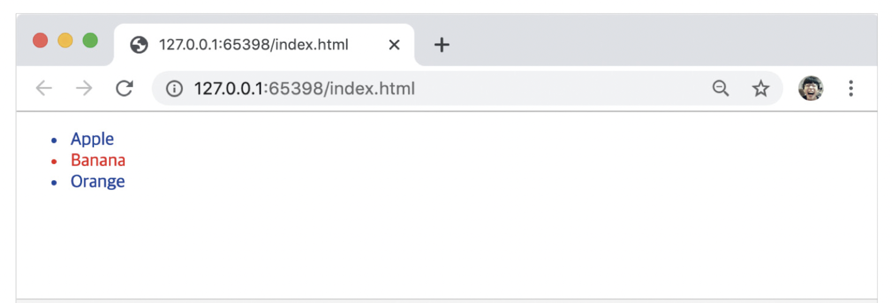
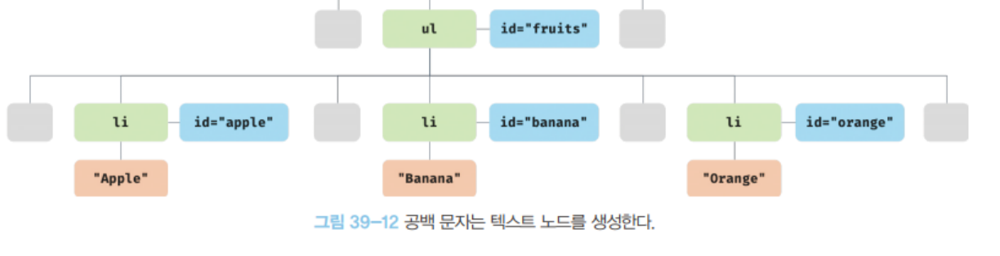

## 39.2.6 HTMLCollection과 NodeList

<aside>
✂️

### **HTMLCollection 과 NodeList**

→ 공통점

1. **유사 배열 객체**
    - 인덱스로 접근 가능 (`items[0]`)
    - `length` 속성 보유
2. **이터러블 (iterable)**
    - `for...of` 문으로 순회 가능
    - 스프레드 문법(`[...]`)으로 배열 변환 가능

→ 중요한 특징

1. 살아있는 객체 (Live Object)
    - **DOM 변경이 자동 반영되는 특징**
    - 예시: `getElementsByTagName`, `getElementsByClassName` → 새로운 요소 추가 시 자동으로 length 업데이트

→ `HTMLCollection`은 언제나 live 객체로 동작한다.

→ `NodeList`는 대부분의 경우 노드 객체의 상태 변화를 실시간으로 반영하지 않고 정적 상태 non-live 객체로 동작하지만, 경우에 따라 live 객체로 동작할 때가 있다.

### → HTMLCollection

- HTMLCollection 객체는 노드 객체의 상태 변화를 실시간으로 반영하는 살아 있는 DOM 컬렉션 객체다.

```html
<!DOCTYPE html>
<head>
	<style>
		.red { color: red; }
		.blue { color: blue; }
	</style>
</head>
<html>
	<body>
		<ul id="fruits">
			<li class="red">Apple</li>
			<li class="red">Banana</li>
			<li class="red">Orange</li>
		</ul>
		<script>
			// class 값이 red인 요소 노드 모두 탐색 후 HTMLCollection 객체에 담아 반환 
			const $elems = document.getElementsByClassName('red');
			// 이 시점에 HTMLCollection 객체에는 3개의 요소 노드가 담겨있다.
			console.log($elems); // HTMLCollection(3) [li.red, li.red, li.red]
			
			// HTMLCollection 객체의 모든 요소의 class 값을 'blue'로 변경
			for(let i = 0; i< $elems.length; i++) {
				$elems[i].className = 'blue';
			}
			
			// 이 시점에서 HTMLCollection 객체에는 3개에서 1개로 변경
			console.log($elems); // HTMLCollection(1) [li.red]
		</script>
```



→ 두번째 li 요소만 class 값이 변경되지 않는다. 

why ? 

1. `for` 루프 첫 번째 반복:
    - `$elems[0]` (Apple)을 `class="blue"`로 변경
    - 이제 Apple은 `.red`가 아니니까 컬렉션에서 자동 제외됨
    - `$elems`에는 Banana, Orange만 남음
2. `for` 루프 두 번째 반복:
    - 인덱스는 `i = 1` → 이 시점에 `$elems[1]`은 Orange (Banana가 0번으로 당겨졌음)
    - 그래서 Banana는 건너뛰고 Orange가 바뀜

> HTMLCollection이 live라서 루프 도중에 컬렉션이 실시간으로 변해서 Banana가 건너뛰어진 것
> 

→ 해결 방법은? 

1. for 문을 역방향으로 순회하는 방법으로 회피할 수 있다.

```jsx
// for 문을 역방향으로 순회
for (let i = $elems.length - 1; i >=0; i--) {
	$elems[i].className = 'blue';
}
```

1. while 문을 사용하여 HTMLCollection 객체에 노드 객체가 남아 있지 않을 때까지 무한 반복하는 방법으로 회피하기.

```jsx
// while 문으로 HTMLCollection에 요소가 남아 있지 않을 때까지 무한 반복
let i = 0;
while ($elems.length > i) {
	$elems[i].className = 'blue';
}
```

1. 유사 배열이자 이터러블인 HTMLCollection을 스프레드 문법으로 배열로 변환하여 순회

```jsx
// HTMLCollection을 배열로 변환하여 순회
[...$elems].forEach(elem => elem.className = 'blue');
```

### → NodeList

- HTMLCollection 객체의 부작용을 해결하기 위해 querySelectorAll 메서드를 사용하는 방법도 있다.
- querySelectorAll 메서드는 DOM 컬렉션 객체인 NodeList 객체를 반환한다.
- 이때 NodeList 객체는 실시간으로 노드 객체의 상태 변경을 반영하지 않는 non-live 객체다.

```jsx
// querySelectorAlldms DOM 컬렉션 객체인 NodeList를 반환한다.
const $elems = document.querySelectorAll('.red');

// NodeList 객체는 NodeList.prototype.forEach 메서드를 상속받아 사용한다.
$elems.forEach(elem => elem.className = 'blue');
```

→ NodeList 객체는 대부분의 경우 노드 객체의 상태 변경을 실시간으로 반영하지 않고 과거의 정적 상태를 유지하는 non-live 객체로 동작한다.

- 하지만 childNodes 프로퍼티가 반환하는 NodeList 객체는 HTMLCollection 객체와 같이 실시간으로 노드 객체의 상태 변경을 반영하는 live 객체로 동작하므로 주의하기!

```html
<!DOCTYPE html>
<html>
	<body>
		<ul id="fruits">
			<li>Apple</li>
			<li>Banana</li>
			<li>Orange</li>
		</ul>
	</body>
	<script>
	const $fruits = document.getElementById('fruits');
	
	// childNodes 프로퍼티는 NodeList 객체(live)를 반환한다.
	const { childNodes }  $fruits;
	console.log(childNodes instanceof NodeList); // true
	
	// $fruits 요소의 자식 노드는 공백 텍스트 노드를 포함해 5개다.
	console.log(childNodes); // NodeList(5) [text, li, text, li, text]
	
	for(let i = 0; i < childNodes.length; i++) {
		// removeChild 메서드는 $fruits 요소의 자식 노드를 DOM에서 삭제한다.
		// removeChild 메서드가 호출될 때마다 NodeList 객체인 childNode가 실시간 변경
		// 따라서 첫 번째, 세 번째, 다섯 번째 요소만 삭제된다.
		$fruits.removeChild(childNodes[i]);
	}
	
	// 예상과 다르게 $fruits 요소의 모든 자식 노드가 삭제되지 않는다.
	console.log(childNodes); // NodeList(2) [li, li]
	</script>
</html>
```

- 노드 객체의 상태 변경과 상관없이 안전하게 DOM 컬렉션을 사용하려면 HTMLCollection이나 NodeList 객체를 배열로 변환하여 사용하는 것을 권장한다.

배열로 변환하는 방법 ? 

1. 스프레드 문법 이용하기
2. Array.from 메서드 이용하기

```html
<!DOCTYPE html>
<html>
	<body>
		<ul id="fruits">
			<li>Apple</li>
			<li>Banana</li>
			<li>Orange</li>
		</ul>
	</body>
	<script>
	const $fruits = document.getElementById('fruits');
	
	// childNodes 프로퍼티는 NodeList 객체(live)를 반환한다.
	const { childNodes }  $fruits;
	console.log(childNodes instanceof NodeList); // true
	
	// 스프레드 문법을 사용하여 NodeList 객체를 배열로 변환한다.
	[...childNodes].forEach(childNode => {
		$fruits.removeChild(childNode);
	});
	
	// $fruits 요소의 모든 자식 노드가 삭제된다
	console.log(childNodes); // NodeList[]
	</script>
</html>
```

</aside>

## 39.3 노드 탐색

<aside>
✂️

→ 요소 노드를 취득한 다음은 ?

1. DOM 트리를 옮겨 다니며 부모, 형제, 자식 노드를 탐색한다.

```html
<ul id="fruits">
	<li class="apple">Apple</li>
	<li class="banana">Banana</li>
	<li class="orange">Orange</li>
</ul>
```

1. 노드를 탐색한다 → HTML 문서 구조는 트리(Tree) 형태!

ul (id="fruits")
├─ li.apple → Apple
├─ li.banana → Banana
└─ li.orange → Orange

1. 프로퍼티들을 이용하여 부모, 자식, 형제 노드를 탐색하기
- 부모 탐색
    - `element.parentNode` → 부모 노드
    - `element.parentElement` → 부모가 요소 노드일 때만 반환
- 자식 탐색
    - `element.childNodes` → 모든 자식 노드 (텍스트 포함)
    - `element.children` → 자식 요소만 (HTMLCollection)
    - `element.firstChild` / `element.lastChild`
    - `element.firstElementChild` / `element.lastElementChild`
- 형제 탐색
    - `element.previousSibling` / `element.nextSibling` → 텍스트 포함
    - `element.previousElementSibling` / `element.nextElementSibling` → 요소만

→ 이때 노드 탐색 프로퍼티는 모두 접근자 프로퍼티다 

- setter 없이 getter만 존재하여 참조만 가능한 읽기 전용 접근자 프로퍼티
- 따라서 프로퍼티에 값을 할당하면 아무런 에러 없이 무시된다.

</aside>

## 39.3.1 공백 텍스트 노드

<aside>
✂️

→ HTML 요소 사이의 스페이스, 탭, 줄바꿈(개행) 등의 공백 문자는 텍스트 노드를 생성한다.

이를 공백 텍스트 노드라 한다.

```html
<!DOCTYPE html>
<html>
	<body>
		<ul id="fruits">
			<li class="apple">Apple</li>
			<li class="banana">Banana</li>
			<li class="orange">Orange</li>
		</ul>
	</body>
</html>
```



- 이러한 공백 문자로 생긴 공백 텍스트 노드는 노드 탐색 시에 주의해야 한다.
- 인위적으로 제거 시 공백 텍스트 노드는 생성하지 않지만 가독성이 좋지 않다.

```html
<ul id="fruits"><li class="apple">Apple</li><li class="banana">Banana</li><li class="orange">Orange</li></ul>
```

</aside>

## 39.3.2 자식 노드 탐색

<aside>
✂️

→ 자식 노드 탐색을 위한 노드 탐색 프로퍼티 확인하기

| 프로퍼티 | 소속 (프로토타입) | 반환 값 | 특징 / 설명 |
| --- | --- | --- | --- |
| **Node.prototype.childNodes** | Node | NodeList | 자식 노드를 모두 탐색하여 DOM 컬렉션 객체인 NodeList에 담아 반환한다. 이때 반환된 NodeList에는 요소 노드뿐만 아니라 텍스트 노드(공백, 줄바꿈)나 요소 노드도 포함될 수 있다. (live 객체) |
| **Element.prototype.children** | Element | HTMLCollection | 자식 노드 중 요소 노드만 탐색하여 HTMLCollection 객체에 담아 반환한다. 텍스트나 요소 노드는 포함되지 않는다. (live 객체) |
| **Node.prototype.firstChild** | Node | Node | 첫 번째 자식 노드를 반환한다. 텍스트 노드나 요소 노드일 수도 있다. |
| **Node.prototype.lastChild** | Node | Node | 마지막 자식 노드를 반환한다. 텍스트 노드나 요소 노드일 수도 있다. |
| **Element.prototype.firstElementChild** | Element | Element | 첫 번째 자식 **요소 노드**만 반환한다. |
| **Element.prototype.lastElementChild** | Element | Element | 마지막 자식 **요소 노드**만 반환한다.  |

```html
<!DOCTYPE html>
<html>
  <body>
    <ul id="fruits">
      <li class="apple">Apple</li>
      <li class="banana">Banana</li>
      <li class="orange">Orange</li>
    </ul>

    <script>
      // ul 요소 노드를 가져옴
      const $fruits = document.getElementById('fruits');

      // -------------------------------
      // 1. Node.prototype.childNodes
      // -------------------------------
      // 자식 노드를 모두 탐색하여 NodeList로 반환
      // NodeList에는 텍스트 노드(공백, 줄바꿈)도 포함됨
      console.log($fruits.childNodes);
      // NodeList(7) [text, li.apple, text, li.banana, text, li.orange, text]

      // -------------------------------
      // 2. Element.prototype.children
      // -------------------------------
      // 자식 노드 중 "요소 노드"만 탐색하여 HTMLCollection으로 반환
      // 텍스트 노드나 주석 노드는 제외됨
      console.log($fruits.children);
      // HTMLCollection(3) [li.apple, li.banana, li.orange]

      // -------------------------------
      // 3. Node.prototype.firstChild
      // -------------------------------
      // 첫 번째 자식 노드를 반환 (텍스트 노드 포함 가능)
      console.log($fruits.firstChild);
      // #text (줄바꿈/공백 때문에 첫 번째 자식은 텍스트 노드)

      // -------------------------------
      // 4. Element.prototype.firstElementChild
      // -------------------------------
      // 첫 번째 자식 "요소 노드"만 반환
      console.log($fruits.firstElementChild);
      // <li class="apple">Apple</li>

      // -------------------------------
      // 5. Node.prototype.lastChild
      // -------------------------------
      // 마지막 자식 노드를 반환 (텍스트 노드 포함 가능)
      console.log($fruits.lastChild);
      // #text (마지막 </li> 뒤에 줄바꿈 때문에 텍스트 노드)

      // -------------------------------
      // 6. Element.prototype.lastElementChild
      // -------------------------------
      // 마지막 자식 "요소 노드"만 반환
      console.log($fruits.lastElementChild);
      // <li class="orange">Orange</li>
    </script>
  </body>
</html>
```

</aside>

## 39.3.3 자식 노드 존재 확인

<aside>
✂️

→ 자식 노드가 존재하는지 확인하는 방법?

- Node.prototype.hasChildNodes 메서드를 사용한다.
- 불리언타입으로 자식 노드가 존재하면 true, 존재하지 않으면 false를 반환한다.

```html
<!DOCTYPE html>
<html>
	<body>
		<ul id="fruits">
		</ul>
	</body>
	<script>
	// 노드 탐색의 기점이 되는 #fruits 요소 노드를 취득한다.
	const $fruits = document.getElementById('fruits');
	
	// #fruits 요소에 자식 노드가 존재하는지 확인
	console.log($fruits.hasChildNodes()); // true? -> 공백 텍스트 노드를 자식노드로
	</script>
</html>
```

- 텍스트 노드가 아닌 요소 노드만 확인하기 위해서는 children.length 또는 childElementCount 프로퍼티를 사용한다.

```html
<!DOCTYPE html>
<html>
	<body>
		<ul id="fruits">
		</ul>
	</body>
	<script>
	// 노드 탐색의 기점이 되는 #fruits 요소 노드를 취득한다.
	const $fruits = document.getElementById('fruits');
	
	// #fruits 요소에 자식 노드가 존재하는지 확인
	console.log($fruits.hasChildNodes()); // true
	// 텍스트 노드가 아닌 요소 노드 존재하는지 확인
	console.log(!!$fruits.children.length); // false 
	// 텍스트 노드가 아닌 요소 노드가 존재하는지 확인 
	console.log(!!$fruits.childElementCount); // false
	</script>
</html>
```

</aside>

## 39.3.4 요소 노드의 텍스트 노드 탐색

<aside>
✂️

→ 요소 노드의 텍스트 노드에 접근하는 방법?

- firstChild 프로퍼티로 접근하기
- firstChild는 첫 번째 자식 노드를 반환한다. 반환한 노드는 텍스트 노드이거나 요소 노드다.

```html
<!DOCTYPE html>
<html>
<body>
	<div id="foo">Hello</div>
	<script>
		// 요소 노드의 텍스트 노드는 firstChild 프로퍼티로 접근할 수 있다.
		console.log(document.getElementById('foo').firstChild); // #text
	</script>
</body>
</html>
```

</aside>

## 39.3.5 부모 노드 탐색

<aside>
✂️

→ 부모 노드를 찾는 방법?

- Node.prototype.parentNode 프로퍼티로 접근하기.
- 텍스트 노드는 DOM 트리의 최종단 노드인 리프 노드이므로 부모 노드가 텍스트 노드인 경우는 없다.

```html
<!DOCTYPE html>
<html>
	<body>
		<ul id="fruits">
			<li class="apple">Apple</li>
			<li class="banana">Banana</li>
			<li class="orange">Orange</li>
		</ul>
	</body>
	<script>
	// 노드 탐색의 기점이 되는 .banana 요소 노드를 취득한다.
	const $banana = document.querySelector('.banana');
	
	// .banana 요소 노드의 부모 노드를 탐색한다.
	console.log($banana.parentNode); // ul#fruits
	</script>
</html>
```

</aside>

## 39.3.5 형제 노드 탐색

<aside>
✂️

→ 형제 노드를 찾는 방법?

| 프로퍼티 | 소속 (프로토타입) | 반환 값 | 특징 / 설명 |
| --- | --- | --- | --- |
| **Node.prototype.previousSibling** | Node | Node | 부모 노드의 자식 중 현재 노드 **앞에 있는 형제 노드**를 반환한다. 요소 노드뿐만 아니라 텍스트 노드도 반환될 수 있다. |
| **Node.prototype.nextSibling** | Node | Node | 부모 노드의 자식 중 현재 노드 **뒤에 있는 형제 노드**를 반환한다. 요소 노드뿐만 아니라 텍스트 노드도 반환될 수 있다. |
| **Element.prototype.previousElementSibling** | Element | Element | 부모 노드의 자식 중 현재 노드 **앞에 있는 형제 요소 노드**만 반환한다. 텍스트/주석 노드는 무시된다. |
| **Element.prototype.nextElementSibling** | Element | Element | 부모 노드의 자식 중 현재 노드 **뒤에 있는 형제 요소 노드**만 반환한다. 텍스트/주석 노드는 무시된다. |

```html
<!DOCTYPE html>
<html>
  <body>
    <ul id="fruits">
	    공백텍스트
      <li class="apple">Apple</li>
      
      <li class="banana">Banana</li>
      
      <li class="orange">Orange</li>
      공백텍스트
    </ul>

    <script>
      const $fruits = document.getElementById('fruits');

      // 1) Node.prototype.firstChild (텍스트 노드 가능)
      const { firstChild } = $fruits;
      console.log(firstChild);
      // #text ("\n      ") ← 줄바꿈 공백이 텍스트 노드로 들어옴

      // 2) Node.prototype.nextSibling (텍스트 노드 가능)
      const { nextSibling } = firstChild;
      console.log(nextSibling);
      // li.apple 

      // 3) Node.prototype.previousSibling (텍스트 노드 가능)
      const { previousSibling } = nextSibling;
      console.log(previousSibling);
      // #text ("\n  ") ← li.apple 이전 줄바꿈 텍스트

      // 4) Element.prototype.firstElementChild (요소만)
      const { firstElementChild } = $fruits;
      console.log(firstElementChild);
      // li.apple 

      // 5) Element.prototype.nextElementSibling (요소만)
      const { nextElementSibling } = firstElementChild;
      console.log(nextElementSibling);
      // li.banana

      // 6) Element.prototype.previousElementSibling (요소만)
      const { previousElementSibling } = firstElementChild;
      console.log(previousElementSibling);
      // li.apple 
    </script>
  </body>
</html>
```

</aside>

## 39.4 노드 정보 취득

<aside>
✂️

→ 노드 객체에 대한 정보를 취득해보자.

| 프로퍼티 | 설명 |
| --- | --- |
| Node.prototype.nodeType | 노드 객체의 종류, 노드 타입을 나타내는 상수를 반환한다.
1. Node.ELEMENT_NODE: 요소 노드 타입을 나타내는 상수 1 반환
2. Node.TEXT_NODE: 텍스트 노드 타입을 나타내는 상수 3 반환
3. Node.DOCUMENT_NODE: 문서 노드 타입을 나타내는 상수 9 반환 |
| Node.prototype.nodeName | 노드의 이름을 문자열로 반환한다.
1. 요소 노드: 대문자 문자열로 태그 이름을 반환
2. 텍스트 노드: 문자열 “#text”를 반환
3. 문서 노드: 문자열 “#document”를 반환 |

```html
<!DOCTYPE html>
<html>
<body>
	<div id="foo">Hello</div>
	<script>
		// 문서 노드의 노드 정보를 취득한다.
		console.log(document.nodeType); // 9
		console.log(document.nodeName); // #document
		
		// 요소 노드의 노드 정보를 취득한다.
		const $foo = document.getElementById('foo');
		console.log($foo.nodeType); // 1
		console.log($foo.nodeName); // DIV
		
		// 텍스트 노드의 노드 정보를 취득한다.
		const $textNode = $foo.firstChild;
		console.log($textNode.nodeType); // 3
		console.log($textNode.nodeName); // #text
	</script>
</body>
</html>
```

</aside>

## 39.5 요소 노드의 텍스트 조작

## 39.5.1 nodeValue

<aside>
✂️

→ nodeValue?

- Node.prototype.nodeValue 프로퍼티는 setter와 getter 모두 존재하는 접근자 프로퍼티다.
- nodeValue 프로퍼티는 참조와 할당 모두 가능하다.
- 노드 객체의 nodeValue를 참조하면, 노드 객체의 값 텍스트 노드의 텍스트를 반환한다.
- 문서 노드나 요소 노드의 nodeValue를 참조하면 null이 나온다.

```html
<!DOCTYPE html>
<html>
<body>
	<div id="foo">Hello</div>
	<script>
		// 문서 노드의 nodeValue 프로퍼티를 참조한다.
		console.log(document.nodeValue); // null
		
		// 요소 노드의 nodeValue 프로퍼티를 참조한다.
		const $foo = document.getElementById('foo');
		console.log($foo.nodeValue); // null
		
		// 텍스트 노드의 nodeValue 프로퍼티를 참조한다.
		const $textNode = $foo.firstChild
		console.log($textNode.nodeValue); // Hello
	</script>
</body>
</html>
```

→ 따라서 텍스트 노드가 아닌 이상 null이기 때문에 의미가 없다.

→ 그렇다면 텍스트 노드의 값을 변경해보자.

```html
<!DOCTYPE html>
<html>
<body>
	<div id="foo">Hello</div>
	<script>
		// 1. #foo 요소 노드의 자식 노드인 텍스트 노드를 취득한다.
		const $textNode = document.getElementById('foo').firstChild;
		
		// 2. nodeValue 프로퍼티를 사용하여 텍스트 노드의 값을 변경한다.
		$textNode.nodeValue = 'World';
		console.log($textNode.nodeValue); // World
	</script>
</body>
</html>
```

</aside>

## 39.5.2 textContent

<aside>
✂️

→ textContent란 ?

- textContent 프로퍼티는 setter와 getter 모두 존재하는 접근자 프로퍼티로서 요소 노드의 텍스트와 모든 자손 노드의 텍스트를 모두 취득하거나 변경한다.
- textContent 참조 시 요소 노드의 콘텐츠 영역 내의 텍스트를 모두 반환한다.

```html
<!DOCTYPE html>
<html>
<body>
	<div id="foo">Hello <span>world!</span></div>
	<script>
		// #foo 요소 노드의 텍스트를 모두 취득한다. 이때 HTML 마크업은 무시된다.
		console.log(document.getElementById('foo').textContent); // Hello world!
	</script>
</body>
</html>
```

→ textContent vs nodeValue

```html
<!DOCTYPE html>
<html>
<body>
  <div id="foo">Hello <span>world!</span></div>
  <script>
    const $foo = document.getElementById('foo');

    // -------------------------------
    // 1. textContent (요소 전체 텍스트)
    // -------------------------------
    // 요소 노드 내부의 모든 텍스트 노드를 합쳐서 반환
    console.log($foo.textContent); 
    // "Hello world!"

    // -------------------------------
    // 2. nodeValue (요소 노드 자체)
    // -------------------------------
    // 요소 노드에서 nodeValue는 항상 null
    console.log($foo.nodeValue); 
    // null

    // -------------------------------
    // 3. nodeValue (자식 텍스트 노드)
    // -------------------------------
    // <div>의 첫 번째 자식은 텍스트 노드 "Hello "
    const textNode = $foo.firstChild;
    console.log(textNode.nodeValue); 
    // "Hello "

    // -------------------------------
    // 4. nodeValue (중첩된 텍스트 노드)
    // -------------------------------
    // <span> 요소 안의 텍스트 노드 "world!"
    const spanTextNode = $foo.lastChild.firstChild;
    console.log(spanTextNode.nodeValue); 
    // "world!"
  </script>
</body>
</html>

```

→ 만약 위에 span world 가 없다면 ?

- textContent 와 firstChild.nodeValue는 같은 결과 값이 나온다.
- 텍스트 노드 뽑을때는 그냥 편리한 textContent 쓰자!

→ textContent 값 교체와 innerHTML 

```html
<div id="foo">Hello <span>world!</span></div>

<script>
  const $foo = document.getElementById('foo');

  // #foo 요소 노드의 모든 자식 노드가 제거되고 할당된 문자열이 텍스트로 추가.
  // textContent는 HTML 마크업이 파싱되지 않는다.
  $foo.textContent = 'Hi <span>there</span>';
  console.log($foo.textContent); // Hi <span>there</span>
  
  // innerHTML
  $foo.innerHTML = 'Hi <span>there</span>';
  console.log($foo.innerHTML); // Hi there
</script>
```

→ 하지만 innerHTML 프로퍼티는 다음과 같은 이유로 쓰지 않는다던데..

</aside>