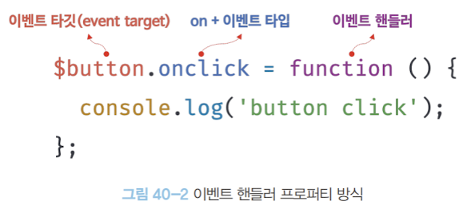
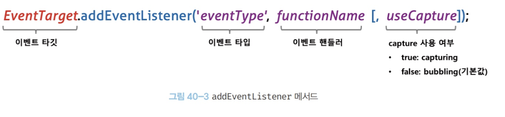
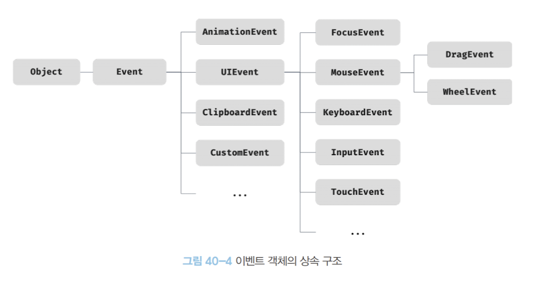

### ⭐️40.1 이벤트 드리븐 프로그래밍

<aside>
🎫

→ 브라우저의 이벤트 발생 방법

- 이벤트(event)란 사용자의 행동(클릭, 입력, 스크롤 등)이나 시스템의 변화(페이지 로드, 네트워크 응답 등)를 의미한다.
- **이벤트 드리븐 프로그래밍**은 이러한 이벤트 발생을 중심으로 프로그램의 흐름이 결정되는 방식이다.
- 즉, **“사용자의 행동 → 브라우저 감지 → 미리 등록한 함수(핸들러) 실행”** 이라는 흐름을 따른다.

> 개발자가 직접 함수를 호출하는 것이 아니라,
> 
> 
> 브라우저에게 “이벤트가 발생하면 이 함수를 실행해줘!”라고 **위임(delegation)** 하는 것이 핵심이다.
> 

```html
<!DOCTYPE html>
<html>
<body>
	<button>Click me!</button>
	<script>
		const $button = document.querySelector('button');
		// 여기서 onclick에 등록된 함수는
    // 사용자가 버튼을 클릭할 때 브라우저가 대신 호출해준다.
		$button.onclick = () => { alert('button click'); };
	</script>
</body>
</html>
```

- 이벤트와 대응하는 함수를 통해 사용자와 애플리케이션은 상호작용할 수 있다, 이런 프로그램 흐름을 이벤트 드리븐 프로그래밍이라 한다.
</aside>

### **📌 40.2.1 마우스 이벤트**

<aside>
🎫

- 마우스의 움직임이나 버튼 클릭 등과 관련된 이벤트

| 이벤트 타입 | 이벤트 발생 시점 |
| --- | --- |
| click | 마우스 버튼을 클릭했을 때 |
| dblclick | 마우스 버튼을 더블 클릭했을 때 |
| mousedown | 마우스 버튼을 눌렀을 때 |
| mouseup | 누르고 있던 마우스 버튼을 놓았을 때 |
| mousemove | 마우스 커서를 움직였을 때 |
| mouseenter | 마우스 커서를 HTML요소 안으로 이동했을 때 (버블링 X) |
| mouseover | 마우스 커서를 HTML 요소 안으로 이동했을 때 (버블링 O) |
| mouseleave | 마우스 커서를 HTML 요소 밖으로 이동했을 때 (버블링 X) |
| mouseout | 마우스 커서를 HTML 요소 밖으로 이동했을 때 (버블링 O) |
</aside>

### **📌 40.2.2 키보드 이벤트**

<aside>
🎫

> 키보드를 누르거나 뗄 때 발생하는 이벤트.
> 
> 
> `keypress`는 과거에 사용되었지만, **현재는 폐지(deprecated)** 되었다.
> 

| 이벤트 타입 | 이벤트 발생 시점 |
| --- | --- |
| keydown  | 모든 키를 눌렀을 때 발생한다.
→ 단문자, 숫자, 특수 문자, enter 키는 연속으로 발생, 이외에는 단 한번만 발생 |
| keypress | 문자 키를 눌렀을 때 연속적으로 발생한다.
→ 문자, 숫자, 특수 문자, enter 키를 눌렀을 때만 발생한다. (폐지 됨) |
| keyup | 누르고 있던 키를 놓았을 때 한번 만 발생한다. |
</aside>

### **📌 40.2.3 포커스 이벤트**

<aside>
🎫

- 버블링이 포함된 타입은 주로 부모가 자식 요소들의 전체를 관리하고 싶을 때 사용한다.
- 부모 요소에서 자식에게 포커스 가는것을 다 관리하고 싶을 때, 버블링이 있는것으로 사용.

| 이벤트 타입 | 이벤트 발생 시점 |
| --- | --- |
| focus | HTML 요소가 포커스 받았을 때 (버블링 X) |
| blur | HTML 요소가 포커스를 잃었을 때 (버블링 X) |
| focusin | HTML 요소가 포커스를 받았을 때 (버블링 O) |
| focusout | HTML 요소가 포커스를 잃었을 때 (버블링 O) |
</aside>

### **📌 40.2.4 폼 이벤트**

<aside>
🎫

| 이벤트 타입 | 이벤트 발생 시점 |
| --- | --- |
| submit | form 요소 내의 submit 버튼을 클릭했을 때 |
| reset | form 요소 내의 reset 버튼을 클릭했을 때 (최근 사용 X) |
</aside>

### **📌 40.2.5 값 변경 이벤트**

<aside>
🎫

| 이벤트 타입 | 이벤트 발생 시점 |
| --- | --- |
| input | input, select, textarea 요소의 값이 입력되었을 때 |
| change | input, select, textarea 요소의 값이 변경되었을 때
→ input과 달리 HTML 요소가 포커스를 잃었을때 인식하여 발생한다. |
| readystatechange | HTML 문서의 로드와 파싱 상태를 나타내는 document.readyState 프로퍼티 값(’loading’, ‘interactive’, ‘complete’)이 변경될 때 |
</aside>

### **📌 40.2.6 DOM 뮤테이션 이벤트**

<aside>
🎫

> HTML 문서의 구조(DOM)가 모두 만들어졌을 때 발생하는 이벤트.
> 

| 이벤트 타입 | 이벤트 발생 시점 |
| --- | --- |
| DOMContentLoaded | HTML 문서의 로드와 파싱이 완료되어 DOM 생성이 완료되었을 때 |
</aside>

### **📌 40.2.7 뷰 이벤트**

<aside>
🎫

| 이벤트 타입 | 이벤트 발생 시점 |
| --- | --- |
| resize | 브라우저 윈도우의 크기를 리사이즈할 때 연속적으로 발생한다. |
| scroll | 웹페이지 또는 HTML 요소를 스크롤할 때 연속적으로 발생한다. |
</aside>

### **📌 40.2.8 리소스 이벤트**

<aside>
🎫

| 이벤트 타입 | 이벤트 발생 시점 |
| --- | --- |
| load | DOMContentLoaded 이벤트가 발생한 이후, 모든 리소스의 로딩이 완료되었을 때 |
| unload | 리소스가 언로드될 때 |
| abort | 리소스 로딩이 중단되었을 때 |
| error  | 리소스 로딩이 실패했을 때 |
</aside>

### ⭐️40.3 이벤트 핸들러 등록

<aside>
🎫

→ 이벤트 핸들러는 이벤트가 발생했을 때 브라우저에 호출을 위임한 함수다.

- 이벤트가 발생하면 브라우저에 의해 호출될 함수가 이벤트 핸들러다.
- 브라우저에게 이벤트 핸들러의 호출을 위임하는것을 이벤트 핸들러 등록이라 한다.
- 이벤트 핸들러를 등록하는 방법은 3가지다.

| 구분 | 방식 이름 | 작성 위치 | 특징 |
| --- | --- | --- | --- |
| ① | **이벤트 핸들러 어트리뷰트 방식** | HTML 태그 안 | 오래된 방식 (직접 HTML에 작성) |
| ② | **이벤트 핸들러 프로퍼티 방식** | JS 코드 내부 | DOM 요소의 프로퍼티에 직접 등록 |
| ③ | **addEventListener 방식** | JS 코드 내부 | 가장 표준적이며 여러 개 등록 가능 |
</aside>

### **📌 40.3.1 이벤트 핸들러 어트리뷰트 방식**

<aside>
🎫

→ 이벤트 핸들러 어트리뷰트 이름은 onclick과 같이 on 접두사와 이벤트의 종류를 나타내는 이벤트 타입으로 이루어져 있다.

```html
<!DOCTYPE html>
<html>
<body>
	<button onclick="sayHi('Lee')">Click me!</button>
	<script>
		function sayHi(name) {
			console.log(`Hi! ${name}.`);
		}
	</script>
</body>
</html>
```

- 주의점 : 이벤트 핸들러 어트리뷰트 값으로 함수 참조가 아닌 함수 호출문 등의 문을 할당하는 것이다.

> HTML의 onclick="...” 안에 적는 건 함수 **자체** 가 아니라,
브라우저가 나중에 실행할 **함수 몸체(실행문)** 를 문자열로 쓴다.

`onclick="sayHi('Lee')"` 어트리뷰트는 파싱되어 다음과 같은 함수를 암묵적으로 생성하고, 이벤트 핸들러 어트리뷰트 이름과 동일한 키 onclick 이벤트 핸들러 프로퍼티에 할당한다.

만약 이벤트 핸들러 어트리뷰트 값으로 함수 참조를 할당해야 한다면 이벤트 핸들러에 인수를 전달하기 곤란하다. `<button onclick="sayHi">Click me!</button>`
> 
> 
> ```html
> button.onclick = function(event) {
> 	sayHi; // 함수 참조만 있고, 실제 호출 안 함
> };
> ```
> 

→ 다양한 프레임워크 이벤트 핸들러 방식

```html
<!-- Angular -->
<button (click)="handleClick($event)">Save</button>

{ /* React */ }
<button onClick={handleClick}>Save</button>

<!-- Svelte -->
<button on:click={handleClick}>Save</button>

<!-- Vue.js -->
<button v-on:click="handleClick($event)">Save</button>
```

</aside>

### **📌 40.3.2 이벤트 핸들러 프로퍼티 방식**

<aside>
🎫

> 브라우저가 HTML 요소를 객체로 생성할 때,
> 
> 
> 각 요소에는 `onclick`, `onchange`, `oninput` 같은 **이벤트 핸들러 프로퍼티**가 함께 생성.
> 
> 이 프로퍼티에 **함수(참조)** 를 직접 대입해서 이벤트를 등록!
> 

```html
<!DOCTYPE html>
<html>
<body>
	<button>Click me!</button>
	<script>
	  // 브라우저는 HTML을 읽을 때,
    // 각 요소를 객체(예: HTMLButtonElement) 로 바꿔서 메모리에 저장
		const $button = document.querySelector('button');
		
		// onclick, onchange, oninput 같은 이벤트 핸들러 프로퍼티를 가지고 있음.
		// 이벤트 핸들러 프로퍼티에 이벤트 핸들러를 바인딩
		$button.onclick = function () {
			console.log('button click');
		};
		// 화살표 함수도 가능
    // $button.onclick = () => alert('clicked!');
	</script>
</body>
</html>
```



- 이벤트 핸들러는 대부분 이벤트를 발생시킬 이벤트 타깃에 바인딩한다.
- 이벤트 핸들러 프로퍼티 방식은 HTML과 자바스크립트가 뒤섞이는 문제를 해결할 수 있다.
- 단점으로는 하나의 이벤트 핸들러만 바인딩이 가능하다.

```html
<!DOCTYPE html>
<html>
<body>
	<button>Click me!</button>
	<script>
		const $button = document.querySelector('button');
		
		// 이벤트 핸들러 프로퍼티 방식은 하나의 이벤트에 하나의 이벤트 핸들러만 바인딩
		// 첫 번째로 바인딩된 이벤트 핸들러는 두 번째 바인딩 핸들러에 의해 재할당
		// 되어 실행되지 않는다.
		$button.onclick = function () {
			console.log('button click 1'); // 출력 X
		};
		$button.onclick = function () {
			console.log('button click 2'); // 얘만 출력
		};
	</script>
</body>
</html>
```

</aside>

### **📌 40.3.3 addEventListener 메서드 방식**

<aside>
🎫

DOM Level 2에서 도입된 EventTarget.prototype.**addEventListener  메서드.**

- 메서드는 `EventTarget` 인터페이스에 정의
- `window`, `document`, `element` 같은 거의 모든 DOM 객체에서 사용 가능



```html
<!DOCTYPE html>
<html>
<body>
	<button>Click me!</button>
	<script>
		const $button = document.querySelector('button');

		$button.addEventListener('click', function () {
			console.log('button click');
		});
	</script>
</body>
</html>
```

addEventListener 에서는 이벤트 핸들러를 인수로 전달한다.

- addEventListener 메서드는 하나 이상의 이벤트 핸들러를 등록할 수 있다.
- 단 참조가 동일한 이벤트 핸들러를 중복 등록하면 하나의 이벤트 핸들러만 등록된다.

```html
<!DOCTYPE html>
<html>
<body>
	<button>Click me!</button>
	<script>
		const $button = document.querySelector('button');
		
		// addEventListener 메서드는 동일한 요소에서 발생한 동일한 이벤트에 대해
		// 하나 이상의 이벤트 핸들러를 등록할 수 있다.
		$button.addEventListener('click', function () {
			console.log('button click 1');
		});
			$button.addEventListener('click', function () {
			console.log('button click 2');
		});
		
		// 참조 주소(메모리 위치) 가 같은지 비교
		// 이미 등록된 경우엔 중복 등록하지 x
		const handleClick = () => console.log('button click');
		
		// 참조가 동일한 이벤트 핸들러를 중복 등록하면 하나의 핸들러만 등록된다.
		$button.addEventListener('click', handleClick);
		$button.addEventListener('click', handleClick);
	</script>
</body>
</html>
```

</aside>

### ⭐️40.4 이벤트 핸들러 제거

<aside>
🎫

→ addEventListener 메서드로 등록한 이벤트 핸들러 제거하기.

- EventTarget.prototype.removeEventListener 메서드를 사용한다.
- 전달하는 인수는 addEventListener 와 동일하다.
- 단, addEventListener 메서드에 전달한 인수와 removerEventListener 메서드에 전달한 인수가 일치하지 않으면 제거되지 않는다.

```html
<!DOCTYPE html>
<html>
<body>
	<button>Click me!</button>
	<script>
		const $button = document.querySelector('button');
		const handleClick = () => console.log('button click');
		
		// 이벤트 핸들러 등록
		$button.addEventListener('click', handleClick);
		
		// 이벤트 핸들러 제거
		// 전달받는 인수가 같아야지 제거!
		$button.removeEventListener('click', handleClick, true); // 실패
		$button.removeEventListener('click', handleClick); // 성공
	</script>
</body>
</html>
```

→ 무명 함수로 이벤트 핸들러로 등록한 경우 제거가 불가능하다.

```jsx
// 이벤트 핸들러 등록
$button.addEventListener('click', () => console.log('button click'));
// 등록한 이벤트 핸들러를 참조할 수 없으므로 제거할 수 없다.
// 화살표 함수는 내부에 자신만의 arguments 객체가 없음!
// 그래서 arguments.callee를 사용할 수도 없고,
// removeEventListener로 제거도 불가능
```

→ 기명 함수를 이벤트로 핸들러로 등록 하면 삭제가 가능하다.

```jsx
// 기명 함수를 이벤트 핸들러로 등록
$button.addEventListener('click', function foo() {
	console.log('button click');
	// 이벤트 핸들러를 제거한다. 따라서 핸들러는 단 한 번만 호출된다.
	$button.removeEventListener('click', foo);
});
```

→ 무명 함수로 제작 시, arguments.callee를 사용하여 제거할 수 있다.

- 단 코드 최적화를 방해하므로, strict mode에서는 사용이 금지된다.

```jsx
$button.addEventListener('click', function () {
	console.log('button click');
	// 이벤트 핸들러를 제거한다. 이벤트 핸들러는 단 한 번만 호출한다.
	// arguments.callee는 호출된 함수, 함수 자신을 가리킨다.
	$button.removeEventListener('click', arguments.callee);
});
```

→ 이벤트 핸들러 프로퍼티 방식으로 등록한 이벤트 핸들러 제거하기

```html
<!DOCTYPE html>
<html>
<body>
	<button>Click me!</button>
	<script>
		const $button = document.querySelector('button');
		const handleClick = () => console.log('button click');
		
		// 이벤트 핸들러 프로퍼티 방식으로 이벤트 핸들러 등록
		$button.onclick = handleClick;
		
		// removeEventListener 메서드로 이벤트 핸들러 제거 불가능
		$button.removeEventListener('click', handleClick);
		
		// 이벤트 핸들러 프로퍼티에 null을 할당하여 이벤트 핸들러를 제거한다.
		$button.onclick = null;
	</script>
</body>
</html>
```

</aside>

### ⭐️40.5 이벤트 객체

<aside>
🎫

→ 이벤트가 발생하면 이벤트에 관련한 다양한 정보를 담고 있는 이벤트 객체가 동적으로 생성된다.

- 생성된 이벤트 객체는 이벤트 핸들러의 첫 번째 인수로 전달된다.

```html
<!DOCTYPE html>
<html>
<body>
	<p>클릭하세요. 클릭한 곳에 좌표가 표시됩니다.</p>
	<em class="message"></em>
	<script>
		const $msg = document.querySelector('.message');
		
		// 클릭 이벤트에 의해 생성된 이벤트 객체는 이벤트 핸들러의 첫 번째 인수로 전달
		function showCoords(e) {
		// e: 이벤트 객체
			$msg.textContent = `clientX: ${e.clientX}, clientY: ${e.clientY}`;
		}
		
		document.onclick = showCoords;
	</script>
</body>
</html>
```

1. 사용자가 페이지를 클릭한다.
2. 브라우저는 “클릭(click)” 이벤트를 감지한다.
3. **이때 브라우저가 자동으로 이벤트 객체 `e`를 생성**하고,
4. 이벤트 핸들러 `showCoords(e)`를 호출하면서 **`e` 를 첫 번째 인자로 전달**한다.
5. 핸들러 함수 안에서 `e.clientX`, `e.clientY`로 **클릭한 좌표를 출력**할 수 있다.

→ 이벤트 핸들러 어트리뷰트 방식으로 이벤트 핸들러를 등록했다면 다음과 같이 event를 통해 이벤트 객체를 전달받을 수 있다.

```html
<!DOCTYPE html>
<html>
<head>
	<style>
		html, body { height: 100%; }
	</style>
</head>
<!-- 이벤트 핸들러 어트리뷰트 방식의 경우 event가 아닌 다른 이름으로는
이벤트 객체를 전달받지 못한다. -->
<body onclick= "showCoords(event)">
	<p>클릭하세요. 클릭한 곳에 좌표가 표시됩니다.</p>
	<em class="message"></em>
	<script>
		const $msg = document.querySelector('.message');
		
		// 클릭 이벤트에 의해 생성된 이벤트 객체는 이벤트 핸들러의 첫 번째 인수로 전달
		function showCoords(e) {
			$msg.textContent = `clientX: ${e.clientX}, clientY: ${e.clientY}`;
		}
	</script>
</body>
</html>
```

- 이벤트 어트리뷰트 방식의 경우 이벤트 객체를 전달받기 위해서는 첫 번째 매개변수 이름이 반드시 event이어야 한다.
- 다른 이름으로 매개변수를 선언하면 이벤트 객체를 전달받지 못한다 → 
이벤트 핸들러의 함수 몸체로 의미하기 때문이다. (브라우저는 event 전역 변수 하나)
`<body onclick="showCoords(e)">` 만약 이렇게 쓴다면 ?
    
    `document.body.onclick = function (event) {
    showCoords(e); // e라는 변수는 존재하지 않음!
    };`
    
</aside>

### **📌 40.5.1 이벤트 객체의 상속 구조**

<aside>
🎫

→ 이벤트 객체의 상속 구조

- 이벤트가 발생하면 브라우저는 그 상황에 대한 정보를 담은
**이벤트 객체(Event Object)** 를 자동으로 만들어서 이벤트 핸들러에 전달

예를 들어 클릭하면

- 어떤 요소가 클릭됐는지 (`target`)
- 마우스 좌표 (`clientX`, `clientY`)
- 키보드라면 어떤 키가 눌렸는지 (`key`, `code`)



```html
<!DOCTYPE html>
<html>
<body>
	<script>
	// Event 생성자 함수를 호출하여 foo 이벤트 타입의 Event 객체를 생성한다.
	let e = new Event('foo');
	console.log(e);
	// Event {isTrusted: false, type: "foo", target: null, ...}
	console.log(e.type);
	console.log(e instanceof Event); // true
	console.log(e instanceof Object); // true
	
	// FocusEvent 생성자 함수를 호출하여 focus 이벤트 타입의 FocusEvent 객체 생성
	e = new FocusEvent('focus');
	console.log(e);
	// FocusEvent {isTrusted: false, relatedTarget: null, view: null, ...}
	
	// MouseEvent 생성자 함수를 호출하여 click 이벤트 타입의 MouseEvent 객체 생성
	e = new MouseEvent('click');
	console.log(e);
	// MouseEvent {isTrusted: false, screenX: 0, screenY: 0, clientX: 0, ...}
	
	// KeyboardEvent 생성자 함수를 호출하여 keyup 이벤트 타입 KeyboardEvent 객체 생성
	e = new KeyboardEvent('keyup');
	console.log(e);
	// KeyboardEvent {isTrusted: false, key: "", code: "", ctrlKey: false, ...}
	
	// InputEvent 생성자 함수를 호출하여 change 이벤트 타입의 InputEvent 객체 생성
	e = new InputEvent('change');
	console.log(e); 
	// InputEvent {isTrusted: false, data: null, inputType: "", ...}
	</script>
</body>
</html>
```

- 이벤트 객체도 생성자 함수에 의해 생성된다.
- 생성된 이벤트 객체는 생성자 함수와 더불어 생성되는 프로토타입으로 구성된 프로토 타입 체인의 일원이 된다.

→ 이벤트 객체의 타입 

1. 사용자의 행위에 의해 생성된 것 → MouseEvent
2. 자바스크립트 코드에 의해 인위적으로 생성된 것 → CustomEvent

```html
<!DOCTYPE html>
<html>
<body>
	<input type="text">
	<input type="checkbox">
	<button>Click me!</button>
	<script>
		const $input = document.querySelector('input[type=text]');
		const $checkbox = document.querySelector('input[type=checkbox]');
		const $button = document.querySelector('button');
		
		// load 이벤트 발생하면 Event 타입의 이벤트 객체가 생성된다.
		window.onload = console.log;
		
		// change 이벤트 발생하면 Event 타입의 이벤트 객체가 생성된다.
		$checkbox.onchange = console.log;
		
		// focus 이벤트 발생하여 FocusEvent 타입의 이벤트 객체가 생성된다.
		$input.onfocus = console.log;
		
		// input 이벤트 발생하면 InputEvent 타입의 이벤트 객체가 생성된다.
		$input.oninput = console.log;
		
		// keyup 이벤트 발생하면 KeyboardEvent 타입의 이벤트 객체가 생성된다.
		$input.onkeyup = console.log;
		
		// click 이벤트가 발생하면 MouseEvent 타입의 이벤트 객체가 생성된다.
		$button.onclick = console.log;
	</script>
</body>
</html>
```

→ 이벤트 객체는 ‘누가’, ‘언제’, ‘어디서’, ‘무엇을 했는지’를 브라우저가 정리해 담은 정보 묶음

</aside>

### **📌 40.5.2 이벤트 객체의 공통 프로퍼티**

<aside>
🎫

→ Event.prototype에 정의되어 있는 모든 이벤트 객체(예: MouseEvent, KeyboardEvent, FocusEvent 등)는 공통적으로 `Event`라는 **부모 인터페이스를 상속**

`Event → UIEvent → MouseEvent
Event → UIEvent → KeyboardEvent
Event → CustomEvent`

- Event 인터페이스의 이벤트 관련 프로퍼티는 모든 이벤트 객체가 상속받는 공통 프로퍼티다.

| 공통 프로퍼티 | 설명 | 타입 |
| --- | --- | --- |
| type | 이벤트 타입 | string |
| target | 이벤트를 발생시킨 DOM | DOM 요소 노드 |
| currentTarget | 이벤트 핸들러가 바인딩된 DOM 요소 | DOM 요소 노드 |
| eventPhase | 이벤트 전판 단계
0: 이벤트 없음, 1: 캡처링 단계, 2: 타깃 단계, 3: 버블링 단계 | number |
| bubbles | 이벤트를 버블링으로 전파하는 여부. 다음 이벤트 bubbles: false로 버블링하지 않는다.
- 포커스 이벤트 focus/blur
- 리소스 이벤트 load/unload/abort/error
- 마우스 이벤트 mouseenter/mouseleave | boolean |
| cancelable | preventDefault 메서드를 호출하여 이벤트의 기본 동작을 취소할 수 있는지 여부. 다음 이벤트는 cancelable: false로 취소할 수 없다.
- 포커스 이벤트 focus/blur
- 리소스 이벤트 load/unload/abort/error
- 마우스 이벤트 dblclick/mouseenter/mouseleave | boolean |
| defaultPrevented | prevenDefault 메서드를 호출하여 이벤트를 취소했는지 여부 | boolean |
| isTrusted | 사용자의 행위에 의해 발생한 이벤트인지 여부.
click 메서드 또느 dispatchEvent 메서드를 통해 인위적으로 발생시킨 이벤트인 경우 isTrusted는 false | boolean |
| timeStamp | 이벤트가 발생한 시각 | number |

→ 체크박스 예제

```html
<!DOCTYPE html>
<html>
<body>
	<input type="checkbox">
	<em class="message">off</em>
	<script>
		const $checkbox = document.querySelector('input[type=checkbox]');
		const $msg = document.querySelector('.message');
		
		// change 이벤트가 발생하면 Event 타입의 이벤트 객체가 생성된다.
		$checkbox.onchange = e => {
			console.log(Object.getPrototypeOf(e) === Event.prototype); // true
			
			// e.target은 change 이벤트를 발생시킨 DOM 요소 $checkbox를 가리키고
			// e.target.checked는 체크박스 요소의 현재 체크 상태를 나타낸다.
			$msg.textContent = e.target.checked ? 'on' : 'off';
		};
	</script>
</body>
</html>
```

1. 사용자가 체크박스 클릭 시 → 브라우저가 자동으로 Event 객체 생성
2. 객체를 이벤트 핸들러의 첫 번째 인수(e)로 전달해준다.
3. 객체 (e)를 통해 이벤트가 발생한 요소(e.target) 와 현재 체크 상태(e.target.checked) 접근
</aside>

### **📌 40.5.3 마우스 정보 취득**

<aside>
🎫

→ 마우스 이벤트가 발생하면 생성되는 이벤트 객체의 고유 프로퍼티

1. 마우스 포인터의 좌표 정보를 나타내는 프로퍼티 → `screenX/screenY, clientX/clientY, pageX/pageY, offsetX/offsetY`
2. 버튼 정보를 나타내는 프로퍼티 → `altKey, ctrlKey, shiftKey, button`

```html
<!DOCTYPE html>
<html>
<head>
	<style>
		.box {
			width: 100px;
			height: 100px;
			background-color: #fff700;  /* 노란색 박스 */
			border: 5px solid orange;   /* 주황색 테두리 */
			cursor: pointer;            /* 마우스를 올리면 손모양 표시 */
		}
	</style>
</head>
<body>
	<!-- 드래그할 대상 박스 -->
	<div class="box"></div>

	<script>
	// 드래그 대상 요소 선택
	const $box = document.querySelector('.box');

	// 드래그 시작 시점의 마우스 포인터 좌표를 저장할 객체
	const initialMousePos = { x: 0, y: 0 };

	// 이동 거리(오프셋)를 저장할 객체
	const offset = { x: 0, y: 0 };

	// mousemove 이벤트 핸들러 (드래그 중일 때 계속 실행됨)
	const move = e => {
		// 현재 마우스 좌표 - 드래그 시작 좌표 = 이동 거리
		offset.x = e.clientX - initialMousePos.x;
		offset.y = e.clientY - initialMousePos.y;

		// 박스를 이동 거리만큼 transform으로 이동
		$box.style.transform = `translate3d(${offset.x}px, ${offset.y}px, 0)`;
	};

	// mousedown 이벤트: 드래그 시작 시점
	$box.addEventListener('mousedown', e => {
		// 현재 마우스 위치를 드래그 시작 좌표로 설정
		// (이미 움직인 만큼 offset을 빼서 자연스럽게 이어지도록 함)
		initialMousePos.x = e.clientX - offset.x;
		initialMousePos.y = e.clientY - offset.y;

		// mousemove 이벤트를 문서 전체에 등록
		// (박스를 벗어나도 드래그가 이어지도록)
		document.addEventListener('mousemove', move);
	});

	// mouseup 이벤트: 드래그 종료 시점
	document.addEventListener('mouseup', () => {
		// mousemove 이벤트를 제거해서 이동 멈춤
		document.removeEventListener('mousemove', move);
	});
	</script>
</body>
</html>

```

</aside>

### **📌 40.5.4 키보드 정보 취득**

<aside>
🎫

→ 키보드 이벤트가 발생하면 생성되는 이벤트 객체의 프로퍼티

- ctrlKey, shiftKey, metaKey, key, keyCode

```html
<!DOCTYPE html>
<html>
<body>
	 <input type="text" />
	 <em class="message"></em>
   <script>
	  const $input = document.querySelector('input[type=text]');
	  const $msg = document.querySelector('.message');
	  
	  $input.onkeyup = e => {
		  // e.key는 입력한 키 값을 문자열로 반환한다.
		  // 입력한 키가 'Enter', 즉 엔터 키가 아니면 무시한다.
		  if(e.key !== 'Enter') return;
		  
		  // 엔터키가 입력되면 현재까지 입력 필드에 입력된 값을 출력한다.
		  $msg.textContent = e.target.value;
		  e.target.value = '';
		 };
   </script>
</body>
</html>

```

</aside>