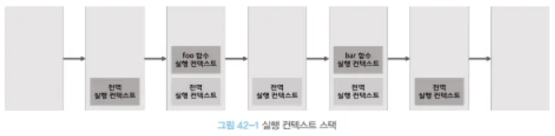
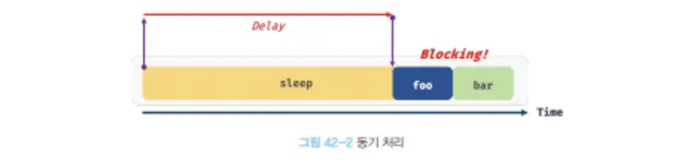
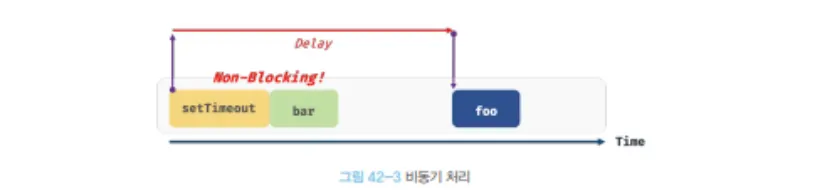

# 42.1 동기 처리와 비동기 처리

<aside>
💡

- 동기 처리 VS 비동기 처리
    
    **동기 처리**는 한 줄의 코드가 끝나야 다음 줄의 코드를 실행시키는 방식
    
    즉, 한 작업이 끝나기 전에는 다음 작업이 시작되지 않는다.
    
    **비동기 처리**는 어떤 작업이 끝날 때까지 기다리지 않고, 다음 작업을 바로 실행하는 방식
    
    즉, 시간이 오래 걸리는 작업을 기다리지 않고 다음 코드를 먼저 실행함
    
</aside>

[ 예제 42 - 01 ] 

```jsx
const foo = () => {};
const bar = () => {};

foo();
bar();
```



<aside>
💡

**자바스크립트 엔진은 단 하나의 실행 컨텍스트 스택을 갖는다.** 

즉. **동시에 2개 이상의 함수를 동시에 실행할 수 없다**는 것을 의미한다. 

또한, 자바스크립트 엔진은 한 번에 하나의 태스크(작업)만 실행할 수 있는 **싱글 스레드 방식**으로 동작한다. (싱글 스레드 방식 ⇒ 한 번에 하나의 작업만 실행할 수 있음)

</aside>

[ 예제 42 - 02 ] 

```jsx
// sleep 함수는 일정 시간(delay)이 경과한 이후에 콜백 함수를 호출한다.
function sleep(func, delay){
	// Date.now()는 현재 시간을 숫자(ms)로 변환한다. 
	const delayUntil = Date.now() + delay;
	
	// 현재 시간(Date.now())에 delay를 더한 delayUntil이 현재 시간보다 작으면 계속 반복한다.
	while (Date.now() < delayUntil);
	// 일정 시간(delay)이 경과한 이후에 콜백 함수(func)를 호출한다.
	func();
}

function foo(){
	console.log('foo');
}

function bar() {
	console.log('bar');
}

// sleep 함수는 3초 이상 실행된다.
sleep(foo, 3*1000);

// bar 함수는 sleep 함수의 실행이 종료된 이후에 호출되므로 3초 이상 블로킹된다.
bar();
// (3초 경과 후) foo 호출 -> bar 호출
```

<aside>
💡

위 예제를 확인하면 sleep 함수는 3초후에 foo 함수를 호출하고 그 후 bar 함수를 호출한다.

이처럼 현재 실행 중인 태스크(작업)이 종료할 때 까지 다음에 실행될 태스크(작업)이 대기하는 방식을 **동기 처리**라고 한다.

bar() 함수는 앞에 sleep() 함수가 종료될 때까지 블로킹(작업 중단)이 된다.

</aside>

[ 예제 42 - 03 ]

```jsx
function foo() {
	console.log('foo');
}

function bar() {
	console.log('bar');
}

// 타이머 함수 setTimeout은 일정 시간이 경과한 이후에 콜백 함수 foo를 호출한다.
// 타이머 함수 setTimeout은 bar 함수를 블로킹하지 않는다.
setTimeout(foo, 3 * 1000);
bar();
// bar 호출 -> (3초 경과 후) foo 호출
```

<aside>
💡

setTimeout 함수는 sleep 함수와 유사하게 일정 시간이 지난 뒤 콜백 함수를 호출하지만 

setTimeout 함수 이후의 태스크(작업)를 블로킹하지 않고 바로 실행한다. 

이러한 방식을 **비동기 처리**라고 한다.

비동기 처리는 블로킹이 발생하지 않는 장점을 가지고 있지만 태스크의 실행 순서가 보장되지 않는다는 단점이 존재한다.

</aside>

<aside>
🤔

여기서 왜 setTimeout() 함수는 비동기 처리가 가능할까 ?

- 답변
    
    위에서 기재된 것처럼 자바스크립트 엔진은 한 번에 한 가지 일만 처리하는 싱글 스레드 방식을 지원하고 있다.
    
    하지만, setTimeout() 함수는 자바스크립트 엔진의 기능이 아니라 브라우저(Web API)가 제공하는 기능이기 때문에 브라우저는 멀티 스레드라 비동기 처리가 일어나는 것이다.
    
    아래서 설명하는 **이벤트 루프 구조** 덕분이기도 하다 !
    
</aside>






# 42.2 이벤트 루프와 태스크 큐


1. 콜 스택 : 실행 중인 코드(함수)들이 쌓이고, 끝나면 빠져나오는 스택 구조(LIFO 구조)
    
    스택 구조 : 실행 될 코드(함수)들이 하나씩 쌓이는 구조
    
    LIFO ( Last In First Out) : 가장 마지막에 들어온 놈이 제일 먼저 나간다.
    
2. Web API : 브라우저가 제공하는 “비동기 기능 영역” , 자바스크립트 엔진이 직접하는게 아니라 브라우저가 대신 해주는 일
    
    ex) setTimeout(), fetch(), addEventListener(), DOM 이벤트 처리 등이 있다.
    
3. 테스크 큐 : 비동기 작업이 완료된 후 실행을 기다리는 콜백 함수들이 줄 서 있는 곳
4. 이벤트 루프 : Call Stack과 Task Queue를 계속 감시하며, 스택이 비었을 때 큐에서 콜백을 꺼내 작업을 실행시키는 역할을 한다.
5. 힙 : 힙은 객체, 배열, 함수 같은 참조 타입 데이터가 저장되는 곳이다.
    
    힙은 구조화되어 있지 않은(비선형적인) 메모리 영역이라, 데이터가 임의의 위치에 저장됨
    

[ 예제 42 - 04 ] 

```jsx
function foo() {
	console.log('foo');
}

function bar() {
	console.log('bar');
}

setTimeout(foo, 0); // 0초(실제는 4ms) 후에 foo 함수가 호출된다.
bar();
```

위 코드를 보고 브라우저 환경에서 예제 42 - 04가 어떻게 동작할지 확인해보자 !

1. 전역 코드가 평가되어 전역 실행 컨텍스트가 생성되고 콜 스택에 푸시된다.
2. 전역 코드가 실행되기 시작하여 setTimeout 함수가 호출된다. 이때 setTimeout 함수의 함수 실행 컨텍스트가 생성되고 콜스택에 푸시되어 현재 실행 중인 실행 컨텍스트가 된다. 브라우저의 Web API(호스트 객체)인 타이머 함수도 함수이므로 함수 실행 컨텍스트를 생성한다.
3. setTimeout 함수가 실행되면 콜백 함수를 호출 스케일링하고 종료되어 콜 스택에서 팝된다. 이때 호출 스케줄링, 즉 타이머 설정과 타이머가 만료되면 콜백 함수를 테스크 큐에 푸시하는 것은 브라우저의 역할이다.
4. **브라우저가 수행하는 4-1**과 **자바스크립트 엔진이 수행하는 4-2**는 **병행 처리**된다.
    
    4-1 브라우저는 타이머를 설정하고 타이머의 만료를 기다린다. 이후 타이머가 만료되면 콜백 함수 foo가 테스크 큐에 푸시된다. 위 예제의 경우 지연 시간(delay)이 0이지만 지연 시간이 4ms이하인 경우 최소 지연 시간 4ms가 지정된다. 따라서 4ms 후에 콜백 함수 foo가 태스크 큐에 푸시되어 대기하게 된다. 
    
    이 처리 또한 자바스크립트 엔진이 아니라 브라우저가 수행한다. 이처럼 setTimeout 함수를 호출 스케일링한 콜백 함수는 정확히 지연 시간 후에 호출된다는 보장은 없다. 지연 시간 이후에 콜백 함수가 태스크 큐에 푸시되어 대기하게 되지만 콜 스택이 비어야 호출되므로 약간의 시간차가 발생할 수 있기 때문이다.
    
    4-2 bar 함수가 호출되어 bar 함수의 실행 컨텍스트가 생성되고 콜 스택에 푸시되어 현재 실행중인 실행 컨텍스트가 된다. 이후 bar 함수가 종료되어 콜 스택에서 팝된다. 이때 브라우저가 타이머를 설정한 후 4ms가 경과했다면 foo 함수는 아직 태스크 큐에서 대기 중이다.
    
5. 전역 코드 실행이 종료되고 전역 실행 컨텍스트가 콜 스택에서 팝된다. 이로서 콜 스택에는 아무런 실행 컨텍스트도 존재하지 않게 된다.
6. 이벤트 루프에 의해 콜 스택이 비어 있음이 감지되고 태스크 큐에서 대기 중인 foo가 이벤트 루프에 의해 콜 스택에 푸시된다. 다시 말해, 콜백 함수 foo의 함수 실행 컨텍스트가 생성되고 콜 스택에 푸시되어 현재 실행 중인 실행 컨텍스트가 된다. 
    
    이후 foo 함수가 종료되어 콜 스택에서 팝된다.
    

**이처럼 비동기 함수인 setTimeout의 콜백 함수는 태스크 큐에 푸시되어 대기하다가 콜 스택이 비게 되면, 다시 말해 전역 코드 및 명시적으로 호출된 함수가 모두 종료하면 비로소 콜 스택에 푸시되어 실행된다.**

<aside>
📌

자바스크립트 엔진은 싱글 스레드

브라우저는 멀티 스레드 임을 잊지 말자 !!

</aside>