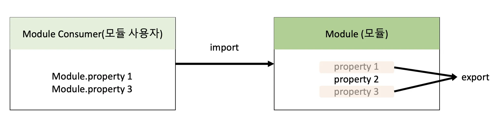

# 48장 모듈

# 48.1 모듈의 일반적 의미

<aside>

모듈이란 애플리케이션을 구성하는 개별적 요소로서 재사용 가능한 코드 조각을 말한다.

</aside>

- 모듈은 기능을 기준으로 파일 단위로 분리한다. 이때 모듈이 성립하려면 모듈은 자신만의 파일 스코프(모듈 스코프)를 가질 수 있어야 한다.
- 자신만의 파일 스코프를 갖는 모듈의 모든 자산은 캡슐화되어 다른 모듈에서 접근할 수 없다. 즉, 모듈은 개별적 존재로서 애플리케이션과 분리되어 존재한다.
- **모듈은 공개가 필요한 자산에 한정하여 명시적으로 선택적 공개가 가능한데, 이를 export라 한다.**
- **모듈 사용자는 모듈이 공개(export)한 자산 중 일부 또는 전체를 선택해 자신의 스코프 내로 불러들여 재사용할 수 있는데, 이를 import라 한다.**



# 48.2 자바스크립트와 모듈

 자바스크립트 런타임 환경인 Node.js는 모듈 시스템의 사실상 표준인 CommonJS를 채택했고 독자적인 진화를 거쳐 기본적으로는 CommonJS 사양을 따르고 있다. 따라서 Node.js 환경에서는 파일별로 독립적인 파일 스코프(모듈 스코프)를 갖는다.

# 48.3 ES6 모듈(ESM)

- ES6에서는 클라이언트 사이드 자바스크립트에서도 동작하는 모듈 기능을 추가했다.

### ES6 모듈 사용법

- script 태그에 type="module" 어트리뷰터를 추가하면 로드된 자바스크립트 파일은 모듈로서 동작한다.

```jsx
<script type="module" src="app.mjs"></script>
```

## 48.3.1 모듈 스코프

- ESM은 독자적인 모듈 스코프를 갖는다.
- ESM이 아닌 일반적인 자바스크립트 파일은 script 태그로 분리해서 로드해도 독자적인 모듈 스코프를 갖지 않는다.

```jsx
// foo.js
// x 변수는 전역 변수다
var x = 'foo';
console.log(window.x); //foo
```

```jsx
// bar.js
// x 변수는 전역 변수다. foo.js에서 선언한 전역 변수 x와 중복된 선언이다.
var x = 'bar';

// foo.js에서 선언한 전역 변수 x의 값이 재할당되었다.
console.log(window.x) //bar
```

- ESM은 파일 자체의 독자적인 모듈 스코프를 제공한다. 따라서 모듈 내에서 var 키워드로 선언한 변수는 더는 전역 변수가 아니며 window 객체의 프로퍼티도 아니다.

## 48.3.2 export 키워드

- 모듈은 독자적인 모듈 스코프를 갖는다.
- 모듈 내부에서 선언한 식별자를 외부에 공개하여 다른 모듈들이 재사용할 수 있게 하려면 export 키워드를 사용한다.
- export 키워드는 선언문 앞에 사용하고, 변수, 함수, 클래스 등 모든 식별자를 export할 수 있다.

```jsx
// lib.mjs
// 변수의 공개
export const pi = Math.PI;

// 함수의 공개
export function square(x) {
 return x * x;
}

// 클래스의 공개
export class Person {
  constructor(name){
   this.name = name;
  }
}
```

- 한 번에 export 할 수 있다.

```jsx
// lib.mjs
const pi = Math.PI;

export function square(x) {
 return x * x;
}

class Person {
  constructor(name){
   this.name = name;
  }
}

// 변수, 함수 클래스를 하나의 객체로 구성하여 공개
export { pi, square, Person };
```

## 48.3.3 import 키워드

- 다른 모듈에서 공개(export)한 식별자를 자신의 모듈 스코프 내부로 로드하려면 import 키워드를 사용한다.
- 다른 모듈이 export한 식별자 이름으로 import해야 하며 ESM의 경우 파일 확장자를 생략할 수 없다.

```jsx
// app.mjs
// 같은 폴더 내의 lib.mjs 모듈이 export한 식별자 이름으로 import한다.
// ESM의 경우 파일 확장자를 생략할 수 없다.
import { pi, square, Person } from './lib.mjs';

console.log(pi); //3.141592653589793
console.log(square(10)); //100
console.log(new Person('Lee')); // Person { name: 'Lee' }
```

- 모듈이 export한 식별자 이름을 변경하여 import할 수도 있다.

```jsx
import { pi as PI, square as sq, Person as P } from './lib.mjs';

console.log(pi); //3.141592653589793
console.log(sq(2); //4
console.log(new P('Lee')); // Person { name: 'Lee' }
```

- 모듈에서 하나의 값만 export한다면 defort 키워드를 사용할 수 있다. default 키워드를 사용하는 경우 기본적으로 이름 없이 하나의 값을 export한다.

```jsx
export default x => x * x;
```

- default 키워드를 사용하는 경우 var, let, const 키워드를 사용할 수 없다.

```jsx
// 잘못된 예시
export default ~~const~~ foo = () => {};
```

- default 키워드와 함께 export한 모듈은 {} 없이 임의의 이름으로 import한다.